# 基础信息

|      |      |
|------|------|
| 名称 | entity |
| 编码语言 | .java |
| 代码路径 | WeFe/common/java/common-data-mongodb/src/main/java/com/welab/wefe/common/data/mongodb/entity |
| 包名 | docs.common.java.common-data-mongodb.src.main.java.com.welab.wefe.common.data.mongodb.entity |
| 概述说明 | OperationLog类记录API操作日志，包含请求响应信息及时间。证书管理模块存储证书全生命周期数据，支持签发流程。联邦学习模块管理多类型数据资源，支持扩展。通用数据模型抽象层定义存储规范，支持时间追踪和节点配置管理。 |

# 说明

## 概述  
该模块是联邦学习平台的多功能数据管理核心，通过MongoDB实现操作日志、证书管理、联邦数据建模等功能的统一存储。采用分层设计：基础层（AbstractMongoModel）提供主键和序列化支持，业务层（如CertInfo、DataSet）扩展特定字段。接口规范统一为getter/setter模式，例如OperationLog记录API调用耗时，CertInfo管理证书链。关键数据结构包括日志文档（含IP地址）、证书PEM内容、数据集权限控制等12种模型。外部依赖仅为MongoDB驱动，类似ORM的轻量级实现。

## 主要业务场景  
模块支撑三类核心业务：1) 操作审计（如记录API调用日志），类似网关日志系统；2) 证书全生命周期管理（从申请到签发），类似PKI体系；3) 联邦学习数据治理（如DataSet权限控制）。典型交互通过POJO操作实现，例如Member维护节点实名信息，BlockSyncHeight同步区块链状态。功能覆盖数据标注（ImageDataSet）、密钥配置（SM2）等8个维度，集成案例包括证书签发API和标签系统（DataResourceDefaultTag）。业务流程均遵循基础模型→业务模型的继承体系。

### 包内部结构视图

```mermaid
graph TD
    entity --> common
    entity --> manager
    entity --> union
    entity --> base
    common --> OperationLog.java
    manager --> CertInfo.java
    manager --> CertRequestInfo.java
    manager --> Account.java
    manager --> CertKeyInfo.java
    union --> ext
    union --> DataResourceDefaultTag.java
    union --> TableDataSet.java
    union --> TrustCerts.java
    union --> RealnameAuthAgreementTemplate.java
    union --> DataResourceLazyUpdateModel.java
    union --> MemberFileInfo.java
    union --> DataSet.java
    union --> BloomFilter.java
    union --> BlockSyncHeight.java
    union --> UnionNode.java
    union --> BlockSyncDetailInfo.java
    union --> BlockSyncContractHeight.java
    union --> DataResource.java
    union --> TransactionResponseDetailInfo.java
    union --> MemberAuthType.java
    union --> DataSetMemberPermission.java
    union --> ImageDataSet.java
    union --> MemberService.java
    union --> Member.java
    union --> DataSetDefaultTag.java
    union --> UnionNodeSm2Config.java
    ext --> DataSetDefaultTagExtJSON.java
    ext --> MemberServiceExtJSON.java
    ext --> MemberAuthTypeExtJSON.java
    ext --> TableDataSetExtJSON.java
    ext --> RealnameAuthAgreementTemplateExtJSON.java
    ext --> BloomFilterExtJSON.java
    ext --> MemberExtJSON.java
    ext --> DataSetMemberPermissionExtJSON.java
    ext --> ImageDataSetExtJSON.java
    ext --> UnionNodeExtJSON.java
    ext --> RealnameAuthFileInfo.java
    ext --> MemberFileInfoExtJSON.java
    ext --> DataResourceDefaultTagExtJSON.java
    ext --> DataResourceExtJSON.java
    ext --> TrustCertsExtJSON.java
    ext --> DataSetExtJSON.java
    base --> AbstractBlockChainBusinessModel.java
    base --> AbstractMongoModel.java
    base --> AbstractUnionNodeConfigMongoModel.java
    base --> AbstractNormalMongoModel.java
```

该流程图展示了MongoDB实体类的层级结构，包含common、manager、union和base四个主要目录。union目录下包含大量实体类和ext扩展类，ext目录下存放各类JSON扩展实体。base目录包含抽象模型基类，整体结构清晰体现了业务模块的划分和继承关系。

# 文件列表

| 名称   | 类型  | 说明 |
|-------|------|-------------|
| [base](base/_module.md) | package | AbstractBlockChainBusinessModel继承AbstractMongoModel，含同步时间、状态标识（1删除0未删）、创建更新时间（YYYY_MM_DD_HH_MM_SS格式）。AbstractMongoModel含ObjectId类型id字段，可序列化。AbstractUnionNodeConfigMongoModel继承AbstractNormalMongoModel，含nodeId（随机UUID）和configType属性。AbstractNormalMongoModel含createTime和updateTime属性，默认当前时间。 |
| [union](union/_module.md) | package | Java模块提供JSON数据扩展框架，支持联邦学习场景下各类业务实体（数据集、成员服务、实名认证等）的扩展管理，通过POJO类定义数据结构，依赖Java标准库和MongoDB实现存储。 |
| [manager](manager/_module.md) | package | CertInfo类存储证书信息，含ID、用户ID、公私钥、序列号等内容。CertRequestInfo类存储证书请求信息，继承AbstractNormalMongoModel，含ID、用户ID等字段。Account类存储账户信息，含ID、手机号、密码等。CertKeyInfo类存储证书密钥信息，含主键、私钥PEM等字段。 |
| [common](common/_module.md) | package | 操作日志类，记录API接口调用信息，包括请求、响应、调用者及耗时等数据。 |

