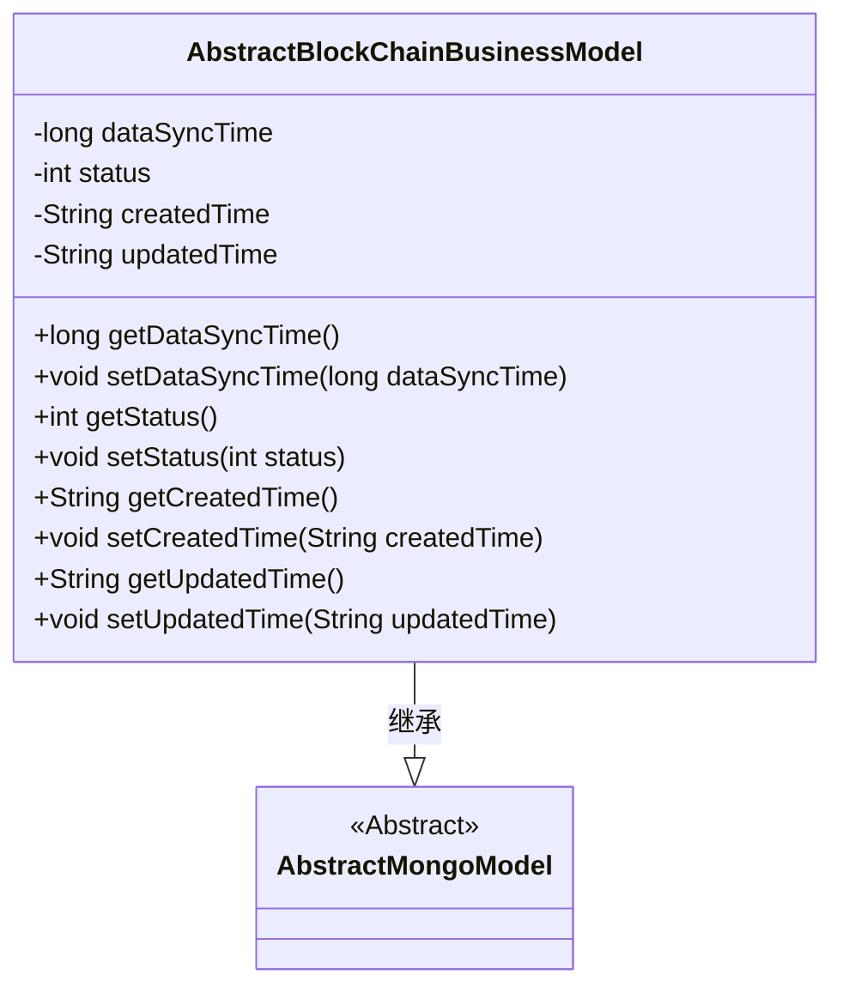

# 基础信息

|      |      |
|------|------|
| 名称 | AbstractBlockChainBusinessModel |
| 编码语言 | .java |
| 代码路径 | WeFe/common/java/common-data-mongodb/src/main/java/com/welab/wefe/common/data/mongodb/entity/base/AbstractBlockChainBusinessModel.java |
| 包名 | com.welab.wefe.common.data.mongodb.entity.base |
| 依赖项 | ['java.util.Date', 'com.welab.wefe.common.util.DateUtil'] |
| 概述说明 | AbstractBlockChainBusinessModel类继承AbstractMongoModel，包含数据同步时间、状态、创建时间和更新时间字段及其getter/setter方法。 |

# 说明

AbstractBlockChainBusinessModel类继承自AbstractMongoModel，包含数据同步时间、状态标识以及创建和更新时间等属性。数据同步时间默认为当前系统时间，状态标识表示数据是否删除（1为删除，0为未删除）。创建和更新时间使用YYYY_MM_DD_HH_MM_SS格式的字符串表示。类提供了各属性的getter和setter方法用于访问和修改这些字段。

# 类列表 Class Summary

| 名称   | 类型  | 说明 |
|-------|------|-------------|
| AbstractBlockChainBusinessModel | class | AbstractBlockChainBusinessModel继承AbstractMongoModel，包含数据同步时间、状态、创建和更新时间字段及其getter/setter方法。 |

## 类 AbstractBlockChainBusinessModel

|      |      |
|------|------|
| 访问范围 | public |
| 类型 | class |
| 名称 | AbstractBlockChainBusinessModel |
| 说明 | AbstractBlockChainBusinessModel继承AbstractMongoModel，包含数据同步时间、状态、创建和更新时间字段及其getter/setter方法。 |

### UML类图

这段代码展示了一个区块链业务模型的抽象基类，继承自`AbstractMongoModel`。类中包含数据同步时间、状态标志以及创建/更新时间等核心字段，所有字段都提供了标准的getter/setter方法。该类主要用于管理区块链业务数据的元信息，包括数据状态跟踪和时间戳记录，为具体业务实现提供基础模型支持。

### 内部方法调用关系图

```mermaid
graph TD
    A["类AbstractBlockChainBusinessModel"]
    B["继承自: AbstractMongoModel"]
    C["属性: long dataSyncTime"]
    D["属性: int status"]
    E["属性: String createdTime"]
    F["属性: String updatedTime"]
    G["方法: getDataSyncTime()"]
    H["方法: setDataSyncTime(long)"]
    I["方法: getStatus()"]
    J["方法: setStatus(int)"]
    K["方法: getCreatedTime()"]
    L["方法: setCreatedTime(String)"]
    M["方法: getUpdatedTime()"]
    N["方法: setUpdatedTime(String)"]

    A --> B
    A --> C
    A --> D
    A --> E
    A --> F
    A --> G
    A --> H
    A --> I
    A --> J
    A --> K
    A --> L
    A --> M
    A --> N
```

这段代码展示了一个继承自AbstractMongoModel的AbstractBlockChainBusinessModel类，主要用于区块链业务模型的数据管理。类中包含四个核心属性：数据同步时间(dataSyncTime)、状态(status)、创建时间(createdTime)和更新时间(updatedTime)，每个属性都有对应的getter和setter方法。createdTime和updatedTime通过DateUtil工具类初始化为当前时间的格式化字符串，而dataSyncTime则初始化为当前时间戳。这个类为区块链业务数据提供了基础的时间戳和状态管理功能。

### 字段列表 Field List

| 名称  | 类型  | 说明 |
|-------|-------|------|
| status | int | 私有整型变量status，用于存储状态信息。 |
| updatedTime = DateUtil.toStringYYYY_MM_DD_HH_MM_SS2(new Date()) | String | 定义字符串变量updatedTime，存储当前时间的年月日时分秒格式化字符串。 |
| createdTime = DateUtil.toStringYYYY_MM_DD_HH_MM_SS2(new Date()) | String | 定义字符串变量createdTime，存储当前时间的年月日时分秒格式化字符串。 |
| dataSyncTime = System.currentTimeMillis() | long | 定义长整型变量dataSyncTime，初始值为当前系统时间毫秒数。 |

### 方法列表

| 名称  | 类型  | 说明 |
|-------|-------|------|
| setStatus | void | 设置状态值的方法，将输入参数status赋值给当前对象的status属性。 |
| getCreatedTime | String | 获取创建时间的方法，返回字符串类型的createdTime变量值。 |
| setDataSyncTime | void | 设置数据同步时间的方法，参数为长整型dataSyncTime，赋值给类成员变量dataSyncTime。 |
| getDataSyncTime | long | 获取数据同步时间的方法，返回长整型值dataSyncTime。 |
| getStatus | int | 这是一个Java方法，返回整型变量status的值。 |
| setCreatedTime | void | 设置创建时间的方法，将参数createdTime赋值给对象的createdTime属性。 |
| getUpdatedTime | String | 获取更新时间的方法，返回字符串类型变量updatedTime。 |
| setUpdatedTime | void | 这是一个Java方法，用于设置对象的updatedTime属性，接受字符串参数updatedTime。 |

