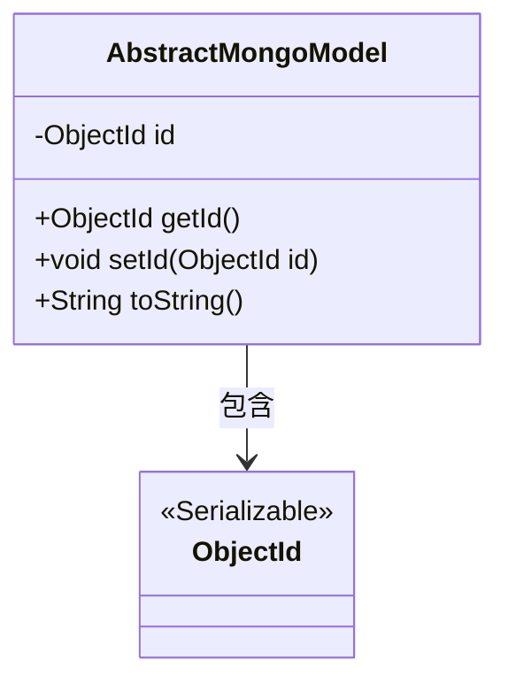
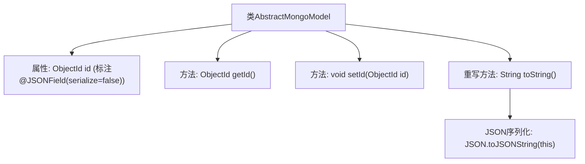

# 基础信息

|      |      |
|------|------|
| 名称 | AbstractMongoModel |
| 编码语言 | .java |
| 代码路径 | WeFe/common/java/common-data-mongodb/src/main/java/com/welab/wefe/common/data/mongodb/entity/base/AbstractMongoModel.java |
| 包名 | com.welab.wefe.common.data.mongodb.entity.base |
| 依赖项 | ['com.alibaba.fastjson.JSON', 'com.alibaba.fastjson.annotation.JSONField', 'org.bson.types.ObjectId', 'java.io.Serializable'] |
| 概述说明 | AbstractMongoModel类实现Serializable接口，包含id字段（JSON序列化时忽略），提供getter/setter方法，toString方法返回JSON字符串。 |

# 说明

这是一个名为AbstractMongoModel的抽象MongoDB模型类，实现了Serializable接口以确保可序列化。类中包含一个私有ObjectId类型的id字段，使用@JSONField注解标记为不序列化。提供了getId和setId方法用于访问和修改id字段。重写了toString方法，使用JSON工具将对象转换为JSON字符串输出。

# 类列表 Class Summary

| 名称   | 类型  | 说明 |
|-------|------|-------------|
| AbstractMongoModel | class | AbstractMongoModel类实现Serializable接口，包含私有ObjectId类型id字段（JSON序列化时忽略），提供id的getter/setter方法，并重写toString方法返回JSON字符串。 |

## 类 AbstractMongoModel

|      |      |
|------|------|
| 访问范围 | public |
| 类型 | class |
| 名称 | AbstractMongoModel |
| 说明 | AbstractMongoModel类实现Serializable接口，包含私有ObjectId类型id字段（JSON序列化时忽略），提供id的getter/setter方法，并重写toString方法返回JSON字符串。 |

### UML类图

这段类图描述了一个名为AbstractMongoModel的抽象MongoDB模型类，该类实现了Serializable接口，包含一个私有ObjectId类型字段id，以及对应的getter和setter方法。toString()方法使用JSON序列化输出对象内容。AbstractMongoModel与ObjectId类之间存在组合关系，表示前者依赖于后者来存储MongoDB的唯一标识符。整个设计体现了MongoDB文档模型的基本特征，适合作为其他具体模型类的基类使用。

### 内部方法调用关系图

该流程图展示了AbstractMongoModel类的结构，包含一个被@JSONField标注为不序列化的ObjectId类型私有属性id，以及对应的getter/setter方法。特别值得注意的是toString()方法通过JSON.toJSONString实现对象序列化，但id字段因注解配置会被排除在序列化结果外。类设计体现了MongoDB文档ID的典型处理方式，同时通过JSON序列化提供对象字符串表示。

### 字段列表 Field List

| 名称  | 类型  | 说明 |
|-------|-------|------|
| id | ObjectId | 私有ObjectId类型字段id，使用JSONField注解禁止序列化。 |

### 方法列表

| 名称  | 类型  | 说明 |
|-------|-------|------|
| getId | ObjectId | 方法返回对象的id属性。 |
| setId | void | 设置对象ID的方法，将传入的ObjectId赋值给当前对象的id属性。 |
| toString | String | 该方法重写toString()，返回当前对象的JSON字符串表示。 |

