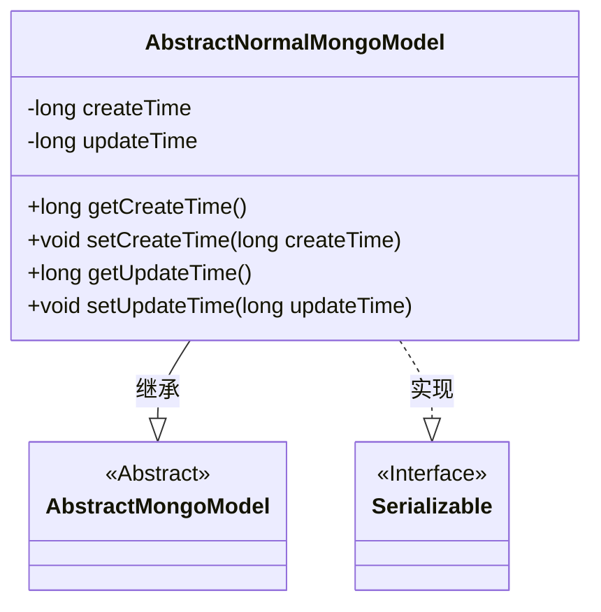
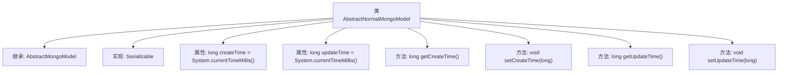

# 基础信息

|      |      |
|------|------|
| 名称 | AbstractNormalMongoModel |
| 编码语言 | .java |
| 代码路径 | WeFe/common/java/common-data-mongodb/src/main/java/com/welab/wefe/common/data/mongodb/entity/base/AbstractNormalMongoModel.java |
| 包名 | com.welab.wefe.common.data.mongodb.entity.base |
| 依赖项 | ['java.io.Serializable'] |
| 概述说明 | AbstractNormalMongoModel类继承AbstractMongoModel并实现Serializable，包含创建时间和更新时间字段及其getter和setter方法。 |

# 说明

这是一个名为AbstractNormalMongoModel的抽象类，继承自AbstractMongoModel并实现了Serializable接口。该类包含两个long类型属性：createTime和updateTime，默认值均为当前系统时间。提供了这两个属性的getter和setter方法，用于获取和设置创建时间与更新时间。

# 类列表 Class Summary

| 名称   | 类型  | 说明 |
|-------|------|-------------|
| AbstractNormalMongoModel | class | 抽象MongoDB模型类，继承AbstractMongoModel并实现Serializable，包含创建时间和更新时间属性及其getter/setter方法。 |

## 类 AbstractNormalMongoModel

|      |      |
|------|------|
| 访问范围 | public |
| 类型 | class |
| 名称 | AbstractNormalMongoModel |
| 说明 | 抽象MongoDB模型类，继承AbstractMongoModel并实现Serializable，包含创建时间和更新时间属性及其getter/setter方法。 |

### UML类图

这段类图展示了AbstractNormalMongoModel继承自抽象类AbstractMongoModel并实现Serializable接口的结构。该类包含createTime和updateTime两个私有时间戳字段，以及对应的getter/setter方法，用于记录MongoDB模型的创建和更新时间。通过继承关系，该类获得了父类的MongoDB基础功能，同时通过序列化接口支持对象持久化传输。

### 内部方法调用关系图

这段代码展示了一个名为AbstractNormalMongoModel的类，它继承自AbstractMongoModel并实现了Serializable接口。该类包含两个long类型的属性createTime和updateTime，分别通过System.currentTimeMillis()初始化。提供了四个方法：getCreateTime和setCreateTime用于访问和修改createTime属性，getUpdateTime和setUpdateTime用于访问和修改updateTime属性。这个类主要用于在MongoDB数据模型中记录对象的创建和更新时间戳。

### 字段列表 Field List

| 名称  | 类型  | 说明 |
|-------|-------|------|
| updateTime = System.currentTimeMillis() | long | 定义私有长整型变量updateTime，初始值为当前系统时间毫秒数。 |
| createTime = System.currentTimeMillis() | long | 定义长整型变量createTime，初始值为当前系统时间毫秒数。 |

### 方法列表

| 名称  | 类型  | 说明 |
|-------|-------|------|
| getUpdateTime | long | 获取更新时间的方法，返回长整型变量updateTime的值。 |
| setCreateTime | void | 设置创建时间的方法，参数为长整型时间戳。 |
| getCreateTime | long | 获取创建时间的方法，返回长整型数值createTime。 |
| setUpdateTime | void | 这是一个Java方法，用于设置对象的updateTime属性，接受一个long类型参数updateTime。 |

