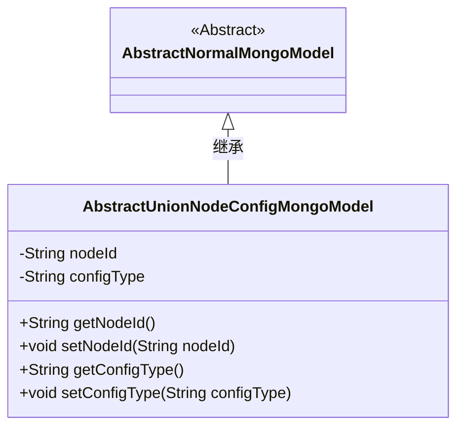
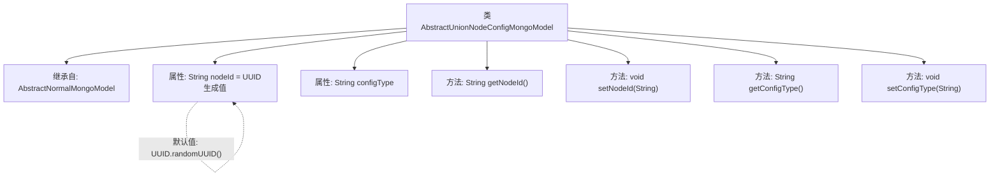

# 基础信息

|      |      |
|------|------|
| 名称 | AbstractUnionNodeConfigMongoModel |
| 编码语言 | .java |
| 代码路径 | WeFe/common/java/common-data-mongodb/src/main/java/com/welab/wefe/common/data/mongodb/entity/base/AbstractUnionNodeConfigMongoModel.java |
| 包名 | com.welab.wefe.common.data.mongodb.entity.base |
| 依赖项 | ['java.util.UUID'] |
| 概述说明 | AbstractUnionNodeConfigMongoModel继承AbstractNormalMongoModel，包含自动生成的nodeId和可配置的configType字段及其getter/setter方法。 |

# 说明

这是一个名为AbstractUnionNodeConfigMongoModel的Java类，继承自AbstractNormalMongoModel。该类包含两个主要属性：nodeId和configType。nodeId属性初始化为去除连字符的随机UUID字符串，并提供了对应的getter和setter方法。configType属性没有初始值，同样提供了getter和setter方法。这个类主要用于MongoDB数据模型配置。

# 类列表 Class Summary

| 名称   | 类型  | 说明 |
|-------|------|-------------|
| AbstractUnionNodeConfigMongoModel | class | 抽象MongoDB模型类，包含随机生成的nodeId和configType属性及其getter/setter方法。 |

## 类 AbstractUnionNodeConfigMongoModel

|      |      |
|------|------|
| 访问范围 | public |
| 类型 | class |
| 名称 | AbstractUnionNodeConfigMongoModel |
| 说明 | 抽象MongoDB模型类，包含随机生成的nodeId和configType属性及其getter/setter方法。 |

### UML类图

该类图展示了AbstractUnionNodeConfigMongoModel继承自抽象类AbstractNormalMongoModel的关系。子类包含两个受保护字符串属性nodeId（自动生成UUID）和configType，以及对应的getter/setter方法。图中清晰体现了类层次结构和成员访问控制，nodeId在实例化时会自动生成去横线的UUID值，configType则需通过setter方法设置。

### 内部方法调用关系图

该流程图展示了AbstractUnionNodeConfigMongoModel类的继承关系和成员结构。该类继承自AbstractNormalMongoModel，包含两个核心属性：自动生成UUID格式的nodeId和可配置的configType，同时提供了标准的getter/setter方法。其中nodeId属性在初始化时通过UUID.randomUUID()生成默认值并移除连字符，体现了该类的唯一标识生成能力。

### 字段列表 Field List

| 名称  | 类型  | 说明 |
|-------|-------|------|
| configType | String | 这是一个受保护的字符串变量，名为configType，用于存储配置类型信息。 |
| nodeId = UUID.randomUUID().toString().replaceAll("-", "") | String | 生成随机UUID并移除连字符，赋值给nodeId字符串变量。 |

### 方法列表

| 名称  | 类型  | 说明 |
|-------|-------|------|
| getNodeId | String | 获取节点ID的方法，返回字符串类型的nodeId。 |
| setNodeId | void | 设置节点ID的方法，将参数nodeId赋值给当前对象的nodeId属性。 |
| getConfigType | String | 获取配置类型的方法，返回字符串类型变量configType。 |
| setConfigType | void | 方法setConfigType用于设置配置类型，参数为字符串configType。 |

