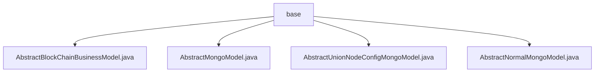

# 基础信息

|      |      |
|------|------|
| 名称 | base |
| 编码语言 | .java |
| 代码路径 | WeFe/common/java/common-data-mongodb/src/main/java/com/welab/wefe/common/data/mongodb/entity/base |
| 包名 | docs.common.java.common-data-mongodb.src.main.java.com.welab.wefe.common.data.mongodb.entity.base |
| 概述说明 | AbstractBlockChainBusinessModel继承AbstractMongoModel，含同步时间、状态标识（1删除0未删）、创建更新时间（YYYY_MM_DD_HH_MM_SS格式）。AbstractMongoModel含ObjectId类型id字段，可序列化。AbstractUnionNodeConfigMongoModel继承AbstractNormalMongoModel，含nodeId（随机UUID）和configType属性。AbstractNormalMongoModel含createTime和updateTime属性，默认当前时间。 |

# 说明

## 概述  
该模块提供基于MongoDB的通用数据模型抽象层，核心职责为定义区块链业务数据的存储规范和时间追踪机制。接口规范包含序列化支持（如实现Serializable接口）和标准字段访问（通过getter/setter方法）。关键数据结构包括AbstractMongoModel的ObjectId主键、AbstractNormalMongoModel的时间戳字段，以及AbstractBlockChainBusinessModel的状态标识符。外部依赖仅需MongoDB驱动。例如AbstractUnionNodeConfigMongoModel使用UUID生成节点ID。

## 主要业务场景  
模块支持分布式节点配置管理（类似注册中心模式）和区块链业务数据持久化。业务流程围绕模型继承体系展开：基础模型→时间追踪模型→业务模型。交互模式通过JSON序列化（如重写toString方法）和标准字段操作实现。典型应用包括节点注册（例如nodeId初始化）和数据状态维护（如软删除标志位）。API类型统一为CRUD操作的基础封装。

### 包内部结构视图

该流程图展示了base目录下的四个Java类文件层级关系，所有类文件均直接隶属于base节点，无中间嵌套结构。这些类文件均为抽象模型类，包括区块链业务模型、Mongo基础模型、联盟节点配置模型和普通模型等核心数据持久化组件。

# 文件列表

| 名称   | 类型  | 说明 |
|-------|------|-------------|
| [AbstractBlockChainBusinessModel.java](AbstractBlockChainBusinessModel.md) | file | AbstractBlockChainBusinessModel类继承AbstractMongoModel，包含数据同步时间、状态、创建时间和更新时间字段及其getter/setter方法。 |
| [AbstractMongoModel.java](AbstractMongoModel.md) | file | AbstractMongoModel类实现Serializable接口，包含id字段（JSON序列化时忽略），提供getter/setter方法，toString方法返回JSON字符串。 |
| [AbstractUnionNodeConfigMongoModel.java](AbstractUnionNodeConfigMongoModel.md) | file | AbstractUnionNodeConfigMongoModel继承AbstractNormalMongoModel，包含自动生成的nodeId和可配置的configType字段及其getter/setter方法。 |
| [AbstractNormalMongoModel.java](AbstractNormalMongoModel.md) | file | AbstractNormalMongoModel类继承AbstractMongoModel并实现Serializable，包含创建时间和更新时间字段及其getter和setter方法。 |

