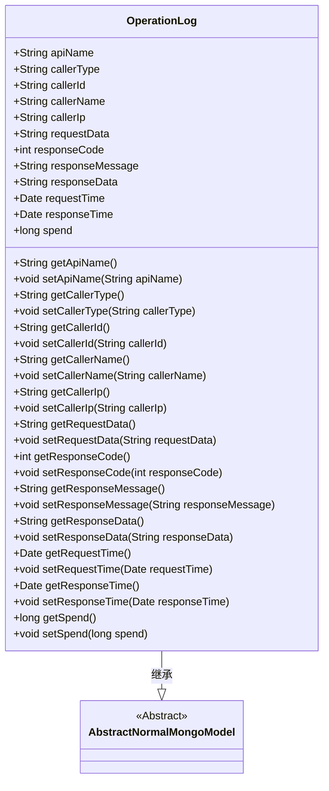

# 基础信息

|      |      |
|------|------|
| 名称 | OperationLog |
| 编码语言 | .java |
| 代码路径 | WeFe/common/java/common-data-mongodb/src/main/java/com/welab/wefe/common/data/mongodb/entity/common/OperationLog.java |
| 包名 | com.welab.wefe.common.data.mongodb.entity.common |
| 依赖项 | ['com.welab.wefe.common.data.mongodb.constant.MongodbTable', 'com.welab.wefe.common.data.mongodb.entity.base.AbstractNormalMongoModel', 'org.springframework.data.mongodb.core.mapping.Document', 'java.util.Date'] |
| 概述说明 | 操作日志类，记录API接口调用信息，包括请求、响应、调用者及耗时等数据。 |

# 说明

OperationLog类是一个MongoDB文档模型，用于记录API操作日志。它包含请求接口名称、调用者类型、ID、名称和IP地址，以及请求参数。同时记录响应状态码、消息和内容，并保存请求时间、响应时间和耗时。该类提供了所有字段的getter和setter方法，用于数据存取。

# 类列表 Class Summary

| 名称   | 类型  | 说明 |
|-------|------|-------------|
| OperationLog | class | OperationLog类记录API操作日志，包含接口名、调用者信息、请求响应数据及时间耗时等字段。 |

## 类 OperationLog

|      |      |
|------|------|
| 访问范围 | @Document(collection = MongodbTable.Common.OPERATION_LOG);;public |
| 类型 | class |
| 名称 | OperationLog |
| 说明 | OperationLog类记录API操作日志，包含接口名、调用者信息、请求响应数据及时间耗时等字段。 |

### UML类图

这段代码定义了一个名为OperationLog的类，用于记录操作日志信息，继承自AbstractNormalMongoModel抽象类。该类包含多个公有字段和方法，用于存储和操作API调用相关的各种信息，如请求接口名称、调用者信息、请求参数、响应数据、时间戳等。通过getter和setter方法可以对这些字段进行读写操作。该类被标记为MongoDB的文档集合，表明其实例将被持久化到MongoDB数据库中。

### 内部方法调用关系图

```mermaid
graph TD
    A["类OperationLog"]
    B["继承: AbstractNormalMongoModel"]
    C["注解: @Document(collection=MongodbTable.Common.OPERATION_LOG)"]
    D["属性: String apiName"]
    E["属性: String callerType"]
    F["属性: String callerId"]
    G["属性: String callerName"]
    H["属性: String callerIp"]
    I["属性: String requestData"]
    J["属性: int responseCode"]
    K["属性: String responseMessage"]
    L["属性: String responseData"]
    M["属性: Date requestTime"]
    N["属性: Date responseTime"]
    O["属性: long spend"]
    P["Getter/Setter方法组"]

    A --> B
    A --> C
    A --> D
    A --> E
    A --> F
    A --> G
    A --> H
    A --> I
    A --> J
    A --> K
    A --> L
    A --> M
    A --> N
    A --> O
    A --> P
```

该流程图展示了OperationLog类的完整结构，该类继承自AbstractNormalMongoModel并标注为MongoDB文档。图中包含14个核心属性，涵盖API调用日志的完整信息（如接口名称、调用者信息、请求/响应数据和耗时统计），以及对应的Getter/Setter方法组。所有属性均使用String、int、Date等基础类型，完整映射了API调用日志的数据存储需求。

### 字段列表 Field List

| 名称  | 类型  | 说明 |
|-------|-------|------|
| callerId | String | 定义了一个公共字符串变量callerId。 |
| responseTime | Date | 响应时间变量，类型为Date。 |
| requestData | String | 声明一个名为requestData的公共字符串变量。 |
| callerIp | String | 声明一个公共字符串变量callerIp，用于存储调用者的IP地址。 |
| apiName | String | 定义字符串类型的API名称变量。 |
| requestTime | Date | 类成员变量requestTime，类型为Date，表示请求时间。 |
| responseData | String | 声明一个公共字符串变量responseData。 |
| responseMessage | String | 声明一个公共字符串变量responseMessage。 |
| callerName | String | 公共字符串变量callerName，用于存储调用者名称。 |
| responseCode | int | 定义整型变量responseCode，用于存储响应代码。 |
| callerType | String | 定义字符串类型变量callerType。 |
| spend | long | 变量spend，长整型，表示花费金额。 |

### 方法列表

| 名称  | 类型  | 说明 |
|-------|-------|------|
| setResponseMessage | void | 设置响应消息的方法，将输入字符串赋值给类的responseMessage成员变量。 |
| setApiName | void | 设置API名称的方法，将传入的apiName赋值给当前对象的apiName属性。 |
| getSpend | long | 获取spend值的公共方法，返回long类型。 |
| getResponseMessage | String | 获取响应消息的方法，返回字符串类型的responseMessage。 |
| getResponseTime | Date | 获取响应时间的方法，返回Date类型值。 |
| setCallerType | void | 设置调用者类型的方法，将参数callerType赋值给当前对象的同名属性。 |
| setRequestTime | void | 设置请求时间的方法，将传入的Date对象赋值给类的requestTime属性。 |
| setCallerIp | void | 设置调用者IP地址的方法。 |
| getRequestData | String | 获取请求数据的方法，返回字符串类型的requestData。 |
| getCallerType | String | 获取调用者类型的方法，返回字符串callerType。 |
| getApiName | String | 获取API名称的方法，返回字符串类型的apiName。 |
| setResponseTime | void | 设置响应时间的方法，将传入的Date对象赋值给类的responseTime属性。 |
| setResponseData | void | 设置响应数据的方法，将传入的字符串赋值给类的responseData成员变量。 |
| getCallerIp | String | 获取调用者IP地址的方法，返回字符串类型的callerIp变量值。 |
| getRequestTime | Date | 获取请求时间的方法，返回Date类型的requestTime。 |
| getResponseData | String | 获取响应数据的方法，返回字符串类型变量responseData。 |
| setCallerId | void | 设置调用者ID的方法，将参数callerId赋值给当前对象的callerId属性。 |
| setRequestData | void | Java方法：设置请求数据字符串。将输入参数requestData赋值给类的同名成员变量。 |
| setResponseCode | void | 设置HTTP响应状态码的方法，将传入的整数值赋给类的responseCode成员变量。 |
| setCallerName | void | 设置调用者名称的方法，将参数callerName赋值给类成员变量callerName。 |
| getResponseCode | int | 该方法返回一个整型的响应码。 |
| getCallerId | String | 方法返回调用者ID字符串。 |
| getCallerName | String | 获取调用者名称的方法，返回字符串类型的callerName变量值。 |
| setSpend | void | 设置花费金额的方法，将参数spend赋值给类成员变量spend。 |

