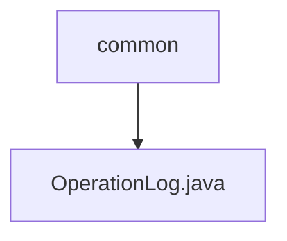

# 基础信息

|      |      |
|------|------|
| 名称 | common |
| 编码语言 | .java |
| 代码路径 | WeFe/common/java/common-data-mongodb/src/main/java/com/welab/wefe/common/data/mongodb/entity/common |
| 包名 | docs.common.java.common-data-mongodb.src.main.java.com.welab.wefe.common.data.mongodb.entity.common |
| 概述说明 | 操作日志类，记录API接口调用信息，包括请求、响应、调用者及耗时等数据。 |

# 说明

OperationLog类是一个MongoDB文档模型，用于记录API操作日志。它包含请求接口名称、调用者类型、ID、名称和IP地址，以及请求参数。同时记录响应状态码、消息和内容，并保存请求时间、响应时间和耗时。该类提供了所有字段的getter和setter方法，用于数据存取。

### 包内部结构视图

流程图描述：该结构展示了一个简单的层级关系，common目录下包含一个OperationLog.java文件。这是一个典型的数据存储层结构，用于存放MongoDB实体类，其中OperationLog.java可能用于记录系统操作日志。

# 文件列表

| 名称   | 类型  | 说明 |
|-------|------|-------------|
| [OperationLog.java](OperationLog.md) | file | 操作日志类，记录API接口调用信息，包括请求、响应、调用者及耗时等数据。 |

