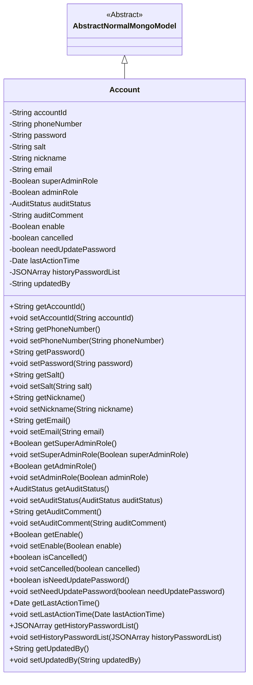

# 基础信息

|      |      |
|------|------|
| 名称 | Account |
| 编码语言 | .java |
| 代码路径 | WeFe/common/java/common-data-mongodb/src/main/java/com/welab/wefe/common/data/mongodb/entity/manager/Account.java |
| 包名 | com.welab.wefe.common.data.mongodb.entity.manager |
| 依赖项 | ['com.alibaba.fastjson.JSONArray', 'com.welab.wefe.common.data.mongodb.constant.MongodbTable', 'com.welab.wefe.common.data.mongodb.entity.base.AbstractNormalMongoModel', 'com.welab.wefe.common.wefe.enums.AuditStatus', 'org.springframework.data.mongodb.core.mapping.Document', 'javax.persistence.EnumType', 'javax.persistence.Enumerated', 'java.util.Date', 'java.util.UUID'] |
| 概述说明 | MongoDB账户类，包含ID、手机号、密码、盐、昵称、邮箱、管理员角色、审核状态、可用性、注销状态、密码更新需求、最后活动时间、历史密码和更新人信息。 |

# 说明

这是一个MongoDB账户实体类，包含账户ID、手机号、密码、盐值、昵称、邮箱等基本信息。同时记录管理员角色、审核状态、可用状态、注销状态、密码更新需求、最后活动时间、历史密码列表及更新人信息。提供所有字段的getter和setter方法。

# 类列表 Class Summary

| 名称   | 类型  | 说明 |
|-------|------|-------------|
| Account | class | MongoDB账户类，包含ID、手机号、密码、盐、昵称、邮箱、管理员角色、审核状态、可用性、注销状态、密码更新标志、最后活动时间、历史密码和更新人信息。 |

## 类 Account

|      |      |
|------|------|
| 访问范围 | @Document(collection = MongodbTable.ACCOUNT);public |
| 类型 | class |
| 名称 | Account |
| 说明 | MongoDB账户类，包含ID、手机号、密码、盐、昵称、邮箱、管理员角色、审核状态、可用性、注销状态、密码更新标志、最后活动时间、历史密码和更新人信息。 |

### UML类图

类图描述：Account类继承自AbstractNormalMongoModel抽象类，表示MongoDB中的账户文档结构。包含账户ID、手机号、密码、盐值、昵称、邮箱等基本信息，以及管理员角色标识、审核状态、账户状态等业务字段。所有字段均为私有属性，通过公共getter/setter方法访问，符合JavaBean规范。类通过@Document注解关联MongoDB集合，体现了ORM映射关系。

### 内部方法调用关系图

```mermaid
graph TD
    A["类Account"]
    B["继承: AbstractNormalMongoModel"]
    C["注解: @Document(collection=MongodbTable.ACCOUNT)"]
    D["属性: String accountId"]
    E["属性: String phoneNumber"]
    F["属性: String password"]
    G["属性: String salt"]
    H["属性: String nickname"]
    I["属性: String email"]
    J["属性: Boolean superAdminRole"]
    K["属性: Boolean adminRole"]
    L["属性: AuditStatus auditStatus"]
    M["属性: String auditComment"]
    N["属性: Boolean enable"]
    O["属性: boolean cancelled"]
    P["属性: boolean needUpdatePassword"]
    Q["属性: Date lastActionTime"]
    R["属性: JSONArray historyPasswordList"]
    S["属性: String updatedBy"]
    T["方法: getAccountId/setAccountId"]
    U["方法: getPhoneNumber/setPhoneNumber"]
    V["方法: getPassword/setPassword"]
    W["方法: getSalt/setSalt"]
    X["方法: getNickname/setNickname"]
    Y["方法: getEmail/setEmail"]
    Z["方法: getSuperAdminRole/setSuperAdminRole"]
    AA["方法: getAdminRole/setAdminRole"]
    AB["方法: getAuditStatus/setAuditStatus"]
    AC["方法: getAuditComment/setAuditComment"]
    AD["方法: getEnable/setEnable"]
    AE["方法: isCancelled/setCancelled"]
    AF["方法: isNeedUpdatePassword/setNeedUpdatePassword"]
    AG["方法: getLastActionTime/setLastActionTime"]
    AH["方法: getHistoryPasswordList/setHistoryPasswordList"]
    AI["方法: getUpdatedBy/setUpdatedBy"]

    A --> B
    A --> C
    A --> D
    A --> E
    A --> F
    A --> G
    A --> H
    A --> I
    A --> J
    A --> K
    A --> L
    A --> M
    A --> N
    A --> O
    A --> P
    A --> Q
    A --> R
    A --> S
    A --> T
    A --> U
    A --> V
    A --> W
    A --> X
    A --> Y
    A --> Z
    A --> AA
    A --> AB
    A --> AC
    A --> AD
    A --> AE
    A --> AF
    A --> AG
    A --> AH
    A --> AI
```

这段代码定义了一个MongoDB的Account实体类，继承自AbstractNormalMongoModel，包含账户ID、手机号、密码、盐值、昵称、邮箱等基本属性，以及管理员角色、审核状态、账户状态等业务属性。每个属性都有对应的getter和setter方法，用于数据的存取操作。类通过@Document注解指定了对应的MongoDB集合名称。

### 字段列表 Field List

| 名称  | 类型  | 说明 |
|-------|-------|------|
| email | String | 私有字符串类型变量email |
| auditComment | String | 私有字符串类型变量，用于存储审核意见。 |
| accountId = UUID.randomUUID().toString().replaceAll("-", "") | String | 生成随机无连字符的UUID作为账户ID。 |
| cancelled | boolean | 布尔变量cancelled，表示是否已取消。 |
| updatedBy | String | 字段updatedBy记录最后更新者信息。 |
| auditStatus | AuditStatus | 枚举类型字段auditStatus，使用字符串形式存储。 |
| needUpdatePassword | boolean | 布尔变量needUpdatePassword表示是否需要更新密码。 |
| phoneNumber | String | 定义私有字符串变量phoneNumber。 |
| enable | Boolean | 布尔类型变量enable，用于控制功能开关状态。 |
| nickname | String | 声明一个私有字符串变量nickname。 |
| salt | String | 声明一个私有字符串变量salt。 |
| adminRole | Boolean | 私有布尔类型变量，标识是否为管理员角色。 |
| historyPasswordList | JSONArray | 私有JSON数组存储历史密码列表。 |
| lastActionTime | Date | 私有成员变量，记录最后一次操作的时间，类型为Date。 |
| superAdminRole | Boolean | 私有布尔类型变量，标识是否为超级管理员角色。 |
| password | String | 私有字符串类型密码变量。 |

### 方法列表

| 名称  | 类型  | 说明 |
|-------|-------|------|
| getPhoneNumber | String | 获取电话号码的方法，返回字符串phoneNumber。 |
| setEnable | void | 设置启用状态的公共方法，参数为布尔值enable，用于更新当前对象的enable属性。 |
| getPassword | String | 获取密码方法，返回字符串类型密码值。 |
| getLastActionTime | Date | 获取最后操作时间的日期对象。 |
| setPassword | void | 设置密码方法，将输入字符串赋值给类成员变量password。 |
| setNeedUpdatePassword | void | 设置密码更新标志的方法，参数决定是否需要更新密码。 |
| getSalt | String | 获取salt值的公共方法。 |
| setAuditStatus | void | 设置审计状态的方法，将传入的auditStatus赋值给当前对象的auditStatus属性。 |
| isCancelled | boolean | 检查任务是否已取消，返回布尔值cancelled的状态。 |
| isNeedUpdatePassword | boolean | 该方法返回一个布尔值，表示是否需要更新密码。 |
| setNickname | void | 设置用户昵称的方法，将输入参数赋值给对象的nickname属性。 |
| getAccountId | String | 获取accountId的公共方法，返回字符串类型的accountId。 |
| getAuditComment | String | 获取审计评语的方法，返回auditComment字符串。 |
| setEmail | void | 这是一个Java方法，用于设置对象的email属性。方法接收一个字符串参数email，并将其赋值给当前对象的email字段。 |
| setLastActionTime | void | 设置对象的上次操作时间为指定日期。 |
| getEmail | String | 获取email字符串的方法。 |
| getHistoryPasswordList | JSONArray | 这是一个Java方法，返回名为historyPasswordList的JSONArray对象。 |
| setHistoryPasswordList | void | 方法设置历史密码列表，参数为JSON数组。 |
| getUpdatedBy | String | 方法getUpdatedBy返回updatedBy字段的值。 |
| setUpdatedBy | void | 设置更新者方法，参数为字符串updatedBy，赋值给成员变量updatedBy。 |
| setCancelled | void | 设置取消状态的公共方法，参数为布尔值cancelled，用于更新内部状态。 |
| getAuditStatus | AuditStatus | 获取审核状态的方法，返回auditStatus变量值。 |
| setSalt | void | 方法setSalt用于设置字符串类型的salt值。 |
| getAdminRole | Boolean | 该方法返回一个布尔值，表示是否具有管理员角色。 |
| setAdminRole | void | 设置管理员角色的方法，接受布尔参数并赋值给成员变量adminRole。 |
| setSuperAdminRole | void | 设置用户是否为超级管理员角色的方法。 |
| setAuditComment | void | 这是一个Java方法，用于设置auditComment属性的值。方法接受一个字符串参数auditComment，并将其赋值给类的同名成员变量。 |
| getNickname | String | 获取昵称的方法，返回字符串类型变量nickname。 |
| setAccountId | void | 设置账户ID的方法，将参数accountId赋值给当前对象的accountId属性。 |
| getEnable | Boolean | 这是一个Java方法，返回布尔类型的enable变量值。 |
| setPhoneNumber | void | 这是一个Java方法，用于设置类中的电话号码属性。方法接收一个字符串参数phoneNumber，并将其赋值给类的成员变量。 |
| getSuperAdminRole | Boolean | 获取超级管理员角色状态的方法，返回布尔值。 |

