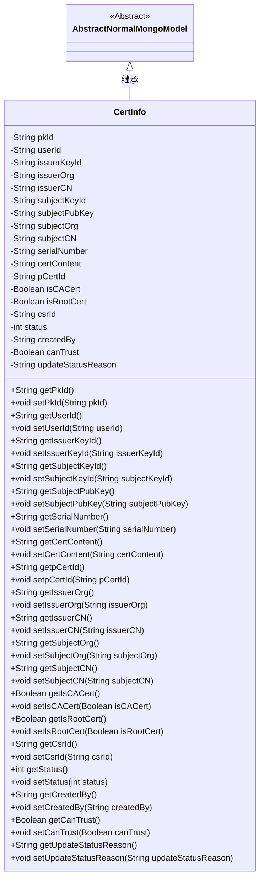

# 基础信息

|      |      |
|------|------|
| 名称 | CertInfo |
| 编码语言 | .java |
| 代码路径 | WeFe/common/java/common-data-mongodb/src/main/java/com/welab/wefe/common/data/mongodb/entity/manager/CertInfo.java |
| 包名 | com.welab.wefe.common.data.mongodb.entity.manager |
| 依赖项 | ['java.util.UUID', 'javax.persistence.Column', 'org.springframework.data.mongodb.core.mapping.Document', 'com.welab.wefe.common.data.mongodb.constant.MongodbTable', 'com.welab.wefe.common.data.mongodb.entity.base.AbstractNormalMongoModel'] |
| 概述说明 | CertInfo类用于存储证书信息，包含主键ID、用户ID、签发机构与申请人信息、证书内容、状态等字段，支持MongoDB存储。 |

# 说明

CertInfo类是一个MongoDB文档模型，用于存储证书信息。包含主键ID、用户ID、签发机构私钥ID和组织信息、申请人私钥ID和公钥内容及组织信息、证书序列号、证书内容、父证书ID、是否为CA或根证书标志、证书请求ID、状态、创建人、信任标志及状态更新原因等字段。所有字段均有对应的getter和setter方法。

# 类列表 Class Summary

| 名称   | 类型  | 说明 |
|-------|------|-------------|
| CertInfo | class | CertInfo类存储证书信息，包含用户ID、签发机构、申请人、证书内容、状态等字段，用于MongoDB数据库操作。 |

## 类 CertInfo

|      |      |
|------|------|
| 访问范围 | @Document(collection = MongodbTable.CERT_INFO);public |
| 类型 | class |
| 名称 | CertInfo |
| 说明 | CertInfo类存储证书信息，包含用户ID、签发机构、申请人、证书内容、状态等字段，用于MongoDB数据库操作。 |

### UML类图

这段代码定义了一个名为`CertInfo`的类，用于表示证书信息，继承自抽象类`AbstractNormalMongoModel`。该类包含多个私有字段，如证书ID、用户ID、签发机构信息、申请人信息、证书内容等，并提供了相应的getter和setter方法。`CertInfo`类主要用于存储和管理证书相关的数据，适用于MongoDB数据库存储。通过继承`AbstractNormalMongoModel`，该类可能还包含一些通用的MongoDB模型方法和属性。

### 内部方法调用关系图

```mermaid
graph TD
    A["类CertInfo"]
    B["继承: AbstractNormalMongoModel"]
    C["注解: @Document(collection = MongodbTable.CERT_INFO)"]
    D["属性: String pkId"]
    E["属性: String userId"]
    F["属性: String issuerKeyId"]
    G["属性: String issuerOrg"]
    H["属性: String issuerCN"]
    I["属性: String subjectKeyId"]
    J["属性: String subjectPubKey"]
    K["属性: String subjectOrg"]
    L["属性: String subjectCN"]
    M["属性: String serialNumber"]
    N["属性: String certContent"]
    O["属性: String pCertId"]
    P["属性: Boolean isCACert"]
    Q["属性: Boolean isRootCert"]
    R["属性: String csrId"]
    S["属性: int status"]
    T["属性: String createdBy"]
    U["属性: Boolean canTrust"]
    V["属性: String updateStatusReason"]
    W["方法: getPkId/setPkId"]
    X["方法: getUserId/setUserId"]
    Y["方法: getIssuerKeyId/setIssuerKeyId"]
    Z["方法: getSubjectKeyId/setSubjectKeyId"]
    AA["方法: getSubjectPubKey/setSubjectPubKey"]
    AB["方法: getSerialNumber/setSerialNumber"]
    AC["方法: getCertContent/setCertContent"]
    AD["方法: getpCertId/setpCertId"]
    AE["方法: getIssuerOrg/setIssuerOrg"]
    AF["方法: getIssuerCN/setIssuerCN"]
    AG["方法: getSubjectOrg/setSubjectOrg"]
    AH["方法: getSubjectCN/setSubjectCN"]
    AI["方法: getIsCACert/setIsCACert"]
    AJ["方法: getIsRootCert/setIsRootCert"]
    AK["方法: getCsrId/setCsrId"]
    AL["方法: getStatus/setStatus"]
    AM["方法: getCreatedBy/setCreatedBy"]
    AN["方法: getCanTrust/setCanTrust"]
    AO["方法: getUpdateStatusReason/setUpdateStatusReason"]

    A --> B
    A --> C
    A --> D
    A --> E
    A --> F
    A --> G
    A --> H
    A --> I
    A --> J
    A --> K
    A --> L
    A --> M
    A --> N
    A --> O
    A --> P
    A --> Q
    A --> R
    A --> S
    A --> T
    A --> U
    A --> V
    A --> W
    A --> X
    A --> Y
    A --> Z
    A --> AA
    A --> AB
    A --> AC
    A --> AD
    A --> AE
    A --> AF
    A --> AG
    A --> AH
    A --> AI
    A --> AJ
    A --> AK
    A --> AL
    A --> AM
    A --> AN
    A --> AO
```

该流程图展示了CertInfo类的完整结构，包含其继承关系、类注解、22个属性和对应的getter/setter方法。作为MongoDB文档模型，它通过@Document注解关联到CERT_INFO集合，并继承了AbstractNormalMongoModel的基础功能。属性涵盖证书核心信息（如签发机构、申请人、序列号）、状态控制字段（如status、canTrust）以及元数据（如创建人、更新时间）。所有属性都配有标准的访问器方法，形成完整的POJO结构。

### 字段列表 Field List

| 名称  | 类型  | 说明 |
|-------|-------|------|
| issuerCN | String | 私有字符串变量issuerCN，用于存储颁发者通用名。 |
| issuerKeyId | String | 私有字符串变量issuerKeyId，用于存储发行者密钥标识。 |
| subjectKeyId | String | 私有字符串变量，存储主题密钥标识。 |
| serialVersionUID = 2536000530329139954L | long | 定义了一个私有静态不可变长整型序列化版本号2536000530329139954L。 |
| isCACert | Boolean | 数据库字段映射：isCACert对应表列is_ca_cert，布尔类型。 |
| subjectPubKey | String | 声明一个私有字符串变量subjectPubKey。 |
| issuerOrg | String | 声明一个私有字符串变量issuerOrg，用于存储发行方组织信息。 |
| certContent | String | 私有字符串变量certContent，用于存储证书内容。 |
| createdBy | String | 私有字符串变量，记录创建者信息。 |
| isRootCert | Boolean | 该字段表示是否为根证书，布尔类型。 |
| status | int | 私有整型变量status，用于表示状态。 |
| subjectCN | String | 私有字符串变量，存储主题中文名称。 |
| pkId = UUID.randomUUID().toString().replaceAll("-", "") | String | 生成随机UUID并去除横杠作为唯一ID。 |
| updateStatusReason | String | 数据库字段映射：update_status_reason，类型为字符串。 |
| subjectOrg | String | 声明一个私有字符串变量subjectOrg。 |
| userId | String | 声明一个私有字符串变量userId。 |
| canTrust | Boolean | 私有布尔变量，表示是否可信。 |
| serialNumber | String | 私有字符串变量serialNumber |
| pCertId | String | 私有字符串变量pCertId，用于存储证书ID。 |
| csrId | String | 私有字符串变量csrId，用于存储CSR标识。 |

### 方法列表

| 名称  | 类型  | 说明 |
|-------|-------|------|
| getCreatedBy | String | 获取创建者信息的方法，返回字符串类型变量createdBy。 |
| getStatus | int | 方法返回状态值status。 |
| getSubjectOrg | String | 获取subjectOrg字符串的方法。 |
| setSubjectKeyId | void | 设置主题密钥ID的方法，将输入字符串赋值给类的成员变量subjectKeyId。 |
| getUserId | String | 获取用户ID的方法，返回字符串类型的userId。 |
| setSubjectCN | void | 设置主题通用名称的方法，参数为字符串类型，赋值给类的成员变量subjectCN。 |
| getSerialNumber | String | 获取序列号的方法，返回字符串类型的serialNumber。 |
| setCreatedBy | void | 这是一个Java方法，用于设置createdBy属性的值。方法接收一个字符串参数createdBy，并将其赋值给当前对象的同名属性。 |
| getIsRootCert | Boolean | 获取根证书状态的方法，返回布尔值isRootCert。 |
| setStatus | void | 设置状态值的方法，将输入参数status赋值给对象的status属性。 |
| getIssuerCN | String | 获取颁发者通用名的方法，返回字符串issuerCN。 |
| setPkId | void | 设置主键ID的方法，将参数pkId赋值给类的pkId属性。 |
| getSubjectCN | String | 获取主题CN的字符串值。 |
| setUserId | void | 设置用户ID的方法，将输入字符串赋值给类的userId成员变量。 |
| setIsRootCert | void | 设置根证书状态的方法，参数为布尔值。 |
| setIssuerKeyId | void | 设置颁发者密钥ID的方法，将输入字符串赋值给类成员变量issuerKeyId。 |
| getIssuerKeyId | String | 获取发行者密钥ID的方法，返回字符串issuerKeyId。 |
| getPkId | String | 获取主键ID的方法，返回pkId字段值。 |
| getCsrId | String | 获取csrId的公共方法。 |
| getSubjectPubKey | String | 获取主题公钥的方法，返回字符串类型。 |
| setIssuerOrg | void | 设置发证机构名称的方法，将参数issuerOrg赋值给当前对象的同名属性。 |
| setSerialNumber | void | 这是一个Java方法，用于设置对象的序列号属性。方法接收一个字符串参数serialNumber，并将其赋值给对象的serialNumber成员变量。 |
| setSubjectOrg | void | 设置主题组织的方法，将输入字符串赋值给类的subjectOrg成员变量。 |
| setpCertId | void | 这是一个Java方法，用于设置对象的pCertId属性值。方法接收一个字符串参数pCertId，并将其赋值给当前对象的同名成员变量。 |
| setCertContent | void | 设置证书内容的方法，将输入字符串赋值给类成员变量certContent。 |
| setCsrId | void | 设置CSR ID的方法，将输入参数csrId赋值给当前对象的csrId字段。 |
| getCertContent | String | 方法返回证书内容字符串。 |
| getSubjectKeyId | String | 获取主题密钥ID的方法，返回字符串类型的subjectKeyId。 |
| getIsCACert | Boolean | 这是一个Java方法，返回布尔类型的isCACert值，表示是否为CA证书。 |
| getCanTrust | Boolean | 方法返回布尔值canTrust，表示是否可信。 |
| setCanTrust | void | 这是一个Java方法，用于设置布尔类型的canTrust属性值。 |
| getUpdateStatusReason | String | 获取更新状态原因的方法，返回字符串类型的updateStatusReason。 |
| setUpdateStatusReason | void | 设置更新状态原因的方法，将输入参数赋值给类成员变量updateStatusReason。 |
| setSubjectPubKey | void | 设置主题公钥的方法，将输入字符串赋值给类的subjectPubKey成员变量。 |
| setIssuerCN | void | 设置颁发者通用名称的方法，将参数issuerCN赋值给类成员变量issuerCN。 |
| setIsCACert | void | 设置证书是否为CA证书的方法，参数为布尔值。 |
| getIssuerOrg | String | 这是一个Java方法，返回名为issuerOrg的字符串变量值。 |
| getpCertId | String | 方法返回字符串类型的pCertId值。 |

