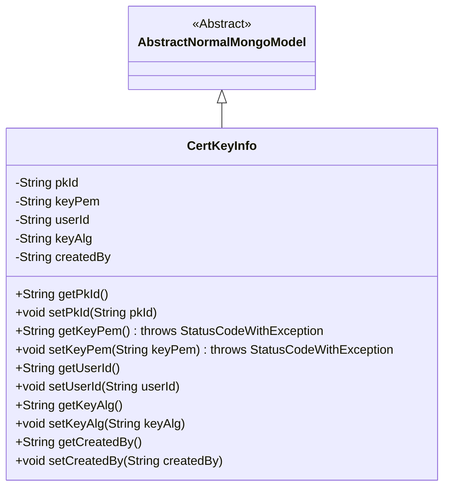

# 基础信息

|      |      |
|------|------|
| 名称 | CertKeyInfo |
| 编码语言 | .java |
| 代码路径 | WeFe/common/java/common-data-mongodb/src/main/java/com/welab/wefe/common/data/mongodb/entity/manager/CertKeyInfo.java |
| 包名 | com.welab.wefe.common.data.mongodb.entity.manager |
| 依赖项 | ['java.util.UUID', 'org.springframework.data.mongodb.core.mapping.Document', 'com.welab.wefe.common.data.mongodb.constant.MongodbTable', 'com.welab.wefe.common.data.mongodb.entity.base.AbstractNormalMongoModel', 'com.welab.wefe.common.exception.StatusCodeWithException'] |
| 概述说明 | CertKeyInfo类存储MongoDB证书密钥信息，包含主键ID、私钥PEM、用户ID、私钥算法和创建人字段，提供各属性的getter和setter方法。 |

# 说明

这是一个名为CertKeyInfo的MongoDB文档类，用于存储证书密钥信息。类中包含五个主要字段：pkId作为主键，使用UUID生成并去除横线；keyPem存储私钥的PEM格式内容；userId关联用户标识；keyAlg记录私钥算法；createdBy记录创建者信息。所有字段均提供标准的getter和setter方法，其中keyPem的读写操作可能抛出StatusCodeWithException异常。该类继承自AbstractNormalMongoModel，并标注为存储在MongodbTable.CERT_KEY_INFO集合中。

# 类列表 Class Summary

| 名称   | 类型  | 说明 |
|-------|------|-------------|
| CertKeyInfo | class | CertKeyInfo类存储MongoDB证书密钥信息，包含主键ID、私钥PEM、用户ID、算法和创建人字段及其getter/setter方法。 |

## 类 CertKeyInfo

|      |      |
|------|------|
| 访问范围 | @Document(collection = MongodbTable.CERT_KEY_INFO);public |
| 类型 | class |
| 名称 | CertKeyInfo |
| 说明 | CertKeyInfo类存储MongoDB证书密钥信息，包含主键ID、私钥PEM、用户ID、算法和创建人字段及其getter/setter方法。 |

### UML类图

该类图展示了CertKeyInfo类继承自AbstractNormalMongoModel抽象类，表示一个MongoDB文档模型。CertKeyInfo包含5个私有字段：pkId（主键）、keyPem（私钥内容）、userId（用户ID）、keyAlg（私钥算法）和createdBy（创建人），并为每个字段提供了getter和setter方法。其中keyPem字段的getter和setter方法可能抛出StatusCodeWithException异常。该类通过继承获得了MongoDB模型的基本功能，用于存储证书密钥相关信息。

### 内部方法调用关系图

```mermaid
graph TD
    A["类CertKeyInfo"]
    B["继承: AbstractNormalMongoModel"]
    C["属性: String pkId"]
    D["属性: String keyPem"]
    E["属性: String userId"]
    F["属性: String keyAlg"]
    G["属性: String createdBy"]
    H["方法: getPkId()"]
    I["方法: setPkId(String pkId)"]
    J["方法: getKeyPem()"]
    K["方法: setKeyPem(String keyPem)"]
    L["方法: getUserId()"]
    M["方法: setUserId(String userId)"]
    N["方法: getKeyAlg()"]
    O["方法: setKeyAlg(String keyAlg)"]
    P["方法: getCreatedBy()"]
    Q["方法: setCreatedBy(String createdBy)"]

    A --> B
    A --> C
    A --> D
    A --> E
    A --> F
    A --> G
    A --> H
    A --> I
    A --> J
    A --> K
    A --> L
    A --> M
    A --> N
    A --> O
    A --> P
    A --> Q
```

该流程图展示了CertKeyInfo类的结构，该类继承自AbstractNormalMongoModel，包含5个私有属性和对应的getter/setter方法。pkId属性在初始化时通过UUID生成并格式化，keyPem和setKeyPem方法可能抛出StatusCodeWithException异常。整体结构清晰，体现了MongoDB文档模型的基本特征，属性用于存储证书密钥相关信息。

### 字段列表 Field List

| 名称  | 类型  | 说明 |
|-------|-------|------|
| userId | String | 声明一个私有字符串变量userId。 |
| createdBy | String | 私有字符串变量，记录创建者信息。 |
| keyPem | String | 私有字符串变量keyPem，用于存储PEM格式的密钥。 |
| keyAlg | String | 私有字符串变量，存储密钥算法类型。 |
| pkId = UUID.randomUUID().toString().replaceAll("-", "") | String | 生成随机UUID作为主键ID并去除连字符。 |
| serialVersionUID = -7731011364389900165L | long | 声明一个私有静态不可变的序列化版本ID，值为-7731011364389900165L。 |

### 方法列表

| 名称  | 类型  | 说明 |
|-------|-------|------|
| getUserId | String | 获取用户ID的方法，返回字符串类型的userId。 |
| getPkId | String | 获取主键ID的方法，返回pkId字符串。 |
| setKeyPem | void | 设置密钥PEM字符串，可能抛出StatusCodeWithException异常。 |
| getKeyPem | String | 获取密钥PEM字符串，可能抛出StatusCodeWithException异常。 |
| setKeyAlg | void | 定义方法setKeyAlg，用于设置成员变量keyAlg的值。 |
| getCreatedBy | String | 这是一个Java方法，返回字符串类型的createdBy字段值。 |
| setCreatedBy | void | Java方法：设置创建者字段值。 |
| getKeyAlg | String | 获取密钥算法的字符串方法，返回keyAlg变量值。 |
| setUserId | void | 设置用户ID的方法，将参数userId赋值给当前对象的userId属性。 |
| setPkId | void | 设置主键ID的方法，将参数pkId赋值给类的pkId属性。 |

