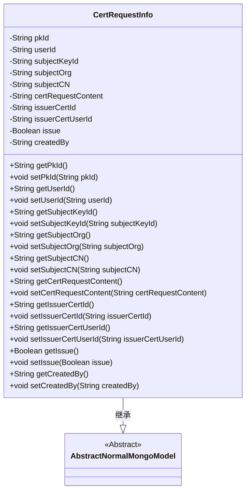

# 基础信息

|      |      |
|------|------|
| 名称 | CertRequestInfo |
| 编码语言 | .java |
| 代码路径 | WeFe/common/java/common-data-mongodb/src/main/java/com/welab/wefe/common/data/mongodb/entity/manager/CertRequestInfo.java |
| 包名 | com.welab.wefe.common.data.mongodb.entity.manager |
| 依赖项 | ['java.util.UUID', 'org.springframework.data.mongodb.core.mapping.Document', 'com.welab.wefe.common.data.mongodb.constant.MongodbTable', 'com.welab.wefe.common.data.mongodb.entity.base.AbstractNormalMongoModel'] |
| 概述说明 | CertRequestInfo类用于存储证书申请信息，包含用户ID、私钥ID、组织名称、常用名、申请内容、签发机构证书ID、签发状态及创建人等字段。 |

# 说明

CertRequestInfo类是一个MongoDB文档模型，用于存储证书请求信息。它继承自AbstractNormalMongoModel，包含主键ID、用户ID、申请人私钥ID、组织名称、常用名、证书申请内容、签发机构证书ID和用户ID、是否签发标志以及创建人等字段。所有字段均提供getter和setter方法，主键ID默认生成无横线的UUID字符串。

# 类列表 Class Summary

| 名称   | 类型  | 说明 |
|-------|------|-------------|
| CertRequestInfo | class | CertRequestInfo类存储证书申请信息，包含用户ID、申请人私钥ID、组织名称、常用名、申请内容、签发机构证书ID、签发状态及创建人等字段。 |

## 类 CertRequestInfo

|      |      |
|------|------|
| 访问范围 | @Document(collection = MongodbTable.CERT_REQUEST_INFO);public |
| 类型 | class |
| 名称 | CertRequestInfo |
| 说明 | CertRequestInfo类存储证书申请信息，包含用户ID、申请人私钥ID、组织名称、常用名、申请内容、签发机构证书ID、签发状态及创建人等字段。 |

### UML类图

这段类图展示了CertRequestInfo类继承自AbstractNormalMongoModel抽象类，表示一个MongoDB中的证书请求信息文档模型。该类包含多个私有字段用于存储证书请求相关信息，如用户ID、申请人信息、证书内容、签发状态等，并为每个字段提供了公有的getter和setter方法。通过@Document注解指定了该模型对应的MongoDB集合名称，体现了该类的持久化特性。

### 内部方法调用关系图

```mermaid
graph TD
    A["类CertRequestInfo"]
    B["继承: AbstractNormalMongoModel"]
    C["注解: @Document(collection=MongodbTable.CERT_REQUEST_INFO)"]
    D["属性: String pkId"]
    E["属性: String userId"]
    F["属性: String subjectKeyId"]
    G["属性: String subjectOrg"]
    H["属性: String subjectCN"]
    I["属性: String certRequestContent"]
    J["属性: String issuerCertId"]
    K["属性: String issuerCertUserId"]
    L["属性: Boolean issue"]
    M["属性: String createdBy"]
    N["方法: getPkId()/setPkId()"]
    O["方法: getUserId()/setUserId()"]
    P["方法: getSubjectKeyId()/setSubjectKeyId()"]
    Q["方法: getSubjectOrg()/setSubjectOrg()"]
    R["方法: getSubjectCN()/setSubjectCN()"]
    S["方法: getCertRequestContent()/setCertRequestContent()"]
    T["方法: getIssuerCertId()/setIssuerCertId()"]
    U["方法: getIssuerCertUserId()/setIssuerCertUserId()"]
    V["方法: getIssue()/setIssue()"]
    W["方法: getCreatedBy()/setCreatedBy()"]

    A --> B
    A --> C
    A --> D
    A --> E
    A --> F
    A --> G
    A --> H
    A --> I
    A --> J
    A --> K
    A --> L
    A --> M
    A --> N
    A --> O
    A --> P
    A --> Q
    A --> R
    A --> S
    A --> T
    A --> U
    A --> V
    A --> W
```

该流程图展示了CertRequestInfo类的完整结构，该类继承自AbstractNormalMongoModel并标注了MongoDB集合映射注解。类包含12个私有属性（如pkId、userId等）和对应的getter/setter方法，用于管理证书请求信息。所有属性和方法均通过层级关系清晰呈现，反映了该实体类的数据封装特性。

### 字段列表 Field List

| 名称  | 类型  | 说明 |
|-------|-------|------|
| issuerCertUserId | String | 声明一个私有字符串变量issuerCertUserId，用于存储证书颁发者用户ID。 |
| serialVersionUID = 7150886210876056683L | long | 声明一个私有静态不可变的序列化ID，值为7150886210876056683L。 |
| userId | String | 私有字符串类型用户ID |
| certRequestContent | String | 私有字符串变量certRequestContent，用于存储证书请求内容。 |
| subjectOrg | String | 声明一个私有字符串变量subjectOrg。 |
| issuerCertId | String | 声明一个私有字符串变量issuerCertId，用于存储证书颁发者ID。 |
| createdBy | String | 私有字符串变量，记录创建者信息。 |
| issue | Boolean | 布尔类型私有变量issue，用于表示问题状态。 |
| subjectCN | String | 定义私有字符串变量subjectCN。 |
| subjectKeyId | String | 私有字符串变量subjectKeyId，用于存储主题密钥标识。 |
| pkId = UUID.randomUUID().toString().replaceAll("-", "") | String | 生成随机UUID字符串并移除横杠，存储为pkId。 |

### 方法列表

| 名称  | 类型  | 说明 |
|-------|-------|------|
| getSubjectOrg | String | 获取subjectOrg字符串的方法。 |
| getSubjectKeyId | String | 获取subjectKeyId的方法，返回字符串类型的subjectKeyId值。 |
| setSubjectKeyId | void | 设置主题密钥ID的方法，将输入字符串赋值给类的成员变量subjectKeyId。 |
| setIssuerCertId | void | 设置颁发者证书ID的方法，将参数issuerCertId赋值给类的成员变量issuerCertId。 |
| setIssuerCertUserId | void | 设置颁发者证书用户ID的方法，将参数值赋给类成员变量issuerCertUserId。 |
| getPkId | String | 获取主键ID的方法，返回pkId字段值。 |
| setPkId | void | 设置主键ID的方法，将参数pkId赋值给类的pkId成员变量。 |
| setUserId | void | 设置用户ID的方法，将参数userId赋值给当前对象的userId属性。 |
| setSubjectCN | void | 这是一个Java方法，用于设置类的subjectCN属性值。方法接收一个字符串参数subjectCN，并将其赋值给类的同名成员变量。 |
| getSubjectCN | String | 获取主题CN的方法，返回字符串类型变量subjectCN。 |
| setSubjectOrg | void | 这是一个Java方法，用于设置成员变量subjectOrg的值。方法接收一个字符串参数，并将其赋值给当前对象的subjectOrg属性。 |
| getIssuerCertUserId | String | 获取颁发者证书用户ID的方法，返回字符串类型值issuerCertUserId。 |
| setCertRequestContent | void | 设置证书请求内容的方法，将输入参数赋值给类成员变量certRequestContent。 |
| getIssuerCertId | String | 获取颁发者证书ID的方法，返回issuerCertId字符串。 |
| getCertRequestContent | String | 该方法返回证书请求内容字符串。 |
| getUserId | String | 获取用户ID的方法，返回字符串类型的userId。 |
| getIssue | Boolean | 这是一个Java方法，返回布尔类型的issue变量值。 |
| setIssue | void | 这是一个Java方法，用于设置布尔类型的issue属性值。方法名为setIssue，接受一个Boolean参数，并将其赋值给类的成员变量issue。 |
| getCreatedBy | String | 获取创建者信息的方法，返回字符串类型变量createdBy。 |
| setCreatedBy | void | 设置创建者属性的方法，参数为字符串类型。 |

