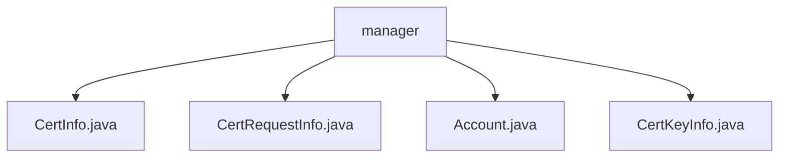

# 基础信息

|      |      |
|------|------|
| 名称 | manager |
| 编码语言 | .java |
| 代码路径 | WeFe/common/java/common-data-mongodb/src/main/java/com/welab/wefe/common/data/mongodb/entity/manager |
| 包名 | docs.common.java.common-data-mongodb.src.main.java.com.welab.wefe.common.data.mongodb.entity.manager |
| 概述说明 | CertInfo类存储证书信息，含ID、用户ID、公私钥、序列号等内容。CertRequestInfo类存储证书请求信息，继承AbstractNormalMongoModel，含ID、用户ID等字段。Account类存储账户信息，含ID、手机号、密码等。CertKeyInfo类存储证书密钥信息，含主键、私钥PEM等字段。 |

# 说明

## 概述  
该模块是面向证书管理的MongoDB数据模型集合，核心职责为存储证书全生命周期数据（如密钥、请求、签发信息）及关联账户信息。接口规范统一采用标准getter/setter模式，例如CertInfo提供证书内容存取方法，CertRequestInfo支持申请状态查询。关键数据结构包括证书信息（含CA标志、序列号）、密钥PEM格式内容、账户基础信息（如三态标记）等。外部依赖仅为MongoDB，通过AbstractNormalMongoModel实现基础CRUD功能。

## 主要业务场景  
模块支持证书签发全流程管理，类似PKI体系：用户通过Account实体认证后，CertRequestInfo提交申请，CertKeyInfo存储密钥对，最终由CertInfo记录签发结果。典型交互如CA机构审核请求后更新状态标志。功能覆盖密钥生成（例如RSA算法PEM存储）、证书链追溯（通过父证书ID）、账户安全控制（如历史密码校验）。集成案例包括证书签发API、账户状态同步等。

### 包内部结构视图

该流程图展示了manager目录下的四个Java文件：CertInfo.java、CertRequestInfo.java、Account.java和CertKeyInfo.java。这些文件都直接隶属于manager目录，没有更深层的嵌套结构。整个结构简洁明了，反映了manager目录中存储的四个实体类文件。

# 文件列表

| 名称   | 类型  | 说明 |
|-------|------|-------------|
| [CertInfo.java](CertInfo.md) | file | CertInfo类用于存储证书信息，包含主键ID、用户ID、签发机构与申请人信息、证书内容、状态等字段，支持MongoDB存储。 |
| [CertRequestInfo.java](CertRequestInfo.md) | file | CertRequestInfo类用于存储证书申请信息，包含用户ID、私钥ID、组织名称、常用名、申请内容、签发机构证书ID、签发状态及创建人等字段。 |
| [Account.java](Account.md) | file | MongoDB账户类，包含ID、手机号、密码、盐、昵称、邮箱、管理员角色、审核状态、可用性、注销状态、密码更新需求、最后活动时间、历史密码和更新人信息。 |
| [CertKeyInfo.java](CertKeyInfo.md) | file | CertKeyInfo类存储MongoDB证书密钥信息，包含主键ID、私钥PEM、用户ID、私钥算法和创建人字段，提供各属性的getter和setter方法。 |

