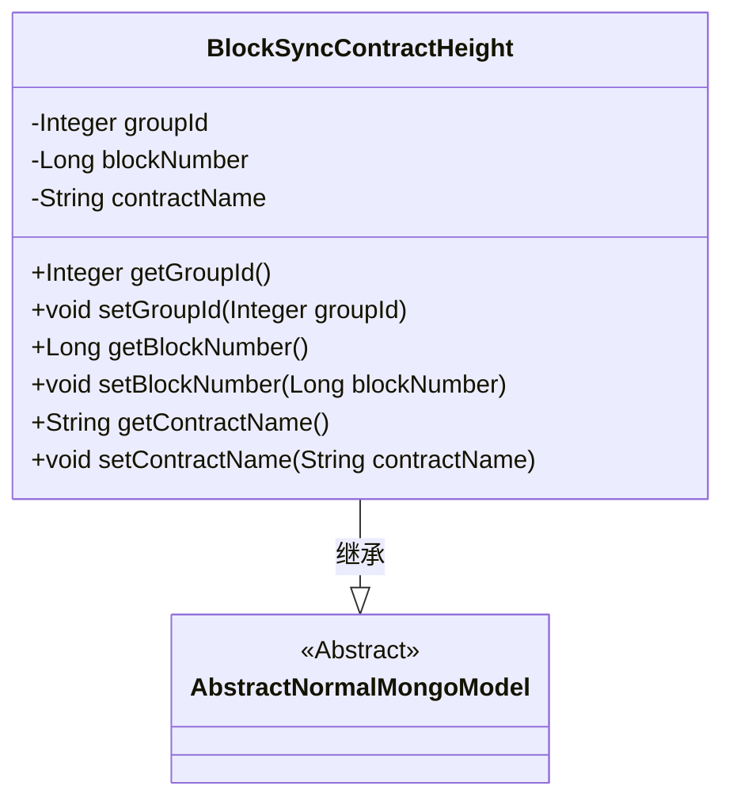

# 基础信息

|      |      |
|------|------|
| 名称 | BlockSyncContractHeight |
| 编码语言 | .java |
| 代码路径 | WeFe/common/java/common-data-mongodb/src/main/java/com/welab/wefe/common/data/mongodb/entity/union/BlockSyncContractHeight.java |
| 包名 | com.welab.wefe.common.data.mongodb.entity.union |
| 依赖项 | ['com.welab.wefe.common.data.mongodb.constant.MongodbTable', 'com.welab.wefe.common.data.mongodb.entity.base.AbstractNormalMongoModel', 'org.springframework.data.mongodb.core.mapping.Document'] |
| 概述说明 | MongoDB实体类BlockSyncContractHeight，包含groupId、blockNumber和contractName字段，用于存储区块同步合约高度信息。 |

# 说明

这是一个名为BlockSyncContractHeight的Java类，用于表示MongoDB集合BLOCK_SYNC_CONTRACT_HEIGHT中的文档结构。该类继承自AbstractNormalMongoModel，包含三个私有字段：groupId（整数类型）、blockNumber（长整型）和contractName（字符串类型）。每个字段都有对应的getter和setter方法，用于访问和修改字段值。该类主要用于存储区块同步时合约的高度信息。

# 类列表 Class Summary

| 名称   | 类型  | 说明 |
|-------|------|-------------|
| BlockSyncContractHeight | class | BlockSyncContractHeight类用于存储区块同步合约高度信息，包含groupId、blockNumber和contractName字段及其getter/setter方法。 |

## 类 BlockSyncContractHeight

|      |      |
|------|------|
| 访问范围 | @Document(collection = MongodbTable.Union.BLOCK_SYNC_CONTRACT_HEIGHT);public |
| 类型 | class |
| 名称 | BlockSyncContractHeight |
| 说明 | BlockSyncContractHeight类用于存储区块同步合约高度信息，包含groupId、blockNumber和contractName字段及其getter/setter方法。 |

### UML类图

这段类图描述了一个MongoDB实体类BlockSyncContractHeight，它继承自抽象基类AbstractNormalMongoModel。该类包含三个私有字段：groupId（整数类型）、blockNumber（长整型）和contractName（字符串类型），并为每个字段提供了标准的getter和setter方法。通过@Document注解指定了该实体对应的MongoDB集合名称，体现了该类的持久化特性，用于存储区块同步过程中合约的高度信息。

### 内部方法调用关系图

```mermaid
graph TD
    A["类BlockSyncContractHeight"]
    B["注解: @Document(collection = MongodbTable.Union.BLOCK_SYNC_CONTRACT_HEIGHT)"]
    C["继承: AbstractNormalMongoModel"]
    D["属性: Integer groupId"]
    E["属性: Long blockNumber"]
    F["属性: String contractName"]
    G["方法: getGroupId()"]
    H["方法: setGroupId(Integer)"]
    I["方法: getBlockNumber()"]
    J["方法: setBlockNumber(Long)"]
    K["方法: getContractName()"]
    L["方法: setContractName(String)"]

    A --> B
    A --> C
    A --> D
    A --> E
    A --> F
    A --> G
    A --> H
    A --> I
    A --> J
    A --> K
    A --> L
```

该流程图展示了BlockSyncContractHeight类的结构，它是一个继承自AbstractNormalMongoModel的MongoDB文档类，带有特定集合名称的注解。类包含三个私有属性（groupId、blockNumber、contractName）及其对应的getter和setter方法。所有方法均直接关联到主类，没有内部调用关系，结构清晰体现了POJO类的典型特征。

### 字段列表 Field List

| 名称  | 类型  | 说明 |
|-------|-------|------|
| blockNumber | Long | 私有长整型变量，存储区块编号。 |
| contractName | String | 私有字符串变量contractName，用于存储合约名称。 |
| groupId | Integer | 私有整型变量groupId，用于标识组别编号。 |

### 方法列表

| 名称  | 类型  | 说明 |
|-------|-------|------|
| setContractName | void | Java方法：设置合同名称，将参数contractName赋值给类成员变量this.contractName。 |
| setBlockNumber | void | 设置区块号的方法，将输入参数赋值给对象的blockNumber属性。 |
| setGroupId | void | 这是一个Java方法，用于设置对象的groupId属性，接受一个Integer类型参数。 |
| getContractName | String | 获取合约名称的方法，返回字符串类型变量contractName。 |
| getGroupId | Integer | 获取分组ID的方法，返回整数类型的groupId。 |
| getBlockNumber | Long | 获取区块编号的方法，返回长整型数值blockNumber。 |

