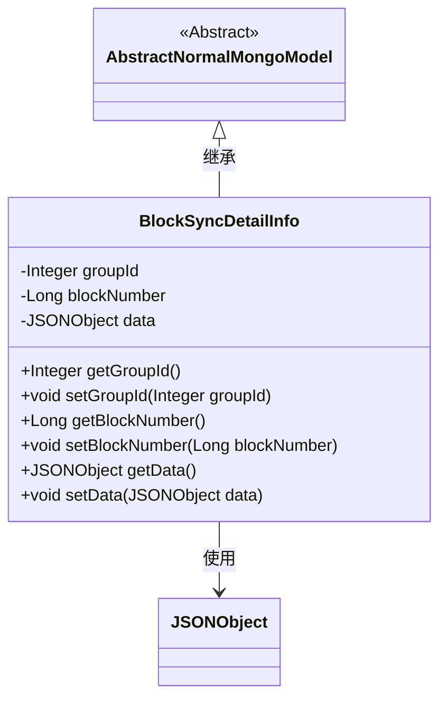
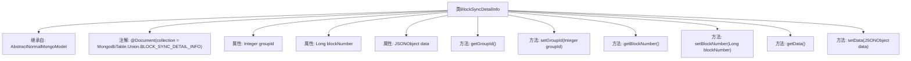

# 基础信息

|      |      |
|------|------|
| 名称 | BlockSyncDetailInfo |
| 编码语言 | .java |
| 代码路径 | WeFe/common/java/common-data-mongodb/src/main/java/com/welab/wefe/common/data/mongodb/entity/union/BlockSyncDetailInfo.java |
| 包名 | com.welab.wefe.common.data.mongodb.entity.union |
| 依赖项 | ['com.alibaba.fastjson.JSONObject', 'com.welab.wefe.common.data.mongodb.constant.MongodbTable', 'com.welab.wefe.common.data.mongodb.entity.base.AbstractNormalMongoModel', 'org.springframework.data.mongodb.core.mapping.Document'] |
| 概述说明 | MongoDB实体类BlockSyncDetailInfo，包含groupId、blockNumber和data字段，用于存储区块同步详细信息。 |

# 说明

这是一个名为BlockSyncDetailInfo的Java类，用于MongoDB数据库中的BLOCK_SYNC_DETAIL_INFO集合。它继承自AbstractNormalMongoModel基类，包含三个主要属性：groupId表示组ID的整型字段，blockNumber表示区块编号的长整型字段，以及data存储JSON数据的JSONObject字段。类中为每个属性提供了标准的getter和setter方法。该类使用@Document注解指定了对应的MongoDB集合名称。

# 类列表 Class Summary

| 名称   | 类型  | 说明 |
|-------|------|-------------|
| BlockSyncDetailInfo | class | MongoDB实体类BlockSyncDetailInfo，包含groupId、blockNumber和data字段，用于存储区块同步详细信息。 |

## 类 BlockSyncDetailInfo

|      |      |
|------|------|
| 访问范围 | @Document(collection = MongodbTable.Union.BLOCK_SYNC_DETAIL_INFO);public |
| 类型 | class |
| 名称 | BlockSyncDetailInfo |
| 说明 | MongoDB实体类BlockSyncDetailInfo，包含groupId、blockNumber和data字段，用于存储区块同步详细信息。 |

### UML类图

类图描述：该图展示了一个MongoDB实体类BlockSyncDetailInfo的结构，它继承自抽象基类AbstractNormalMongoModel，包含groupId、blockNumber和data三个私有字段及其对应的getter/setter方法。其中data字段使用JSONObject类型存储结构化数据，通过依赖关系与JSONObject类关联。类注解@Document表明这是MongoDB集合的映射实体，用于存储区块同步详细信息。

### 内部方法调用关系图

该流程图展示了BlockSyncDetailInfo类的结构，该类继承自AbstractNormalMongoModel，并使用@Document注解指定MongoDB集合名称。类包含三个私有属性：groupId、blockNumber和data，分别用于存储整数类型的组ID、长整型的区块编号和JSON格式的数据对象。类提供了这些属性的getter和setter方法，用于属性的读取和修改。流程图清晰地反映了类的继承关系、注解使用以及属性与方法的关联。

### 字段列表 Field List

| 名称  | 类型  | 说明 |
|-------|-------|------|
| blockNumber | Long | 区块号，长整型私有变量。 |
| groupId | Integer | 私有整型变量groupId，用于存储组标识符。 |
| data | JSONObject | 私有JSON对象数据 |

### 方法列表

| 名称  | 类型  | 说明 |
|-------|-------|------|
| getGroupId | Integer | 获取分组ID的方法，返回整数类型的groupId。 |
| getData | JSONObject | 获取并返回JSONObject类型的数据对象。 |
| setBlockNumber | void | 这是一个Java方法，用于设置对象的blockNumber属性值。方法接收一个Long类型参数，并将其赋值给对象的成员变量blockNumber。 |
| setGroupId | void | 设置整数类型的组ID值。 |
| getBlockNumber | Long | 获取区块编号的方法，返回类型为长整型。 |
| setData | void | 设置JSON对象数据的方法。 |

