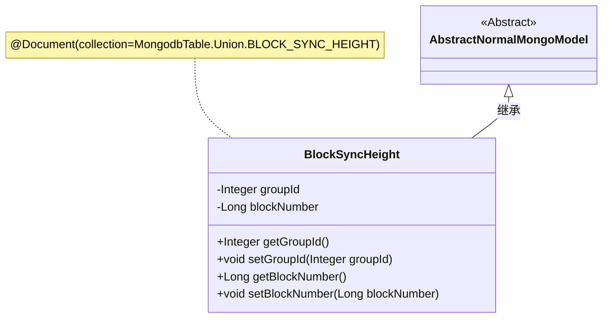
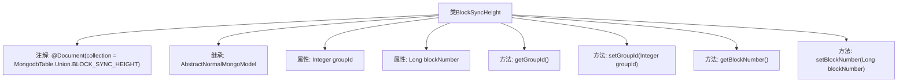

# 基础信息

|      |      |
|------|------|
| 名称 | BlockSyncHeight |
| 编码语言 | .java |
| 代码路径 | WeFe/common/java/common-data-mongodb/src/main/java/com/welab/wefe/common/data/mongodb/entity/union/BlockSyncHeight.java |
| 包名 | com.welab.wefe.common.data.mongodb.entity.union |
| 依赖项 | ['com.welab.wefe.common.data.mongodb.constant.MongodbTable', 'com.welab.wefe.common.data.mongodb.entity.base.AbstractNormalMongoModel', 'org.springframework.data.mongodb.core.mapping.Document'] |
| 概述说明 | Java类BlockSyncHeight用于存储区块同步高度信息，包含groupId和blockNumber字段及其getter/setter方法。 |

# 说明

这是一个名为BlockSyncHeight的Java类，用于MongoDB数据库中的BLOCK_SYNC_HEIGHT集合。它继承自AbstractNormalMongoModel，包含两个私有字段：groupId（整数类型）和blockNumber（长整型）。类中为这两个字段提供了标准的getter和setter方法，用于获取和设置字段值。该类通过@Document注解指定了对应的MongoDB集合名称。

# 类列表 Class Summary

| 名称   | 类型  | 说明 |
|-------|------|-------------|
| BlockSyncHeight | class | BlockSyncHeight类用于MongoDB存储区块同步高度信息，包含groupId和blockNumber字段及其getter/setter方法。 |

## 类 BlockSyncHeight

|      |      |
|------|------|
| 访问范围 | @Document(collection = MongodbTable.Union.BLOCK_SYNC_HEIGHT);public |
| 类型 | class |
| 名称 | BlockSyncHeight |
| 说明 | BlockSyncHeight类用于MongoDB存储区块同步高度信息，包含groupId和blockNumber字段及其getter/setter方法。 |

### UML类图

该代码定义了一个名为BlockSyncHeight的MongoDB文档实体类，继承自AbstractNormalMongoModel抽象类。类中包含groupId和blockNumber两个私有字段，分别表示组ID和区块高度，并提供了对应的getter/setter方法。通过@Document注解指定了该实体在MongoDB中的集合名称，体现了与MongodbTable配置的关联关系。这个类主要用于存储和同步区块链的区块高度信息，是数据持久层的核心组件之一。

### 内部方法调用关系图

这段代码定义了一个名为BlockSyncHeight的MongoDB文档类，继承自AbstractNormalMongoModel基类。类中包含两个核心属性：groupId（整数类型）和blockNumber（长整型），分别用于存储群组ID和区块高度值。通过getter和setter方法提供对这两个属性的访问和修改能力。类级别的@Document注解指定了该文档在MongoDB中的集合名称，表明这是一个用于记录区块同步高度的数据模型。整个类结构简洁，专注于维护区块链同步过程中的关键高度信息。

### 字段列表 Field List

| 名称  | 类型  | 说明 |
|-------|-------|------|
| blockNumber | Long | 私有长整型变量blockNumber，用于存储区块编号。 |
| groupId | Integer | 私有整型变量groupId，用于标识组别。 |

### 方法列表

| 名称  | 类型  | 说明 |
|-------|-------|------|
| getBlockNumber | Long | 获取区块编号的方法，返回长整型数值blockNumber。 |
| getGroupId | Integer | 获取分组ID的方法，返回整数类型的groupId。 |
| setGroupId | void | 设置组ID的方法，将参数groupId赋值给类的成员变量groupId。 |
| setBlockNumber | void | 设置区块号方法，将输入参数赋值给对象的blockNumber属性。 |

