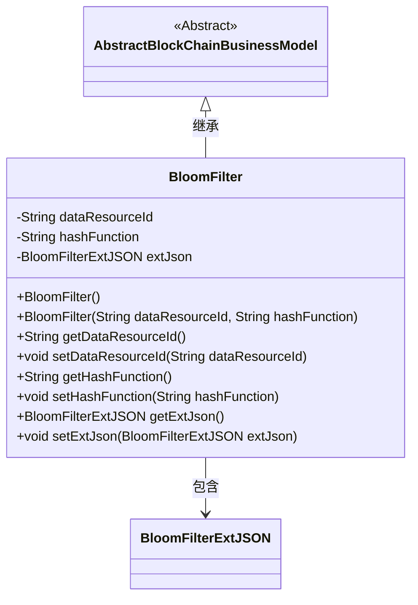

# 基础信息

|      |      |
|------|------|
| 名称 | BloomFilter |
| 编码语言 | .java |
| 代码路径 | WeFe/common/java/common-data-mongodb/src/main/java/com/welab/wefe/common/data/mongodb/entity/union/BloomFilter.java |
| 包名 | com.welab.wefe.common.data.mongodb.entity.union |
| 依赖项 | ['com.welab.wefe.common.data.mongodb.constant.MongodbTable', 'com.welab.wefe.common.data.mongodb.entity.base.AbstractBlockChainBusinessModel', 'com.welab.wefe.common.data.mongodb.entity.union.ext.BloomFilterExtJSON', 'com.welab.wefe.common.data.mongodb.entity.union.ext.DataResourceExtJSON', 'org.springframework.data.mongodb.core.mapping.Document'] |
| 概述说明 | BloomFilter类继承AbstractBlockChainBusinessModel，包含dataResourceId、hashFunction和extJson属性，提供构造方法和getter/setter。 |

# 说明

该内容描述了一个名为BloomFilter的Java类，继承自AbstractBlockChainBusinessModel，用于MongoDB集合MongodbTable.Union.BLOOM_FILTER。类包含私有字段dataResourceId和hashFunction，以及BloomFilterExtJSON类型的extJson对象。提供了无参和有参构造函数，以及各字段的getter和setter方法。

# 类列表 Class Summary

| 名称   | 类型  | 说明 |
|-------|------|-------------|
| BloomFilter | class | BloomFilter类继承AbstractBlockChainBusinessModel，包含dataResourceId、hashFunction属性和extJson对象，提供构造方法和getter/setter。 |

## 类 BloomFilter

|      |      |
|------|------|
| 访问范围 | @Document(collection = MongodbTable.Union.BLOOM_FILTER);public |
| 类型 | class |
| 名称 | BloomFilter |
| 说明 | BloomFilter类继承AbstractBlockChainBusinessModel，包含dataResourceId、hashFunction属性和extJson对象，提供构造方法和getter/setter。 |

### UML类图

这段代码描述了一个布隆过滤器类BloomFilter，它继承自抽象类AbstractBlockChainBusinessModel。BloomFilter包含三个主要私有字段：dataResourceId、hashFunction和extJson（BloomFilterExtJSON类型），提供了构造方法和相应的getter/setter方法。该类通过extJson字段与BloomFilterExtJSON类形成组合关系，用于存储扩展的JSON数据。整体设计体现了区块链业务模型的基础结构，通过继承和组合实现功能扩展。

### 内部方法调用关系图

```mermaid
graph TD
    A["类BloomFilter"]
    B["注解: @Document(collection = MongodbTable.Union.BLOOM_FILTER)"]
    C["继承: AbstractBlockChainBusinessModel"]
    D["属性: String dataResourceId"]
    E["属性: String hashFunction"]
    F["属性: BloomFilterExtJSON extJson"]
    G["构造方法: BloomFilter()"]
    H["构造方法: BloomFilter(String dataResourceId, String hashFunction)"]
    I["方法: getDataResourceId()"]
    J["方法: setDataResourceId(String dataResourceId)"]
    K["方法: getHashFunction()"]
    L["方法: setHashFunction(String hashFunction)"]
    M["方法: getExtJson()"]
    N["方法: setExtJson(BloomFilterExtJSON extJson)"]

    A --> B
    A --> C
    A --> D
    A --> E
    A --> F
    A --> G
    A --> H
    A --> I
    A --> J
    A --> K
    A --> L
    A --> M
    A --> N
```

该流程图展示了BloomFilter类的完整结构，包括类注解、继承关系、属性字段、构造方法和成员方法。该类被标注为MongoDB文档类型，继承自AbstractBlockChainBusinessModel，包含三个核心属性（dataResourceId、hashFunction和extJson），提供无参和有参两种构造方式，并为每个属性实现了标准的getter/setter方法。extJson属性使用BloomFilterExtJSON类进行封装，体现了组合设计模式。

### 字段列表 Field List

| 名称  | 类型  | 说明 |
|-------|-------|------|
| extJson = new BloomFilterExtJSON() | BloomFilterExtJSON | 创建私有布隆过滤器扩展JSON对象实例。 |
| dataResourceId | String | 私有字符串类型变量dataResourceId |
| hashFunction | String | 私有字符串变量hashFunction，用于存储哈希函数名称。 |

### 方法列表

| 名称  | 类型  | 说明 |
|-------|-------|------|
| setHashFunction | void | Java方法：设置哈希函数字符串参数。 |
| setDataResourceId | void | 设置数据资源ID的方法，将输入参数赋值给类的成员变量dataResourceId。 |
| getDataResourceId | String | 获取数据资源ID的方法，返回字符串类型的dataResourceId。 |
| setExtJson | void | 方法setExtJson用于设置BloomFilterExtJSON类型的extJson属性值。 |
| getHashFunction | String | 获取哈希函数名称的方法。 |
| getExtJson | BloomFilterExtJSON | 获取BloomFilterExtJSON类型的extJson对象。 |

