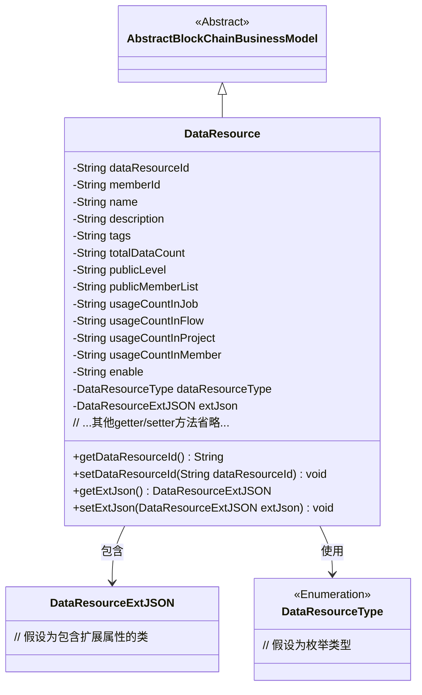

# 基础信息

|      |      |
|------|------|
| 名称 | DataResource |
| 编码语言 | .java |
| 代码路径 | WeFe/common/java/common-data-mongodb/src/main/java/com/welab/wefe/common/data/mongodb/entity/union/DataResource.java |
| 包名 | com.welab.wefe.common.data.mongodb.entity.union |
| 依赖项 | ['com.welab.wefe.common.data.mongodb.constant.MongodbTable', 'com.welab.wefe.common.data.mongodb.entity.base.AbstractBlockChainBusinessModel', 'com.welab.wefe.common.data.mongodb.entity.union.ext.DataResourceExtJSON', 'com.welab.wefe.common.wefe.enums.DataResourceType', 'org.springframework.data.mongodb.core.mapping.Document'] |
| 概述说明 | DataResource类存储MongoDB数据资源信息，包含ID、名称、描述、标签、数据量、公开级别、使用统计及扩展JSON等属性。 |

# 说明

DataResource类是一个MongoDB文档模型，继承自AbstractBlockChainBusinessModel，对应Union.DATA_RESOURCE集合。该类包含数据资源ID、成员ID、名称、描述、标签、总数据量、公开级别、公开成员列表等核心属性。还记录了在作业、流程、项目和成员中的使用次数，以及启用状态和资源类型。扩展信息通过DataResourceExtJSON对象存储。所有属性均提供getter和setter方法，支持灵活的数据操作与业务逻辑处理。

# 类列表 Class Summary

| 名称   | 类型  | 说明 |
|-------|------|-------------|
| DataResource | class | DataResource类表示MongoDB中的数据资源，包含ID、名称、描述、标签、数据量、公开级别、使用统计等属性，继承自AbstractBlockChainBusinessModel。 |

## 类 DataResource

|      |      |
|------|------|
| 访问范围 | @Document(collection = MongodbTable.Union.DATA_RESOURCE);public |
| 类型 | class |
| 名称 | DataResource |
| 说明 | DataResource类表示MongoDB中的数据资源，包含ID、名称、描述、标签、数据量、公开级别、使用统计等属性，继承自AbstractBlockChainBusinessModel。 |

### UML类图

该代码定义了一个区块链数据资源模型类，继承自抽象基类AbstractBlockChainBusinessModel。类中包含数据资源ID、所属成员ID、名称、描述等核心属性，以及使用统计、公开级别等业务字段，并通过DataResourceExtJSON实现扩展属性存储。所有字段均通过getter/setter方法访问，符合JavaBean规范，且通过枚举类型DataResourceType限定资源类型。

### 内部方法调用关系图

```mermaid
graph TD
    A["类DataResource"]
    B["继承: AbstractBlockChainBusinessModel"]
    C["注解: @Document(collection = MongodbTable.Union.DATA_RESOURCE)"]
    D["属性: String dataResourceId"]
    E["属性: String memberId"]
    F["属性: String name"]
    G["属性: String description"]
    H["属性: String tags"]
    I["属性: String totalDataCount"]
    J["属性: String publicLevel"]
    K["属性: String publicMemberList"]
    L["属性: String usageCountInJob"]
    M["属性: String usageCountInFlow"]
    N["属性: String usageCountInProject"]
    O["属性: String usageCountInMember"]
    P["属性: String enable"]
    Q["属性: DataResourceType dataResourceType"]
    R["属性: DataResourceExtJSON extJson"]
    S["Getter/Setter方法组"]
    T["getDataResourceId/setDataResourceId"]
    U["getMemberId/setMemberId"]
    V["getName/setName"]
    W["getDescription/setDescription"]
    X["getTags/setTags"]
    Y["getTotalDataCount/setTotalDataCount"]
    Z["getPublicLevel/setPublicLevel"]
    AA["getPublicMemberList/setPublicMemberList"]
    AB["getUsageCountInJob/setUsageCountInJob"]
    AC["getUsageCountInFlow/setUsageCountInFlow"]
    AD["getUsageCountInProject/setUsageCountInProject"]
    AE["getUsageCountInMember/setUsageCountInMember"]
    AF["getEnable/setEnable"]
    AG["getDataResourceType/setDataResourceType"]
    AH["getExtJson/setExtJson"]

    A --> B
    A --> C
    A --> D
    A --> E
    A --> F
    A --> G
    A --> H
    A --> I
    A --> J
    A --> K
    A --> L
    A --> M
    A --> N
    A --> O
    A --> P
    A --> Q
    A --> R
    A --> S
    S --> T
    S --> U
    S --> V
    S --> W
    S --> X
    S --> Y
    S --> Z
    S --> AA
    S --> AB
    S --> AC
    S --> AD
    S --> AE
    S --> AF
    S --> AG
    S --> AH
```

该流程图展示了DataResource类的完整结构，包含其继承关系、MongoDB文档注解、14个字符串类型属性、1个枚举类型属性和1个自定义对象属性，以及对应的16组Getter/Setter方法。类继承自AbstractBlockChainBusinessModel，表明这是一个区块链业务模型，通过@Document注解映射到MongoDB的DATA_RESOURCE集合。所有属性均为私有字段，通过公共方法提供访问接口，符合JavaBean规范。

### 字段列表 Field List

| 名称  | 类型  | 说明 |
|-------|-------|------|
| usageCountInFlow | String | 私有字符串变量usageCountInFlow，用于记录流程中的使用次数。 |
| extJson = new DataResourceExtJSON() | DataResourceExtJSON | 定义私有变量extJson，初始化为DataResourceExtJSON类的新实例。 |
| enable | String | 私有字符串变量enable，用于控制功能开关状态。 |
| usageCountInProject | String | 项目内使用次数字符串变量。 |
| tags | String | 私有字符串变量tags，用于存储标签信息。 |
| memberId | String | 成员ID字符串变量 |
| publicLevel | String | 私有字符串变量publicLevel，用于存储公开级别信息。 |
| dataResourceType | DataResourceType | 私有数据资源类型变量dataResourceType。 |
| description | String | 私有字符串类型变量description |
| usageCountInJob | String | 私有字符串变量，记录作业中的使用次数。 |
| usageCountInMember | String | 成员变量usageCountInMember，字符串类型，用于记录使用次数。 |
| publicMemberList | String | 私有字符串变量publicMemberList，用于存储公共成员列表。 |
| dataResourceId | String | 私有字符串类型变量dataResourceId，用于标识数据资源。 |
| totalDataCount | String | 私有字符串变量，用于存储总数据量计数。 |
| name | String | 声明一个私有字符串变量name。 |

### 方法列表

| 名称  | 类型  | 说明 |
|-------|-------|------|
| getUsageCountInJob | String | 获取作业中的使用计数。 |
| setUsageCountInProject | void | 设置项目内使用次数的公共方法。 |
| getDataResourceId | String | 获取数据资源ID的方法，返回字符串类型的数据资源ID。 |
| getUsageCountInMember | String | 获取成员使用次数的方法，返回字符串类型的usageCountInMember值。 |
| getName | String | 这是一个Java方法，返回字符串类型的成员变量name的值。 |
| setPublicLevel | void | 设置公共级别方法，将输入字符串赋值给类的publicLevel成员变量。 |
| setTotalDataCount | void | 设置总数据计数方法，将输入字符串赋值给类变量totalDataCount。 |
| setPublicMemberList | void | 设置公共成员列表的方法，将输入字符串赋值给类的publicMemberList变量。 |
| getTotalDataCount | String | 获取totalDataCount值的公共方法。 |
| getEnable | String | 获取enable值的公共方法，返回字符串类型。 |
| setUsageCountInMember | void | 这是一个Java方法，用于设置成员变量usageCountInMember的值。方法接收一个字符串参数，并将其赋值给类的成员变量。 |
| getUsageCountInProject | String | 获取项目内使用次数的字符串方法。 |
| getExtJson | DataResourceExtJSON | 获取扩展JSON数据资源对象。 |
| getMemberId | String | 方法getMemberId返回成员ID字符串memberId。 |
| setName | void | 设置对象名称的方法，将参数name赋值给对象的name属性。 |
| setEnable | void | Java方法：设置enable属性的字符串值。 |
| getUsageCountInFlow | String | 获取流程使用次数字符串方法。 |
| setDataResourceId | void | 设置数据资源ID的方法，将输入参数赋值给类的成员变量dataResourceId。 |
| setDataResourceType | void | 设置数据资源类型的方法，将输入参数赋值给类的成员变量。 |
| setUsageCountInFlow | void | Java方法：设置流程中的使用次数，参数为字符串类型。 |
| setUsageCountInJob | void | 这是一个Java方法，用于设置作业中的使用次数属性值。方法接收字符串参数并赋值给类成员变量usageCountInJob。 |
| getPublicMemberList | String | 获取公共成员列表的方法，返回字符串类型变量publicMemberList。 |
| setDescription | void | 这是一个Java方法，用于设置对象的描述属性。方法接收一个字符串参数description，并将其赋值给当前对象的description字段。 |
| getPublicLevel | String | 获取publicLevel值的公共方法。 |
| setTags | void | 设置标签字符串。 |
| getDataResourceType | DataResourceType | 获取数据资源类型的方法，返回dataResourceType字段值。 |
| getDescription | String | 获取描述信息的方法，返回字符串类型的description值。 |
| getTags | String | 方法getTags返回字符串tags的值。 |
| setMemberId | void | 设置成员ID的方法，将输入参数赋值给类的成员变量memberId。 |
| setExtJson | void | 设置外部JSON数据对象。 |

