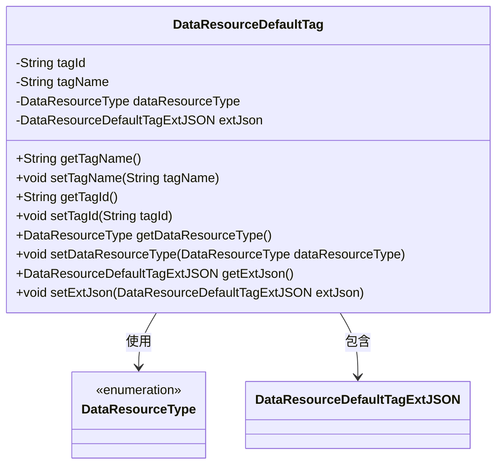

# 基础信息

|      |      |
|------|------|
| 名称 | DataResourceDefaultTag |
| 编码语言 | .java |
| 代码路径 | WeFe/common/java/common-data-mongodb/src/main/java/com/welab/wefe/common/data/mongodb/entity/union/DataResourceDefaultTag.java |
| 包名 | com.welab.wefe.common.data.mongodb.entity.union |
| 依赖项 | ['com.welab.wefe.common.data.mongodb.constant.MongodbTable', 'com.welab.wefe.common.data.mongodb.entity.base.AbstractBlockChainBusinessModel', 'com.welab.wefe.common.data.mongodb.entity.union.ext.DataResourceDefaultTagExtJSON', 'com.welab.wefe.common.wefe.enums.DataResourceType', 'org.springframework.data.mongodb.core.mapping.Document', 'java.util.UUID'] |
| 概述说明 | Java类DataResourceDefaultTag表示MongoDB集合中的默认标签，包含标签ID、名称、资源类型和扩展JSON字段，继承自AbstractBlockChainBusinessModel。 |

# 说明

这是一个名为DataResourceDefaultTag的Java类，用于表示MongoDB集合中的数据资源默认标签。该类继承自AbstractBlockChainBusinessModel，包含四个主要属性：tagId（自动生成的UUID字符串）、tagName（标签名称）、dataResourceType（数据资源类型枚举）和extJson（扩展JSON对象）。类中为每个属性提供了标准的getter和setter方法，支持对这些字段的读写操作。该类映射到MongoDB的指定集合，用于存储和管理数据资源的默认标签信息。

# 类列表 Class Summary

| 名称   | 类型  | 说明 |
|-------|------|-------------|
| DataResourceDefaultTag | class | Java类DataResourceDefaultTag表示MongoDB集合中的默认数据资源标签，包含标签ID、名称、资源类型和扩展JSON属性，继承自AbstractBlockChainBusinessModel。 |

## 类 DataResourceDefaultTag

|      |      |
|------|------|
| 访问范围 | @Document(collection = MongodbTable.Union.DATA_RESOURCE_DEFAULT_TAG);public |
| 类型 | class |
| 名称 | DataResourceDefaultTag |
| 说明 | Java类DataResourceDefaultTag表示MongoDB集合中的默认数据资源标签，包含标签ID、名称、资源类型和扩展JSON属性，继承自AbstractBlockChainBusinessModel。 |

### UML类图

这段代码定义了一个名为DataResourceDefaultTag的类，它继承自AbstractBlockChainBusinessModel（图中未展示）。该类用于表示数据资源的默认标签，包含标签ID、名称、资源类型和扩展JSON信息。其中tagId在初始化时会自动生成UUID并去除连字符，其他字段通过getter/setter方法进行访问和修改。该类与DataResourceType枚举和DataResourceDefaultTagExtJSON类存在关联关系。

### 内部方法调用关系图

```mermaid
graph TD
    A["类DataResourceDefaultTag"]
    B["注解: @Document(collection = MongodbTable.Union.DATA_RESOURCE_DEFAULT_TAG)"]
    C["继承: AbstractBlockChainBusinessModel"]
    D["属性: String tagId = UUID.randomUUID().toString().replaceAll('-', '')"]
    E["属性: String tagName"]
    F["属性: DataResourceType dataResourceType"]
    G["属性: DataResourceDefaultTagExtJSON extJson = new DataResourceDefaultTagExtJSON()"]
    H["方法: String getTagName()"]
    I["方法: void setTagName(String tagName)"]
    J["方法: String getTagId()"]
    K["方法: void setTagId(String tagId)"]
    L["方法: DataResourceType getDataResourceType()"]
    M["方法: void setDataResourceType(DataResourceType dataResourceType)"]
    N["方法: DataResourceDefaultTagExtJSON getExtJson()"]
    O["方法: void setExtJson(DataResourceDefaultTagExtJSON extJson)"]

    A --> B
    A --> C
    A --> D
    A --> E
    A --> F
    A --> G
    A --> H
    A --> I
    A --> J
    A --> K
    A --> L
    A --> M
    A --> N
    A --> O
```

这段代码定义了一个名为DataResourceDefaultTag的类，它继承了AbstractBlockChainBusinessModel类，并使用了MongoDB的@Document注解来指定集合名称。类中包含四个私有属性：tagId（通过UUID生成并去除连字符）、tagName、dataResourceType和extJson（初始化为新的DataResourceDefaultTagExtJSON对象）。为每个属性提供了对应的getter和setter方法，用于访问和修改这些属性的值。这个类主要用于表示数据资源的默认标签信息，其中extJson属性提供了扩展的JSON数据存储能力。

### 字段列表 Field List

| 名称  | 类型  | 说明 |
|-------|-------|------|
| dataResourceType | DataResourceType | 私有数据资源类型变量dataResourceType。 |
| tagName | String | 私有字符串变量，用于存储标签名称。 |
| extJson = new DataResourceDefaultTagExtJSON() | DataResourceDefaultTagExtJSON | 初始化一个默认标签扩展JSON对象实例。 |
| tagId = UUID.randomUUID().toString().replaceAll("-", "") | String | 生成无连字符的随机UUID字符串并赋值给tagId。 |

### 方法列表

| 名称  | 类型  | 说明 |
|-------|-------|------|
| getTagId | String | 获取标签ID的方法，返回字符串类型的tagId。 |
| getTagName | String | 获取标签名称的方法，返回字符串类型的tagName。 |
| getDataResourceType | DataResourceType | 获取数据资源类型的方法，返回dataResourceType。 |
| setTagId | void | 设置标签ID的方法，将输入字符串赋值给对象的tagId属性。 |
| setTagName | void | 这是一个Java方法，用于设置对象的tagName属性值。方法接收一个字符串参数tagName，并将其赋值给当前对象的同名属性。 |
| setDataResourceType | void | 设置数据资源类型的方法，参数为DataResourceType类型，赋值给当前对象的dataResourceType属性。 |
| getExtJson | DataResourceDefaultTagExtJSON | 方法返回DataResourceDefaultTagExtJSON类型的extJson对象。 |
| setExtJson | void | 方法setExtJson用于设置extJson属性，参数为DataResourceDefaultTagExtJSON类型。 |

