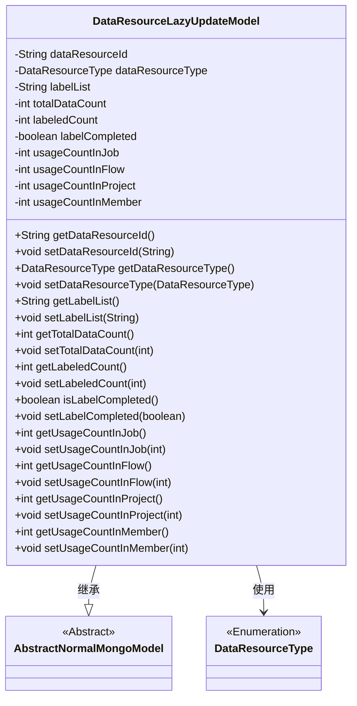

# 基础信息

|      |      |
|------|------|
| 名称 | DataResourceLazyUpdateModel |
| 编码语言 | .java |
| 代码路径 | WeFe/common/java/common-data-mongodb/src/main/java/com/welab/wefe/common/data/mongodb/entity/union/DataResourceLazyUpdateModel.java |
| 包名 | com.welab.wefe.common.data.mongodb.entity.union |
| 依赖项 | ['com.welab.wefe.common.data.mongodb.constant.MongodbTable', 'com.welab.wefe.common.data.mongodb.entity.base.AbstractNormalMongoModel', 'com.welab.wefe.common.wefe.enums.DataResourceType', 'org.springframework.data.mongodb.core.mapping.Document'] |
| 概述说明 | DataResourceLazyUpdateModel类用于记录数据资源的懒更新信息，包含资源ID、类型、标签列表、数据总量、已标记数量、标记完成状态及在作业、流程、项目和成员中的使用次数。 |

# 说明

DataResourceLazyUpdateModel是一个MongoDB集合模型，继承自AbstractNormalMongoModel。它包含数据资源ID、类型、标签列表、总数据量、已标记数量、标记完成状态等属性，并记录在任务、流程、项目和成员中的使用次数。提供了所有属性的getter和setter方法。

# 类列表 Class Summary

| 名称   | 类型  | 说明 |
|-------|------|-------------|
| DataResourceLazyUpdateModel | class | MongoDB数据资源懒更新模型类，包含资源ID、类型、标签列表、数据总量、已标记量、标记完成状态及各类使用计数。 |

## 类 DataResourceLazyUpdateModel

|      |      |
|------|------|
| 访问范围 | @Document(collection = MongodbTable.Union.DATA_RESOURCE_LAZY_UPDATE_MODEL);public |
| 类型 | class |
| 名称 | DataResourceLazyUpdateModel |
| 说明 | MongoDB数据资源懒更新模型类，包含资源ID、类型、标签列表、数据总量、已标记量、标记完成状态及各类使用计数。 |

### UML类图

该类图展示了DataResourceLazyUpdateModel作为MongoDB数据模型的实现细节。它继承自AbstractNormalMongoModel抽象类，包含数据资源ID、类型、标签列表、各类计数状态等核心字段，并通过getter/setter提供完整访问控制。枚举类型DataResourceType被用于标识资源类型，整体设计符合数据持久化层的封装规范。

### 内部方法调用关系图

```mermaid
graph TD
    A["类DataResourceLazyUpdateModel"]
    B["继承: AbstractNormalMongoModel"]
    C["注解: @Document(collection=MongodbTable.Union.DATA_RESOURCE_LAZY_UPDATE_MODEL)"]
    D["属性: String dataResourceId"]
    E["属性: DataResourceType dataResourceType"]
    F["属性: String labelList"]
    G["属性: int totalDataCount"]
    H["属性: int labeledCount"]
    I["属性: boolean labelCompleted"]
    J["属性: int usageCountInJob"]
    K["属性: int usageCountInFlow"]
    L["属性: int usageCountInProject"]
    M["属性: int usageCountInMember"]
    N["方法: get/setDataResourceId"]
    O["方法: get/setDataResourceType"]
    P["方法: get/setLabelList"]
    Q["方法: get/setTotalDataCount"]
    R["方法: get/setLabeledCount"]
    S["方法: is/setLabelCompleted"]
    T["方法: get/setUsageCountInJob"]
    U["方法: get/setUsageCountInFlow"]
    V["方法: get/setUsageCountInProject"]
    W["方法: get/setUsageCountInMember"]

    A --> B
    A --> C
    A --> D
    A --> E
    A --> F
    A --> G
    A --> H
    A --> I
    A --> J
    A --> K
    A --> L
    A --> M
    A --> N
    A --> O
    A --> P
    A --> Q
    A --> R
    A --> S
    A --> T
    A --> U
    A --> V
    A --> W
```

该流程图展示了DataResourceLazyUpdateModel类的完整结构，包括继承关系、类注解、9个私有属性和对应的16个getter/setter方法。这个MongoDB文档模型用于记录数据资源的懒更新状态，包含资源ID、类型、标签列表、数据总量、已标注量、完成状态以及在作业/流程/项目/成员中的使用计数。所有属性都通过标准JavaBean规范进行封装，便于数据库操作和状态跟踪。

### 字段列表 Field List

| 名称  | 类型  | 说明 |
|-------|-------|------|
| usageCountInFlow | int | 私有整型变量，记录流程中的使用次数。 |
| labelCompleted | boolean | 布尔变量labelCompleted，用于标记是否完成标签。 |
| usageCountInJob | int | 私有整型变量，记录作业内使用次数。 |
| usageCountInProject | int | 项目内使用次数计数器 |
| labelList | String | 私有字符串变量labelList，用于存储标签列表。 |
| dataResourceType | DataResourceType | 私有数据资源类型变量dataResourceType。 |
| dataResourceId | String | 私有字符串类型变量dataResourceId，用于标识数据资源。 |
| usageCountInMember | int | 成员变量usageCountInMember，用于记录使用次数，类型为私有整型。 |
| totalDataCount | int | 私有整型变量，用于存储数据总数。 |
| labeledCount | int | 私有整型变量labeledCount，用于记录标记数量。 |

### 方法列表

| 名称  | 类型  | 说明 |
|-------|-------|------|
| getDataResourceId | String | 获取数据资源ID的方法，返回字符串类型的数据资源ID。 |
| setDataResourceId | void | 设置数据资源ID的方法，将输入参数赋值给类的成员变量dataResourceId。 |
| getUsageCountInJob | int | 获取作业中的使用次数。 |
| isLabelCompleted | boolean | 检查标签是否完成的布尔方法，返回labelCompleted状态。 |
| setUsageCountInJob | void | 设置作业中的使用次数变量值。 |
| getLabeledCount | int | 获取已标记数量的方法，返回整型值labeledCount。 |
| setUsageCountInFlow | void | 设置流程内使用次数的公共方法，参数为整型usageCountInFlow。 |
| setUsageCountInProject | void | 设置项目内使用次数的方法，参数为usageCountInProject。 |
| setTotalDataCount | void | 设置总数据计数方法，将输入参数赋值给类变量totalDataCount。 |
| getUsageCountInProject | int | 获取项目内使用次数的整型数值。 |
| getLabelList | String | 这是一个Java方法，返回名为labelList的字符串变量。 |
| setLabelCompleted | void | 设置标签完成状态的方法，参数为布尔值，用于更新内部变量labelCompleted。 |
| getDataResourceType | DataResourceType | 该方法返回数据资源类型对象dataResourceType。 |
| setDataResourceType | void | 设置数据资源类型的方法，将输入参数赋值给类的成员变量。 |
| getTotalDataCount | int | 方法返回总数据计数值。 |
| setUsageCountInMember | void | 这是一个Java方法，用于设置成员变量usageCountInMember的值。方法接受一个整数参数，并将其赋值给当前对象的usageCountInMember属性。 |
| getUsageCountInMember | int | 获取成员使用次数的公共方法，返回整型值usageCountInMember。 |
| setLabelList | void | 定义了一个公共方法setLabelList，用于设置labelList属性的值。参数为字符串labelList。 |
| getUsageCountInFlow | int | 获取流程中的使用次数。 |
| setLabeledCount | void | 设置已标记数量的方法，将输入参数赋值给成员变量labeledCount。 |

