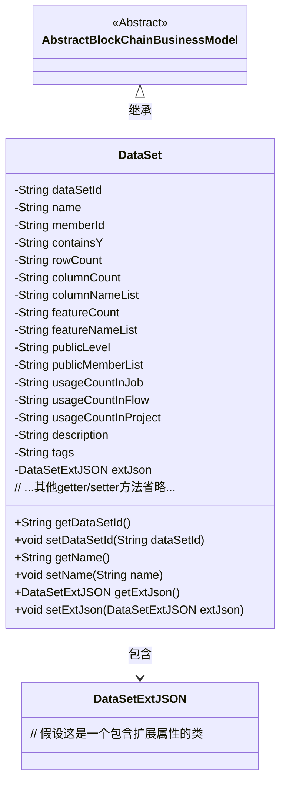

# 基础信息

|      |      |
|------|------|
| 名称 | DataSet |
| 编码语言 | .java |
| 代码路径 | WeFe/common/java/common-data-mongodb/src/main/java/com/welab/wefe/common/data/mongodb/entity/union/DataSet.java |
| 包名 | com.welab.wefe.common.data.mongodb.entity.union |
| 依赖项 | ['com.welab.wefe.common.data.mongodb.constant.MongodbTable', 'com.welab.wefe.common.data.mongodb.entity.base.AbstractBlockChainBusinessModel', 'com.welab.wefe.common.data.mongodb.entity.union.ext.DataSetExtJSON', 'org.springframework.data.mongodb.core.mapping.Document'] |
| 概述说明 | 数据集类，包含ID、名称、成员ID、行列数、特征、公开级别、使用统计、描述、标签等属性，扩展JSON字段。 |

# 说明

DataSet类是一个继承自AbstractBlockChainBusinessModel的MongoDB文档模型，对应Union.DATASET集合。该类包含数据集的核心属性：唯一标识dataSetId、名称name、所属成员memberId、是否包含Y值containsY。结构信息包括行数rowCount、列数columnCount、列名列表columnNameList、特征数featureCount及特征名列表featureNameList。公开属性有公开级别publicLevel和公开成员列表publicMemberList。使用统计包含任务usageCountInJob、流程usageCountInFlow和项目usageCountInProject的引用次数。辅助信息含描述description、标签tags以及扩展JSON对象extJson。所有字段均提供标准的getter/setter方法。

# 类列表 Class Summary

| 名称   | 类型  | 说明 |
|-------|------|-------------|
| DataSet | class | 数据集类，包含ID、名称、成员ID、行列数、特征、公开级别、使用统计、描述和标签等属性，扩展JSON字段。 |

## 类 DataSet

|      |      |
|------|------|
| 访问范围 | @Document(collection = MongodbTable.Union.DATASET);public |
| 类型 | class |
| 名称 | DataSet |
| 说明 | 数据集类，包含ID、名称、成员ID、行列数、特征、公开级别、使用统计、描述和标签等属性，扩展JSON字段。 |

### UML类图

类图描述：
DataSet类继承自AbstractBlockChainBusinessModel抽象类，表示一个区块链业务模型的数据集实体。该类包含15个私有字符串类型字段，分别记录数据集ID、名称、成员ID、是否包含Y值等元数据信息，以及一个DataSetExtJSON类型的扩展属性对象。通过公开的getter和setter方法提供对这些属性的访问和修改能力。类图清晰地展示了继承关系和组合关系，体现了数据集实体的核心属性和关联对象。

### 内部方法调用关系图

```mermaid
graph TD
    A["类DataSet"]
    B["继承: AbstractBlockChainBusinessModel"]
    C["注解: @Document(collection = MongodbTable.Union.DATASET)"]
    D["属性: String dataSetId"]
    E["属性: String name"]
    F["属性: String memberId"]
    G["属性: String containsY"]
    H["属性: String rowCount"]
    I["属性: String columnCount"]
    J["属性: String columnNameList"]
    K["属性: String featureCount"]
    L["属性: String featureNameList"]
    M["属性: String publicLevel"]
    N["属性: String publicMemberList"]
    O["属性: String usageCountInJob"]
    P["属性: String usageCountInFlow"]
    Q["属性: String usageCountInProject"]
    R["属性: String description"]
    S["属性: String tags"]
    T["属性: DataSetExtJSON extJson"]
    U["Getter/Setter方法: 所有属性"]

    A --> B
    A --> C
    A --> D
    A --> E
    A --> F
    A --> G
    A --> H
    A --> I
    A --> J
    A --> K
    A --> L
    A --> M
    A --> N
    A --> O
    A --> P
    A --> Q
    A --> R
    A --> S
    A --> T
    A --> U
```

这段代码定义了一个DataSet类，继承自AbstractBlockChainBusinessModel，并使用@Document注解标记为MongoDB集合。类包含16个String类型属性和1个DataSetExtJSON类型属性，每个属性都有对应的getter和setter方法。该类主要用于表示数据集相关的元数据信息，包括数据集ID、名称、成员ID、行列统计信息、特征信息、公开级别、使用计数等业务属性。

### 字段列表 Field List

| 名称  | 类型  | 说明 |
|-------|-------|------|
| rowCount | String | 私有字符串变量rowCount，用于记录行数。 |
| memberId | String | 声明一个私有字符串变量memberId。 |
| columnNameList | String | 私有字符串变量columnNameList，用于存储列名列表。 |
| usageCountInJob | String | 私有字符串变量，记录作业中的使用次数。 |
| tags | String | 私有字符串变量tags，用于存储标签信息。 |
| publicLevel | String | 私有字符串变量publicLevel，用于存储公共级别信息。 |
| containsY | String | 变量containsY，类型为String，私有访问权限。 |
| name | String | 声明一个私有字符串变量name。 |
| usageCountInFlow | String | 私有字符串变量，记录流程中的使用次数。 |
| extJson = new DataSetExtJSON() | DataSetExtJSON | 定义私有变量extJson，初始化为DataSetExtJSON类实例。 |
| featureNameList | String | 定义了一个私有字符串变量featureNameList。 |
| publicMemberList | String | 私有字符串变量publicMemberList |
| usageCountInProject | String | 项目中的使用次数统计字段。 |
| columnCount | String | 私有字符串变量columnCount，用于存储列数信息。 |
| dataSetId | String | 声明一个私有字符串变量dataSetId。 |
| featureCount | String | 私有字符串变量featureCount，用于存储特征数量。 |
| description | String | 私有字符串类型变量description。 |

### 方法列表

| 名称  | 类型  | 说明 |
|-------|-------|------|
| getName | String | 这是一个Java方法，返回字符串类型的成员变量name的值。 |
| setFeatureNameList | void | 设置特征名称列表的方法，将输入字符串赋值给类的成员变量featureNameList。 |
| getContainsY | String | 这是一个Java方法，返回字符串类型的成员变量containsY的值。 |
| getUsageCountInProject | String | 获取项目中的使用计数。 |
| setFeatureCount | void | 设置特征数量方法，将输入参数赋值给类成员变量featureCount。 |
| setPublicMemberList | void | 这是一个Java方法，用于设置publicMemberList变量的值。方法接收一个字符串参数，并将其赋值给类的成员变量。 |
| setUsageCountInJob | void | 设置作业中使用次数的值。 |
| setMemberId | void | 设置成员ID的方法，将输入参数memberId赋值给当前对象的memberId属性。 |
| getPublicLevel | String | 获取publicLevel值的公共方法。 |
| setColumnCount | void | 方法setColumnCount用于设置columnCount属性的值，参数为字符串类型。 |
| getUsageCountInJob | String | 获取作业内使用次数的字符串方法。 |
| getRowCount | String | 获取行数的方法，返回字符串类型的行数值。 |
| setColumnNameList | void | 设置列名列表的方法，将输入参数赋值给类的成员变量columnNameList。 |
| getColumnCount | String | 获取列数的方法，返回columnCount变量值。 |
| setPublicLevel | void | 这是一个Java方法，用于设置publicLevel属性的值。方法接受一个字符串参数，并将其赋值给类的成员变量publicLevel。 |
| setContainsY | void | 这是一个Java方法，用于设置类成员变量containsY的值。方法接受一个字符串参数，并将其赋值给当前对象的containsY属性。 |
| getMemberId | String | 这是一个Java方法，返回成员ID字符串memberId。 |
| getFeatureCount | String | 获取featureCount值的公共方法。 |
| getDataSetId | String | 获取数据集ID的方法，返回dataSetId字符串。 |
| getColumnNameList | String | 获取列名列表的方法，返回字符串类型变量columnNameList。 |
| setUsageCountInFlow | void | 设置流程内使用次数的字符串值方法。 |
| getUsageCountInFlow | String | 获取流程中的使用次数。 |
| setUsageCountInProject | void | 设置项目内使用次数的公共方法，参数为字符串类型。 |
| getDescription | String | 获取描述信息的方法，返回字符串类型的描述内容。 |
| setDescription | void | 这是一个Java方法，用于设置对象的描述信息。方法接收一个字符串参数description，并将其赋值给对象的description属性。 |
| getTags | String | 方法getTags返回字符串类型的成员变量tags的值。 |
| setTags | void | 设置标签字符串。 |
| getExtJson | DataSetExtJSON | 获取外部JSON数据集方法，返回extJson对象。 |
| setExtJson | void | 方法setExtJson用于设置DataSetExtJSON类型的extJson属性值。 |
| getPublicMemberList | String | 获取公共成员列表的方法，返回字符串类型变量publicMemberList。 |
| setName | void | 设置对象名称的方法，将参数name赋值给对象的name属性。 |
| setRowCount | void | 设置行数的方法，将参数rowCount赋值给类的同名成员变量。 |
| getFeatureNameList | String | 获取特性名称列表的方法，直接返回成员变量featureNameList。 |
| setDataSetId | void | 设置数据集ID的方法，将输入参数赋值给类的dataSetId成员变量。 |

