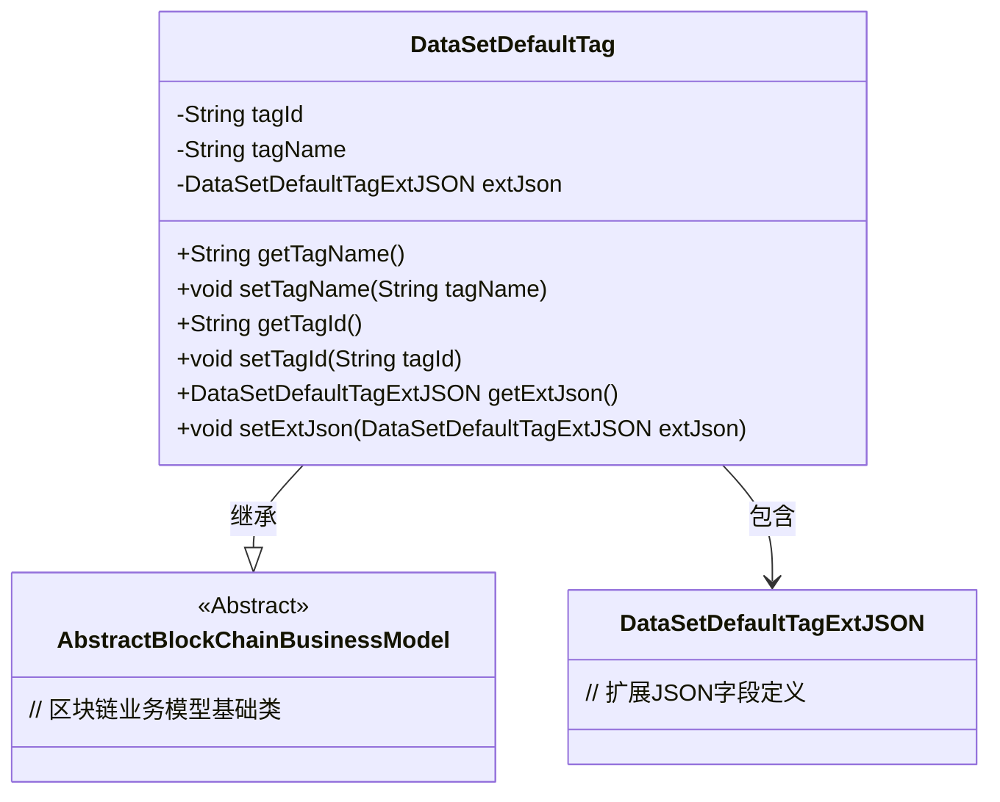
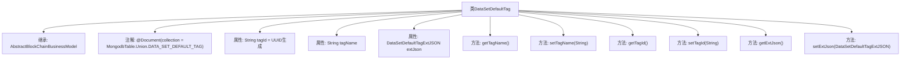

# 基础信息

|      |      |
|------|------|
| 名称 | DataSetDefaultTag |
| 编码语言 | .java |
| 代码路径 | WeFe/common/java/common-data-mongodb/src/main/java/com/welab/wefe/common/data/mongodb/entity/union/DataSetDefaultTag.java |
| 包名 | com.welab.wefe.common.data.mongodb.entity.union |
| 依赖项 | ['com.welab.wefe.common.data.mongodb.constant.MongodbTable', 'com.welab.wefe.common.data.mongodb.entity.base.AbstractBlockChainBusinessModel', 'com.welab.wefe.common.data.mongodb.entity.union.ext.DataSetDefaultTagExtJSON', 'org.springframework.data.mongodb.core.mapping.Document', 'java.util.UUID'] |
| 概述说明 | DataSetDefaultTag类继承AbstractBlockChainBusinessModel，包含tagId、tagName和extJson属性，提供对应的getter和setter方法。tagId默认生成UUID并去除横线。 |

# 说明

DataSetDefaultTag类是一个继承自AbstractBlockChainBusinessModel的MongoDB文档模型，对应集合MongodbTable.Union.DATA_SET_DEFAULT_TAG。该类包含三个主要属性：tagId（自动生成的UUID并去除横线）、tagName（标签名称）和extJson（DataSetDefaultTagExtJSON类型对象）。提供了这些属性的getter和setter方法，用于访问和修改字段值。该模型用于处理区块链业务中数据集默认标签的相关数据。

# 类列表 Class Summary

| 名称   | 类型  | 说明 |
|-------|------|-------------|
| DataSetDefaultTag | class | DataSetDefaultTag类用于MongoDB数据集默认标签存储，包含tagId、tagName和extJson属性，提供getter和setter方法。继承自AbstractBlockChainBusinessModel。 |

## 类 DataSetDefaultTag

|      |      |
|------|------|
| 访问范围 | @Document(collection = MongodbTable.Union.DATA_SET_DEFAULT_TAG);public |
| 类型 | class |
| 名称 | DataSetDefaultTag |
| 说明 | DataSetDefaultTag类用于MongoDB数据集默认标签存储，包含tagId、tagName和extJson属性，提供getter和setter方法。继承自AbstractBlockChainBusinessModel。 |

### UML类图

这段类图展示了DataSetDefaultTag类的结构，该类继承自AbstractBlockChainBusinessModel抽象类，并包含三个主要私有字段：tagId、tagName和extJson。其中extJson是DataSetDefaultTagExtJSON类型的对象，通过组合关系与主类关联。类提供了标准的getter/setter方法用于字段访问和修改，体现了典型的Java Bean设计模式。该模型用于MongoDB数据库存储，通过注解指定了集合名称，tagId字段在对象创建时自动生成UUID并格式化。

### 内部方法调用关系图

该流程图展示了DataSetDefaultTag类的结构，它是一个继承自AbstractBlockChainBusinessModel的MongoDB文档实体类。类包含三个核心属性：自动生成的tagId、可设置的tagName和extJson对象，以及对应的getter/setter方法。注解表明该类映射到MongoDB的DATA_SET_DEFAULT_TAG集合，体现了区块链业务模型与数据库的集成设计。

### 字段列表 Field List

| 名称  | 类型  | 说明 |
|-------|-------|------|
| tagId = UUID.randomUUID().toString().replaceAll("-", "") | String | 生成随机UUID作为标签ID并去除连字符。 |
| tagName | String | 私有字符串变量tagName，用于存储标签名称。 |
| extJson = new DataSetDefaultTagExtJSON() | DataSetDefaultTagExtJSON | 定义私有变量extJson，初始化为DataSetDefaultTagExtJSON类的新实例。 |

### 方法列表

| 名称  | 类型  | 说明 |
|-------|-------|------|
| getExtJson | DataSetDefaultTagExtJSON | 方法getExtJson返回DataSetDefaultTagExtJSON类型的extJson对象。 |
| setTagId | void | 设置标签ID的方法，将参数tagId赋值给当前对象的tagId属性。 |
| setExtJson | void | 方法setExtJson用于设置extJson属性，参数为DataSetDefaultTagExtJSON类型对象。 |
| setTagName | void | 这是一个Java方法，用于设置对象的tagName属性值。方法接收一个字符串参数tagName，并将其赋值给当前对象的同名属性。 |
| getTagName | String | 获取标签名称的方法，返回字符串类型的tagName。 |
| getTagId | String | 获取标签ID的方法，返回字符串类型的tagId。 |

