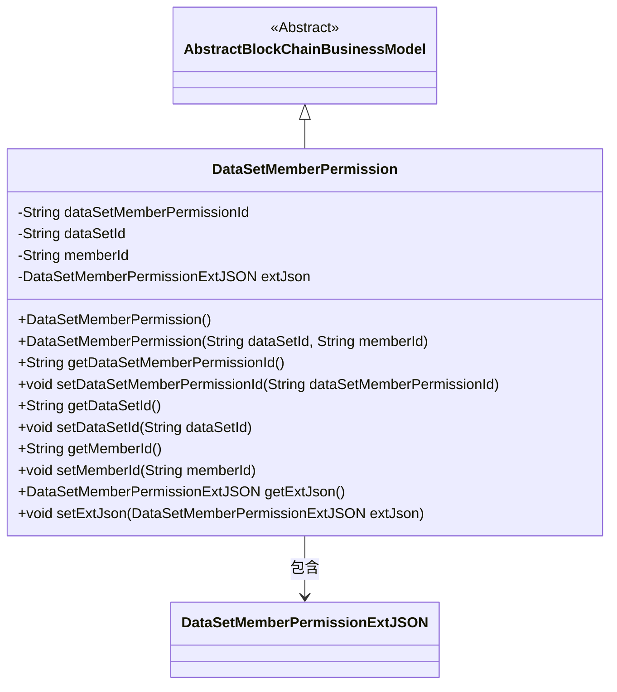

# 基础信息

|      |      |
|------|------|
| 名称 | DataSetMemberPermission |
| 编码语言 | .java |
| 代码路径 | WeFe/common/java/common-data-mongodb/src/main/java/com/welab/wefe/common/data/mongodb/entity/union/DataSetMemberPermission.java |
| 包名 | com.welab.wefe.common.data.mongodb.entity.union |
| 依赖项 | ['com.welab.wefe.common.data.mongodb.constant.MongodbTable', 'com.welab.wefe.common.data.mongodb.entity.base.AbstractBlockChainBusinessModel', 'com.welab.wefe.common.data.mongodb.entity.union.ext.DataSetMemberPermissionExtJSON', 'org.springframework.data.mongodb.core.mapping.Document'] |
| 概述说明 | 数据集成员权限类，包含权限ID、数据集ID、成员ID和扩展JSON字段，继承自区块链业务模型基类。 |

# 说明

DataSetMemberPermission类是一个继承自AbstractBlockChainBusinessModel的MongoDB文档模型，对应数据集成员权限表。该类包含四个主要属性：数据集成员权限ID、数据集ID、成员ID以及一个扩展JSON对象。提供了无参构造方法和带数据集ID、成员ID参数的构造方法。为每个属性实现了标准的getter和setter方法，支持对属性的读取和修改操作。该类用于管理数据集与成员之间的权限关系。

# 类列表 Class Summary

| 名称   | 类型  | 说明 |
|-------|------|-------------|
| DataSetMemberPermission | class | 数据集成员权限类，包含权限ID、数据集ID、成员ID及扩展JSON字段，提供构造方法和getter/setter。 |

## 类 DataSetMemberPermission

|      |      |
|------|------|
| 访问范围 | @Document(collection = MongodbTable.Union.DATASET_MEMBER_PERMISSION);public |
| 类型 | class |
| 名称 | DataSetMemberPermission |
| 说明 | 数据集成员权限类，包含权限ID、数据集ID、成员ID及扩展JSON字段，提供构造方法和getter/setter。 |

### UML类图

这段代码描述了一个数据集成员权限类(DataSetMemberPermission)，它继承自抽象区块链业务模型(AbstractBlockChainBusinessModel)。该类包含数据集成员权限ID、数据集ID、成员ID等核心属性，以及一个扩展JSON对象(DataSetMemberPermissionExtJSON)。类图清晰地展示了继承关系和组合关系，体现了该实体在区块链系统中用于管理数据集成员权限的核心功能，同时通过扩展JSON对象提供了灵活的扩展能力。

### 内部方法调用关系图

```mermaid
graph TD
    A["类DataSetMemberPermission"]
    B["注解: @Document(collection=MongodbTable.Union.DATASET_MEMBER_PERMISSION)"]
    C["继承: AbstractBlockChainBusinessModel"]
    D["属性: String dataSetMemberPermissionId"]
    E["属性: String dataSetId"]
    F["属性: String memberId"]
    G["属性: DataSetMemberPermissionExtJSON extJson"]
    H["构造方法: DataSetMemberPermission()"]
    I["构造方法: DataSetMemberPermission(String dataSetId, String memberId)"]
    J["方法: getDataSetMemberPermissionId()"]
    K["方法: setDataSetMemberPermissionId(String)"]
    L["方法: getDataSetId()"]
    M["方法: setDataSetId(String)"]
    N["方法: getMemberId()"]
    O["方法: setMemberId(String)"]
    P["方法: getExtJson()"]
    Q["方法: setExtJson(DataSetMemberPermissionExtJSON)"]

    A --> B
    A --> C
    A --> D
    A --> E
    A --> F
    A --> G
    A --> H
    A --> I
    A --> J
    A --> K
    A --> L
    A --> M
    A --> N
    A --> O
    A --> P
    A --> Q
```

这段代码定义了一个名为DataSetMemberPermission的类，该类继承自AbstractBlockChainBusinessModel，并使用了MongoDB的@Document注解来指定集合名称。类中包含四个私有属性：dataSetMemberPermissionId、dataSetId、memberId和extJson，其中extJson是DataSetMemberPermissionExtJSON类型的对象。类提供了两个构造方法（无参构造和带dataSetId、memberId参数的构造方法），以及各个属性的getter和setter方法。这个类主要用于表示数据集成员权限信息，可以存储到MongoDB数据库中。

### 字段列表 Field List

| 名称  | 类型  | 说明 |
|-------|-------|------|
| memberId | String | 成员ID字符串类型私有变量。 |
| dataSetMemberPermissionId | String | 私有字符串类型变量，表示数据集成员权限ID。 |
| dataSetId | String | 数据集ID的私有字符串变量。 |
| extJson = new DataSetMemberPermissionExtJSON() | DataSetMemberPermissionExtJSON | 定义私有变量extJson，初始化为DataSetMemberPermissionExtJSON类的新实例。 |

### 方法列表

| 名称  | 类型  | 说明 |
|-------|-------|------|
| setDataSetId | void | 设置数据集ID的方法，将输入参数赋值给类的dataSetId成员变量。 |
| getDataSetId | String | 获取数据集ID的方法，返回dataSetId。 |
| getDataSetMemberPermissionId | String | 获取数据集成员权限ID的方法，返回字符串类型的权限ID值。 |
| getMemberId | String | 这是一个Java方法，返回成员ID字符串memberId。 |
| setDataSetMemberPermissionId | void | 设置数据集成员权限ID的方法，将传入参数赋值给类成员变量。 |
| setMemberId | void | 设置成员ID的方法，将输入参数memberId赋值给当前对象的同名属性。 |
| getExtJson | DataSetMemberPermissionExtJSON | 方法返回DataSetMemberPermissionExtJSON类型的extJson对象。 |
| setExtJson | void | 设置扩展JSON数据的方法，参数为DataSetMemberPermissionExtJSON类型。 |

