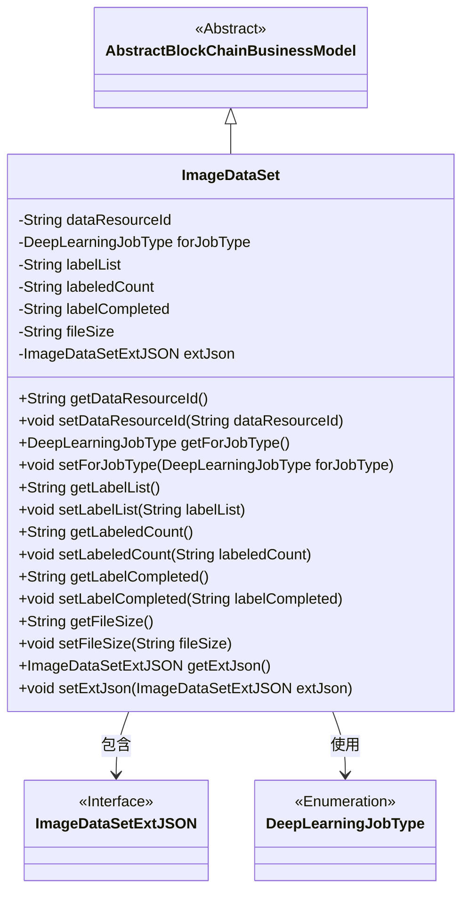

# 基础信息

|      |      |
|------|------|
| 名称 | ImageDataSet |
| 编码语言 | .java |
| 代码路径 | WeFe/common/java/common-data-mongodb/src/main/java/com/welab/wefe/common/data/mongodb/entity/union/ImageDataSet.java |
| 包名 | com.welab.wefe.common.data.mongodb.entity.union |
| 依赖项 | ['com.welab.wefe.common.data.mongodb.constant.MongodbTable', 'com.welab.wefe.common.data.mongodb.entity.base.AbstractBlockChainBusinessModel', 'com.welab.wefe.common.data.mongodb.entity.union.ext.ImageDataSetExtJSON', 'com.welab.wefe.common.wefe.enums.DeepLearningJobType', 'org.springframework.data.mongodb.core.mapping.Document'] |
| 概述说明 | ImageDataSet类表示MongoDB中的图像数据集，包含数据资源ID、任务类型、标签列表、标注数量、完成状态、文件大小和扩展JSON信息。 |

# 说明

ImageDataSet类是一个MongoDB文档模型，继承自AbstractBlockChainBusinessModel，对应集合IMAGE_DATASET。包含数据资源ID、深度学习任务类型、标签列表、已标注数量、标注完成状态、文件大小及扩展JSON信息。提供各字段的getter和setter方法，用于操作这些属性。

# 类列表 Class Summary

| 名称   | 类型  | 说明 |
|-------|------|-------------|
| ImageDataSet | class | ImageDataSet类表示MongoDB中的图像数据集，包含数据资源ID、任务类型、标签列表、标注数量、完成状态、文件大小和扩展JSON信息。 |

## 类 ImageDataSet

|      |      |
|------|------|
| 访问范围 | @Document(collection = MongodbTable.Union.IMAGE_DATASET);public |
| 类型 | class |
| 名称 | ImageDataSet |
| 说明 | ImageDataSet类表示MongoDB中的图像数据集，包含数据资源ID、任务类型、标签列表、标注数量、完成状态、文件大小和扩展JSON信息。 |

### UML类图

该图展示了ImageDataSet类继承自AbstractBlockChainBusinessModel，并包含多个私有字段及其对应的getter/setter方法。ImageDataSet与ImageDataSetExtJSON接口和DeepLearningJobType枚举存在关联关系，分别表示扩展JSON数据和深度学习任务类型。类图清晰地呈现了类之间的继承和依赖关系，以及类的成员结构。

### 内部方法调用关系图

该流程图展示了ImageDataSet类的完整结构，包括类注解、继承关系、7个私有属性及其对应的getter/setter方法。作为MongoDB文档模型，它通过@Document注解指定集合名称，并继承区块链业务模型基类。所有属性均为字符串或自定义类型，通过标准访问器方法实现封装，适用于图像数据集的管理场景。

### 字段列表 Field List

| 名称  | 类型  | 说明 |
|-------|-------|------|
| forJobType | DeepLearningJobType | 私有深度学习任务类型变量forJobType。 |
| labelList | String | 私有字符串变量，用于存储标签列表。 |
| extJson | ImageDataSetExtJSON | 私有图像数据集扩展JSON对象。 |
| fileSize | String | 定义文件大小的字符串变量。 |
| dataResourceId | String | 私有字符串类型变量dataResourceId |
| labelCompleted | String | 私有字符串变量，用于标记完成状态。 |
| labeledCount | String | 私有字符串变量，用于存储标记计数。 |

### 方法列表

| 名称  | 类型  | 说明 |
|-------|-------|------|
| getLabelList | String | 获取labelList字符串的方法。 |
| getForJobType | DeepLearningJobType | 获取当前深度学习任务类型的方法。 |
| getDataResourceId | String | 获取数据资源ID的方法，返回字符串类型值dataResourceId。 |
| setLabelList | void | Java方法：设置标签列表字符串。参数labelList赋值给类成员变量this.labelList。 |
| setLabelCompleted | void | 这是一个Java方法，用于设置labelCompleted属性的值。方法接受一个字符串参数，并将其赋值给类的成员变量labelCompleted。 |
| setForJobType | void | 设置深度学习任务类型的方法，将参数赋值给类成员变量。 |
| getLabelCompleted | String | 获取已完成标签的字符串值。 |
| setFileSize | void | Java方法：设置文件大小属性，参数为字符串fileSize。 |
| getExtJson | ImageDataSetExtJSON | 获取ImageDataSetExtJSON类型的extJson对象。 |
| setLabeledCount | void | 设置标签计数方法，将参数labeledCount赋值给类成员变量labeledCount。 |
| getLabeledCount | String | 获取labeledCount值的公共方法。 |
| setDataResourceId | void | 设置数据资源ID的方法，将输入参数赋值给类的成员变量dataResourceId。 |
| getFileSize | String | 获取文件大小的方法，返回字符串类型的fileSize值。 |
| setExtJson | void | 该方法用于设置图像数据集的扩展JSON数据，将传入的extJson参数赋值给类的extJson成员变量。 |

