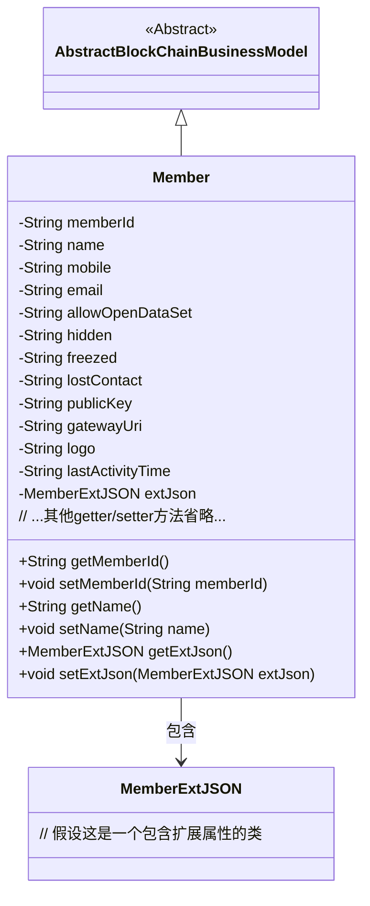

# 基础信息

|      |      |
|------|------|
| 名称 | Member |
| 编码语言 | .java |
| 代码路径 | WeFe/common/java/common-data-mongodb/src/main/java/com/welab/wefe/common/data/mongodb/entity/union/Member.java |
| 包名 | com.welab.wefe.common.data.mongodb.entity.union |
| 依赖项 | ['com.welab.wefe.common.data.mongodb.constant.MongodbTable', 'com.welab.wefe.common.data.mongodb.entity.base.AbstractBlockChainBusinessModel', 'com.welab.wefe.common.data.mongodb.entity.union.ext.MemberExtJSON', 'org.springframework.data.mongodb.core.mapping.Document'] |
| 概述说明 | Member类表示区块链成员，包含ID、姓名、联系方式、状态标志、公钥、网关URI、LOGO、最后活动时间和扩展信息等属性。 |

# 说明

该代码定义了一个名为Member的Java类，用于表示MongoDB中的成员数据。该类继承自AbstractBlockChainBusinessModel，包含成员ID、姓名、手机、邮箱等基本信息，以及是否允许开放数据集、是否隐藏、是否冻结、是否失联等状态字段。此外还包含公钥、网关URI、logo、最后活动时间等扩展信息，并通过MemberExtJSON对象存储额外JSON数据。每个字段都有对应的getter和setter方法。该类映射到MongoDB的MEMBER集合。

# 类列表 Class Summary

| 名称   | 类型  | 说明 |
|-------|------|-------------|
| Member | class | Member类表示区块链成员，包含ID、姓名、联系方式、状态标志、公钥、网关URI、LOGO、最后活动时间和扩展信息等属性。 |

## 类 Member

|      |      |
|------|------|
| 访问范围 | @Document(collection = MongodbTable.Union.MEMBER);public |
| 类型 | class |
| 名称 | Member |
| 说明 | Member类表示区块链成员，包含ID、姓名、联系方式、状态标志、公钥、网关URI、LOGO、最后活动时间和扩展信息等属性。 |

### UML类图

这段代码展示了一个区块链成员管理系统的核心类结构。Member类继承自AbstractBlockChainBusinessModel，包含成员ID、基本信息、状态标志（如冻结/失联）、区块链相关属性（公钥/网关）等字段，并通过MemberExtJSON对象存储扩展属性。类图清晰地反映了实体间的继承和组合关系，适用于MongoDB持久化的区块链成员数据模型。

### 内部方法调用关系图

```mermaid
graph TD
    A["类Member<br/>继承AbstractBlockChainBusinessModel"]
    B["注解: @Document(collection=MongodbTable.Union.MEMBER)"]
    C["属性: String memberId"]
    D["属性: String name"]
    E["属性: String mobile"]
    F["属性: String email"]
    G["属性: String allowOpenDataSet"]
    H["属性: String hidden"]
    I["属性: String freezed"]
    J["属性: String lostContact"]
    K["属性: String publicKey"]
    L["属性: String gatewayUri"]
    M["属性: String logo"]
    N["属性: String lastActivityTime"]
    O["属性: MemberExtJSON extJson"]
    P["Getter/Setter方法对(13对)"]
    Q["特殊方法: getExtJson/setExtJson"]

    A --> B
    A --> C
    A --> D
    A --> E
    A --> F
    A --> G
    A --> H
    A --> I
    A --> J
    A --> K
    A --> L
    A --> M
    A --> N
    A --> O
    A --> P
    A --> Q
```

该流程图展示了Member类的完整结构，该类继承自AbstractBlockChainBusinessModel并使用MongoDB文档注解。类包含13个String类型属性和1个MemberExtJSON类型属性，每个属性都有对应的getter/setter方法对。特别展示了extJson属性的特殊处理方法，整体结构清晰反映了该实体类的数据存储设计模式。

### 字段列表 Field List

| 名称  | 类型  | 说明 |
|-------|-------|------|
| hidden | String | 私有字符串变量hidden。 |
| extJson = new MemberExtJSON() | MemberExtJSON | 成员变量extJson初始化为MemberExtJSON实例。 |
| mobile | String | 定义私有字符串变量mobile。 |
| gatewayUri | String | 声明一个私有字符串变量gatewayUri。 |
| allowOpenDataSet | String | 私有字符串变量allowOpenDataSet，用于控制数据集开放权限。 |
| lostContact | String | 私有字符串变量lostContact，用于存储失联信息。 |
| lastActivityTime | String | 私有字符串变量，记录最后活动时间。 |
| publicKey | String | 私有字符串变量publicKey，用于存储公钥。 |
| name | String | 声明一个私有字符串变量name。 |
| logo | String | 私有字符串变量logo，用于存储标识信息。 |
| email | String | 声明一个私有字符串变量email。 |
| freezed | String | 声明了一个私有字符串变量freezed。 |
| memberId | String | 成员ID字符串变量 |

### 方法列表

| 名称  | 类型  | 说明 |
|-------|-------|------|
| getGatewayUri | String | 获取网关URI的方法，返回gatewayUri变量值。 |
| getAllowOpenDataSet | String | 这是一个Java方法，返回字符串类型的allowOpenDataSet变量值。 |
| setPublicKey | void | 设置公钥的方法，将输入字符串赋值给类的publicKey成员变量。 |
| setName | void | 这是一个Java方法，用于设置对象的名称属性。方法接收一个字符串参数name，并将其赋值给当前对象的name字段。 |
| getLogo | String | 获取logo字符串的方法。 |
| getEmail | String | 获取email字符串的方法。 |
| getHidden | String | 获取隐藏字符串的方法，返回私有变量hidden的值。 |
| setAllowOpenDataSet | void | 设置允许打开的数据集参数。 |
| getMemberId | String | 获取成员ID的方法，返回字符串类型的memberId。 |
| getName | String | 这是一个Java方法，返回字符串类型的name变量值。 |
| setFreezed | void | 定义了一个公共方法setFreezed，用于设置freezed属性的值。 |
| setLostContact | void | 设置丢失联系信息的方法，将参数lostContact赋值给类成员变量lostContact。 |
| setMemberId | void | 设置成员ID的方法，将输入参数memberId赋值给当前对象的memberId属性。 |
| getPublicKey | String | 获取公钥的方法，返回字符串类型的publicKey。 |
| setMobile | void | 这是一个Java方法，用于设置类的mobile属性值。方法接受一个字符串参数mobile，并将其赋值给类的同名成员变量。 |
| setHidden | void | 这是一个Java方法，用于设置hidden属性的值。方法接受一个字符串参数hidden，并将其赋值给当前对象的hidden属性。 |
| setEmail | void | 设置email属性的方法，将传入的email参数赋值给当前对象的email字段。 |
| getLastActivityTime | String | 获取最后活动时间的方法，返回字符串类型的lastActivityTime值。 |
| setLastActivityTime | void | 设置最后活动时间的方法，参数为字符串类型。 |
| getExtJson | MemberExtJSON | 获取成员扩展JSON数据的方法，返回extJson对象。 |
| setExtJson | void | 设置成员扩展JSON数据的方法，将参数extJson赋值给当前对象的extJson属性。 |
| setLogo | void | 设置logo字符串的方法。 |
| getMobile | String | 方法返回字符串类型变量mobile的值。 |
| getLostContact | String | 获取丢失联系人的方法，返回lostContact字符串。 |
| setGatewayUri | void | 设置网关URI的方法，将输入参数赋值给类的gatewayUri变量。 |
| getFreezed | String | 获取freezed字符串的方法。 |

