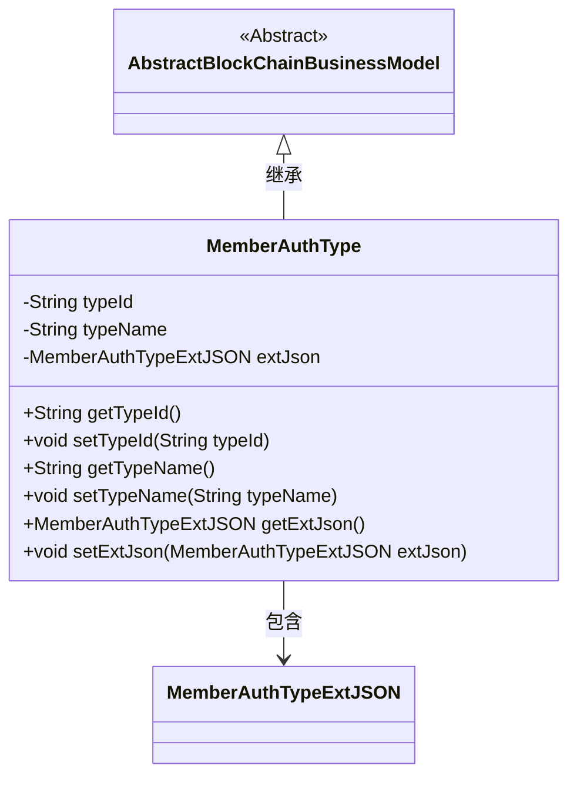

# 基础信息

|      |      |
|------|------|
| 名称 | MemberAuthType |
| 编码语言 | .java |
| 代码路径 | WeFe/common/java/common-data-mongodb/src/main/java/com/welab/wefe/common/data/mongodb/entity/union/MemberAuthType.java |
| 包名 | com.welab.wefe.common.data.mongodb.entity.union |
| 依赖项 | ['com.welab.wefe.common.data.mongodb.constant.MongodbTable', 'com.welab.wefe.common.data.mongodb.entity.base.AbstractBlockChainBusinessModel', 'com.welab.wefe.common.data.mongodb.entity.union.ext.MemberAuthTypeExtJSON', 'org.springframework.data.mongodb.core.mapping.Document', 'java.util.UUID'] |
| 概述说明 | Java类MemberAuthType，存储于MongoDB的MEMBER_AUTH_TYPE表，包含typeId（自动生成UUID）、typeName和extJson字段，提供getter/setter方法。继承AbstractBlockChainBusinessModel。 |

# 说明

该内容描述了一个名为MemberAuthType的Java类，用于表示成员认证类型。该类继承自AbstractBlockChainBusinessModel，并使用@Document注解指定MongoDB集合名。包含三个主要属性：typeId（默认值为去除连字符的UUID字符串）、typeName（类型名称）和extJson（扩展JSON对象，初始化为MemberAuthTypeExtJSON实例）。提供了这些属性的getter和setter方法。

# 类列表 Class Summary

| 名称   | 类型  | 说明 |
|-------|------|-------------|
| MemberAuthType | class | Java类MemberAuthType，存储于MongoDB的MEMBER_AUTH_TYPE表，包含typeId（自动生成UUID）、typeName和extJson字段，提供getter/setter方法。 |

## 类 MemberAuthType

|      |      |
|------|------|
| 访问范围 | @Document(collection = MongodbTable.Union.MEMBER_AUTH_TYPE);public |
| 类型 | class |
| 名称 | MemberAuthType |
| 说明 | Java类MemberAuthType，存储于MongoDB的MEMBER_AUTH_TYPE表，包含typeId（自动生成UUID）、typeName和extJson字段，提供getter/setter方法。 |

### UML类图

这段类图展示了MemberAuthType类继承自AbstractBlockChainBusinessModel抽象类，并包含一个MemberAuthTypeExtJSON类型的成员变量。MemberAuthType类用于表示成员认证类型，包含typeId、typeName和extJson三个私有字段，分别通过getter和setter方法进行访问和修改。其中typeId默认通过UUID生成并去除连字符，extJson字段在初始化时即创建新实例。该类通过MongoDB的@Document注解标记为集合文档，映射到指定的数据库表。

### 内部方法调用关系图

```mermaid
graph TD
    A["类MemberAuthType"]
    B["注解: @Document(collection = MongodbTable.Union.MEMBER_AUTH_TYPE)"]
    C["继承: AbstractBlockChainBusinessModel"]
    D["属性: String typeId = UUID.randomUUID().toString().replaceAll('-', '')"]
    E["属性: String typeName"]
    F["属性: MemberAuthTypeExtJSON extJson = new MemberAuthTypeExtJSON()"]
    G["方法: String getTypeId()"]
    H["方法: void setTypeId(String typeId)"]
    I["方法: String getTypeName()"]
    J["方法: void setTypeName(String typeName)"]
    K["方法: MemberAuthTypeExtJSON getExtJson()"]
    L["方法: void setExtJson(MemberAuthTypeExtJSON extJson)"]

    A --> B
    A --> C
    A --> D
    A --> E
    A --> F
    A --> G
    A --> H
    A --> I
    A --> J
    A --> K
    A --> L
```

该流程图展示了MemberAuthType类的完整结构，该类是一个MongoDB文档模型，继承自AbstractBlockChainBusinessModel。主要包含三个核心属性：自动生成的typeId（去除UUID横线）、typeName和extJson对象，以及对应的getter/setter方法。类通过@Document注解指定了MongoDB集合名称，体现了区块链业务模型的扩展性设计，其中extJson属性使用MemberAuthTypeExtJSON类型存储扩展JSON数据。

### 字段列表 Field List

| 名称  | 类型  | 说明 |
|-------|-------|------|
| extJson = new MemberAuthTypeExtJSON() | MemberAuthTypeExtJSON | 定义私有成员变量extJson，类型为MemberAuthTypeExtJSON并初始化。 |
| typeId = UUID.randomUUID().toString().replaceAll("-", "") | String | 生成随机UUID字符串并移除连字符，赋值给typeId变量。 |
| typeName | String | 声明一个私有字符串变量typeName。 |

### 方法列表

| 名称  | 类型  | 说明 |
|-------|-------|------|
| getTypeName | String | 方法返回类型名称字符串。 |
| getTypeId | String | 获取类型ID的方法，返回字符串typeId。 |
| getExtJson | MemberAuthTypeExtJSON | 获取成员认证类型的扩展JSON数据。 |
| setExtJson | void | 设置成员认证类型的扩展JSON数据。 |
| setTypeId | void | 这是一个Java方法，用于设置对象的typeId属性值。方法接收一个字符串参数typeId，并将其赋值给当前对象的同名成员变量。 |
| setTypeName | void | 这是一个Java方法，用于设置类成员变量typeName的值。方法接收一个字符串参数typeName，并将其赋值给当前对象的同名属性。 |

