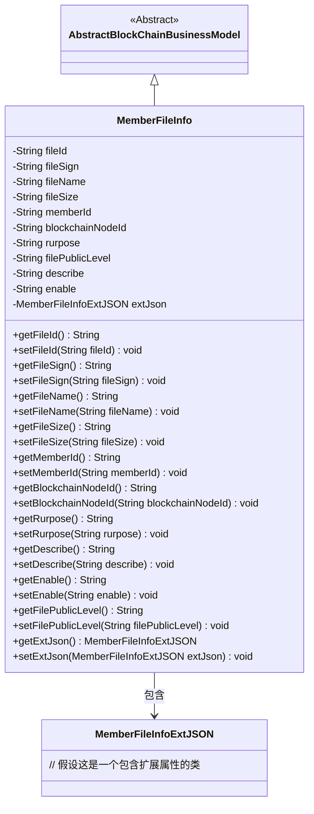

# 基础信息

|      |      |
|------|------|
| 名称 | MemberFileInfo |
| 编码语言 | .java |
| 代码路径 | WeFe/common/java/common-data-mongodb/src/main/java/com/welab/wefe/common/data/mongodb/entity/union/MemberFileInfo.java |
| 包名 | com.welab.wefe.common.data.mongodb.entity.union |
| 依赖项 | ['com.welab.wefe.common.data.mongodb.constant.MongodbTable', 'com.welab.wefe.common.data.mongodb.entity.base.AbstractBlockChainBusinessModel', 'com.welab.wefe.common.data.mongodb.entity.union.ext.MemberFileInfoExtJSON', 'org.springframework.data.mongodb.core.mapping.Document'] |
| 概述说明 | MemberFileInfo类表示成员文件信息，包含文件ID、签名、名称、大小、成员ID、区块链节点ID、用途、公开级别、描述、启用状态及扩展JSON数据。 |

# 说明

该内容定义了一个名为MemberFileInfo的Java类，用于表示成员文件信息。该类继承自AbstractBlockChainBusinessModel，并标注为MongoDB集合MEMBER_FILE_INFO。包含文件ID、签名、名称、大小、成员ID、区块链节点ID、用途、公开级别、描述、启用状态等属性，以及一个扩展JSON对象。所有属性均提供getter和setter方法，默认启用状态为"1"。

# 类列表 Class Summary

| 名称   | 类型  | 说明 |
|-------|------|-------------|
| MemberFileInfo | class | MemberFileInfo类存储成员文件信息，包含文件ID、签名、名称、大小、成员ID、区块链节点ID、用途、公开级别、描述、启用状态及扩展JSON。 |

## 类 MemberFileInfo

|      |      |
|------|------|
| 访问范围 | @Document(collection = MongodbTable.Union.MEMBER_FILE_INFO);public |
| 类型 | class |
| 名称 | MemberFileInfo |
| 说明 | MemberFileInfo类存储成员文件信息，包含文件ID、签名、名称、大小、成员ID、区块链节点ID、用途、公开级别、描述、启用状态及扩展JSON。 |

### UML类图

这段类图展示了MemberFileInfo类继承自AbstractBlockChainBusinessModel，并包含多个文件相关属性（如fileId、fileName等）和一个MemberFileInfoExtJSON类型的扩展属性。该类主要用于管理区块链成员文件信息，提供了完整的getter/setter方法用于属性访问和修改，其中enable字段默认值为"1"。通过继承关系，该类获得了区块链业务模型的基础功能，同时通过组合方式扩展了文件信息的存储能力。

### 内部方法调用关系图

```mermaid
graph TD
    A["类MemberFileInfo"]
    B["继承: AbstractBlockChainBusinessModel"]
    C["注解: @Document(collection = MongodbTable.Union.MEMBER_FILE_INFO)"]
    D["属性: String fileId"]
    E["属性: String fileSign"]
    F["属性: String fileName"]
    G["属性: String fileSize"]
    H["属性: String memberId"]
    I["属性: String blockchainNodeId"]
    J["属性: String rurpose"]
    K["属性: String filePublicLevel"]
    L["属性: String describe"]
    M["属性: String enable = '1'"]
    N["属性: MemberFileInfoExtJSON extJson = new MemberFileInfoExtJSON()"]
    O["Getter/Setter方法组"]
    
    A --> B
    A --> C
    A --> D
    A --> E
    A --> F
    A --> G
    A --> H
    A --> I
    A --> J
    A --> K
    A --> L
    A --> M
    A --> N
    A --> O
```

该流程图展示了MemberFileInfo类的完整结构，包含继承关系、类注解、11个字符串类型属性、1个自定义对象属性及其初始化值。所有属性都配有对应的Getter/Setter方法组，其中enable属性默认值为"1"，extJson属性在声明时即完成实例化。类通过@Document注解与MongoDB的MEMBER_FILE_INFO集合建立映射关系，并继承自区块链业务模型基类。

### 字段列表 Field List

| 名称  | 类型  | 说明 |
|-------|-------|------|
| fileName | String | 声明一个私有字符串变量fileName。 |
| extJson = new MemberFileInfoExtJSON() | MemberFileInfoExtJSON | 成员文件信息扩展JSON对象初始化。 |
| filePublicLevel | String | 文件公开级别属性 |
| rurpose | String | 私有字符串变量rurpose，用途未指定。 |
| blockchainNodeId | String | 私有字符串变量，存储区块链节点ID。 |
| fileSize | String | 定义文件大小的字符串变量。 |
| describe | String | 私有字符串变量describe，用于存储描述信息。 |
| enable = "1" | String | 变量enable被初始化为字符串"1"。 |
| fileId | String | 私有字符串类型变量fileId，用于存储文件标识符。 |
| fileSign | String | 私有字符串变量fileSign，用于存储文件签名。 |
| memberId | String | 成员ID字符串变量 |

### 方法列表

| 名称  | 类型  | 说明 |
|-------|-------|------|
| getDescribe | String | 获取描述字符串的方法。 |
| setMemberId | void | 设置成员ID的方法，将输入参数memberId赋值给当前对象的memberId属性。 |
| setFileSign | void | 这是一个Java方法，用于设置文件签名属性。方法名为setFileSign，接收一个String类型参数fileSign，并将其赋值给当前对象的同名属性。 |
| getMemberId | String | 获取成员ID的方法，返回字符串类型的memberId。 |
| getFileSize | String | 获取文件大小的方法，返回fileSize字符串。 |
| getFileId | String | 获取文件ID的方法，返回fileId字符串。 |
| getFileSign | String | 获取文件签名字符串的方法。 |
| setFileId | void | 这是一个Java方法，用于设置文件ID。方法接收一个字符串参数fileId，并将其赋值给类的成员变量fileId。 |
| setRurpose | void | 这是一个Java方法，用于设置类成员变量rurpose的值。方法接受一个字符串参数rurpose，并将其赋值给当前对象的同名属性。 |
| setBlockchainNodeId | void | 设置区块链节点ID的方法，将参数赋值给成员变量blockchainNodeId。 |
| setFileName | void | 设置文件名的方法，将输入参数赋值给成员变量fileName。 |
| getFileName | String | 获取文件名称的方法，返回字符串类型的fileName变量值。 |
| setFileSize | void | Java方法：设置文件大小属性，参数为字符串类型。 |
| setDescribe | void | 这是一个Java方法，用于设置对象的describe属性值。方法接收一个字符串参数，并将其赋值给对象的describe字段。 |
| getRurpose | String | 获取rurpose值的公共方法。 |
| getBlockchainNodeId | String | 获取区块链节点ID的方法，直接返回节点ID字符串。 |
| getEnable | String | 获取enable值的公共方法，返回字符串类型。 |
| setEnable | void | 这是一个Java方法，用于设置成员变量enable的值。方法接受一个字符串参数enable，并将其赋值给当前对象的enable属性。 |
| getFilePublicLevel | String | 获取文件公开等级的方法，返回filePublicLevel字符串。 |
| setFilePublicLevel | void | 设置文件公开级别的方法，参数为文件公开级别字符串，将其赋值给类成员变量filePublicLevel。 |
| getExtJson | MemberFileInfoExtJSON | 获取成员文件扩展信息的JSON对象。 |
| setExtJson | void | 方法setExtJson用于设置成员文件信息的扩展JSON数据，参数为MemberFileInfoExtJSON类型对象。 |

