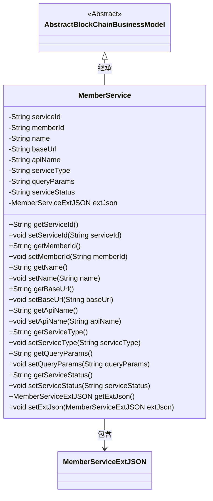

# 基础信息

|      |      |
|------|------|
| 名称 | MemberService |
| 编码语言 | .java |
| 代码路径 | WeFe/common/java/common-data-mongodb/src/main/java/com/welab/wefe/common/data/mongodb/entity/union/MemberService.java |
| 包名 | com.welab.wefe.common.data.mongodb.entity.union |
| 依赖项 | ['com.welab.wefe.common.data.mongodb.constant.MongodbTable', 'com.welab.wefe.common.data.mongodb.entity.base.AbstractBlockChainBusinessModel', 'com.welab.wefe.common.data.mongodb.entity.union.ext.MemberServiceExtJSON', 'org.springframework.data.mongodb.core.mapping.Document'] |
| 概述说明 | MemberService类存储会员服务信息，包含ID、名称、URL、API、类型、状态等字段及扩展JSON。 |

# 说明

该内容定义了一个名为MemberService的Java类，继承自AbstractBlockChainBusinessModel，用于表示成员服务信息。类中包含多个私有字段，包括serviceId、memberId、name、baseUrl、apiName、serviceType、queryParams和serviceStatus，以及一个MemberServiceExtJSON类型的extJson字段。每个字段都有对应的getter和setter方法，用于访问和修改字段值。该类使用@Document注解指定了MongoDB的集合名称为MongodbTable.Union.MEMBER_SERVICE。

# 类列表 Class Summary

| 名称   | 类型  | 说明 |
|-------|------|-------------|
| MemberService | class | Java类MemberService存储会员服务信息，包含ID、名称、URL、API、类型、状态等字段及扩展JSON。 |

## 类 MemberService

|      |      |
|------|------|
| 访问范围 | @Document(collection = MongodbTable.Union.MEMBER_SERVICE);public |
| 类型 | class |
| 名称 | MemberService |
| 说明 | Java类MemberService存储会员服务信息，包含ID、名称、URL、API、类型、状态等字段及扩展JSON。 |

### UML类图

这段类图展示了MemberService类的结构，它继承自AbstractBlockChainBusinessModel抽象类，并包含一个MemberServiceExtJSON类型的成员变量。MemberService类主要封装了会员服务的各种属性，包括服务ID、会员ID、名称、基础URL、API名称、服务类型、查询参数和服务状态等，提供了完整的getter和setter方法。该类通过extJson字段实现了对扩展JSON数据的封装，体现了良好的面向对象设计原则。

### 内部方法调用关系图

```mermaid
graph TD
    A["类MemberService"]
    B["继承: AbstractBlockChainBusinessModel"]
    C["注解: @Document(collection = MongodbTable.Union.MEMBER_SERVICE)"]
    D["属性: String serviceId"]
    E["属性: String memberId"]
    F["属性: String name"]
    G["属性: String baseUrl"]
    H["属性: String apiName"]
    I["属性: String serviceType"]
    J["属性: String queryParams"]
    K["属性: String serviceStatus"]
    L["属性: MemberServiceExtJSON extJson"]
    M["方法: getServiceId/setServiceId"]
    N["方法: getMemberId/setMemberId"]
    O["方法: getName/setName"]
    P["方法: getBaseUrl/setBaseUrl"]
    Q["方法: getApiName/setApiName"]
    R["方法: getServiceType/setServiceType"]
    S["方法: getQueryParams/setQueryParams"]
    T["方法: getServiceStatus/setServiceStatus"]
    U["方法: getExtJson/setExtJson"]

    A --> B
    A --> C
    A --> D
    A --> E
    A --> F
    A --> G
    A --> H
    A --> I
    A --> J
    A --> K
    A --> L
    A --> M
    A --> N
    A --> O
    A --> P
    A --> Q
    A --> R
    A --> S
    A --> T
    A --> U
```

这段代码定义了一个名为MemberService的类，继承自AbstractBlockChainBusinessModel，并使用@Document注解标记为MongoDB集合。类中包含多个字符串类型属性（如serviceId、memberId等）和一个MemberServiceExtJSON类型的extJson属性，每个属性都有对应的getter和setter方法。该类主要用于表示成员服务相关的业务模型，包含服务基础信息、API配置和状态等字段，适用于区块链业务场景的数据持久化操作。

### 字段列表 Field List

| 名称  | 类型  | 说明 |
|-------|-------|------|
| serviceStatus | String | 声明一个私有字符串变量serviceStatus，用于存储服务状态信息。 |
| serviceId | String | 私有字符串变量serviceId，用于存储服务标识。 |
| name | String | 私有字符串变量name。 |
| serviceType | String | 私有字符串变量，存储服务类型信息。 |
| queryParams | String | 私有字符串变量queryParams，用于存储查询参数。 |
| extJson = new MemberServiceExtJSON() | MemberServiceExtJSON | 创建MemberServiceExtJSON类的实例extJson。 |
| apiName | String | 声明一个私有字符串变量apiName。 |
| memberId | String | 声明一个私有字符串变量memberId。 |
| baseUrl | String | 私有字符串变量baseUrl |

### 方法列表

| 名称  | 类型  | 说明 |
|-------|-------|------|
| setName | void | 设置对象名称的方法，将参数name赋值给对象的name属性。 |
| getServiceStatus | String | 方法返回服务状态字符串。 |
| getBaseUrl | String | 方法返回baseUrl字符串值。 |
| getMemberId | String | 方法返回成员ID字符串。 |
| setServiceId | void | 设置服务ID的方法，将输入参数赋值给类的serviceId成员变量。 |
| getServiceId | String | 获取serviceId的公共方法，返回字符串类型的serviceId值。 |
| getQueryParams | String | 获取查询参数字符串的方法。 |
| setApiName | void | 定义公共方法setApiName，接收字符串参数apiName并赋值给当前对象的同名属性。 |
| getApiName | String | 方法返回字符串类型的apiName值。 |
| setBaseUrl | void | 设置基础URL的方法，将参数baseUrl赋值给类的成员变量this.baseUrl。 |
| getServiceType | String | 获取serviceType的字符串值的方法。 |
| setServiceStatus | void | 这是一个Java方法，用于设置类的serviceStatus属性值。方法接收一个字符串参数serviceStatus，并将其赋值给类的同名成员变量。 |
| setQueryParams | void | 设置查询参数的方法，将输入参数赋值给类的成员变量queryParams。 |
| getName | String | 这是一个Java方法，返回字符串类型的name变量值。 |
| getExtJson | MemberServiceExtJSON | 获取成员服务的扩展JSON数据。 |
| setMemberId | void | 设置成员ID的方法，将输入参数赋值给类的成员变量memberId。 |
| setServiceType | void | 定义方法setServiceType，用于设置类成员变量serviceType的值。参数为字符串类型serviceType。 |
| setExtJson | void | 方法setExtJson用于设置成员服务扩展JSON数据，将传入的extJson赋值给当前对象的extJson属性。 |

