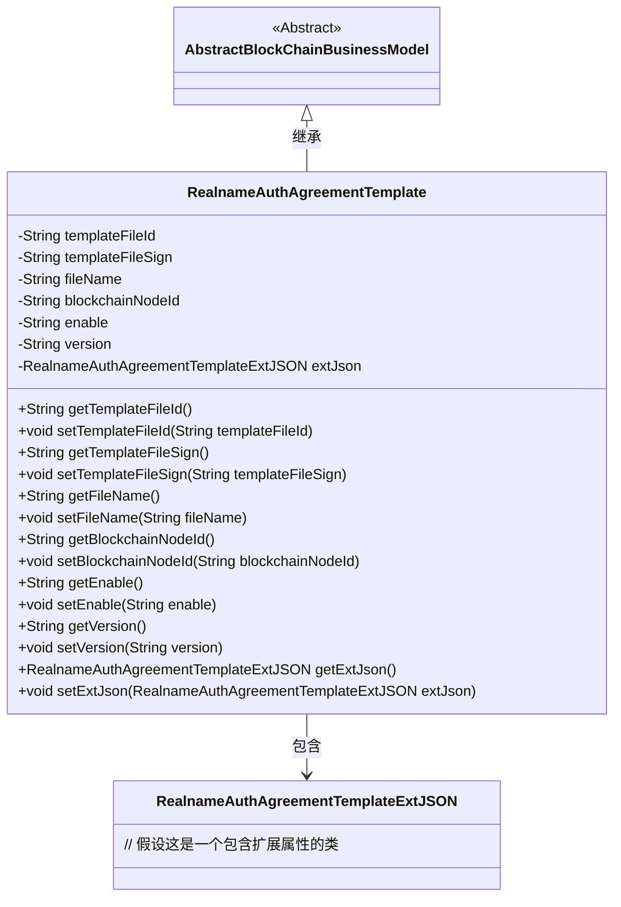

# 基础信息

|      |      |
|------|------|
| 名称 | RealnameAuthAgreementTemplate |
| 编码语言 | .java |
| 代码路径 | WeFe/common/java/common-data-mongodb/src/main/java/com/welab/wefe/common/data/mongodb/entity/union/RealnameAuthAgreementTemplate.java |
| 包名 | com.welab.wefe.common.data.mongodb.entity.union |
| 依赖项 | ['com.welab.wefe.common.data.mongodb.constant.MongodbTable', 'com.welab.wefe.common.data.mongodb.entity.base.AbstractBlockChainBusinessModel', 'com.welab.wefe.common.data.mongodb.entity.union.ext.RealnameAuthAgreementTemplateExtJSON', 'org.springframework.data.mongodb.core.mapping.Document'] |
| 概述说明 | Java类RealnameAuthAgreementTemplate表示实名认证协议模板，包含文件ID、签名、名称、区块链节点ID、启用状态、版本及扩展JSON数据。 |

# 说明

这是一个名为RealnameAuthAgreementTemplate的Java类，继承自AbstractBlockChainBusinessModel，用于表示实名认证协议模板。该类映射到MongoDB的REALNAME_AUTH_AGREEMENT_TEMPLATE集合。包含以下字段：templateFileId（模板文件ID）、templateFileSign（模板文件签名）、fileName（文件名）、blockchainNodeId（区块链节点ID）、enable（启用状态，默认"0"）、version（版本号）以及extJson（扩展JSON对象）。提供了所有字段的getter和setter方法。

# 类列表 Class Summary

| 名称   | 类型  | 说明 |
|-------|------|-------------|
| RealnameAuthAgreementTemplate | class | RealnameAuthAgreementTemplate类表示实名认证协议模板，包含文件ID、签名、名称、区块链节点ID、启用状态、版本及扩展JSON等属性。 |

## 类 RealnameAuthAgreementTemplate

|      |      |
|------|------|
| 访问范围 | @Document(collection = MongodbTable.Union.REALNAME_AUTH_AGREEMENT_TEMPLATE);public |
| 类型 | class |
| 名称 | RealnameAuthAgreementTemplate |
| 说明 | RealnameAuthAgreementTemplate类表示实名认证协议模板，包含文件ID、签名、名称、区块链节点ID、启用状态、版本及扩展JSON等属性。 |

### UML类图

这段代码描述了一个实名认证协议模板类`RealnameAuthAgreementTemplate`，它继承自抽象类`AbstractBlockChainBusinessModel`。该类包含模板文件ID、签名、文件名、区块链节点ID等核心属性，以及一个扩展JSON对象`extJson`用于存储额外信息。所有字段都通过getter/setter方法进行访问控制，体现了良好的封装性。该类通过继承获得区块链业务模型的通用特性，同时通过组合方式扩展了模板的定制化能力。

### 内部方法调用关系图

```mermaid
graph TD
    A["类RealnameAuthAgreementTemplate"]
    B["属性: String templateFileId"]
    C["属性: String templateFileSign"]
    D["属性: String fileName"]
    E["属性: String blockchainNodeId"]
    F["属性: String enable = '0'"]
    G["属性: String version"]
    H["属性: RealnameAuthAgreementTemplateExtJSON extJson"]
    I["方法: getTemplateFileId()"]
    J["方法: setTemplateFileId()"]
    K["方法: getTemplateFileSign()"]
    L["方法: setTemplateFileSign()"]
    M["方法: getFileName()"]
    N["方法: setFileName()"]
    O["方法: getBlockchainNodeId()"]
    P["方法: setBlockchainNodeId()"]
    Q["方法: getEnable()"]
    R["方法: setEnable()"]
    S["方法: getVersion()"]
    T["方法: setVersion()"]
    U["方法: getExtJson()"]
    V["方法: setExtJson()"]

    A --> B
    A --> C
    A --> D
    A --> E
    A --> F
    A --> G
    A --> H
    A --> I
    A --> J
    A --> K
    A --> L
    A --> M
    A --> N
    A --> O
    A --> P
    A --> Q
    A --> R
    A --> S
    A --> T
    A --> U
    A --> V
```

这段代码定义了一个名为RealnameAuthAgreementTemplate的类，继承自AbstractBlockChainBusinessModel，用于表示实名认证协议模板。该类包含多个属性，如模板文件ID、签名、文件名等，以及对应的getter和setter方法。其中enable属性默认值为"0"，表示禁用状态。此外，还包含一个extJson属性，用于存储扩展的JSON数据。这个类主要用于在MongoDB中存储和管理实名认证协议模板的相关信息。

### 字段列表 Field List

| 名称  | 类型  | 说明 |
|-------|-------|------|
| extJson = new RealnameAuthAgreementTemplateExtJSON() | RealnameAuthAgreementTemplateExtJSON | 声明一个私有变量extJson，类型为RealnameAuthAgreementTemplateExtJSON，并初始化为新实例。 |
| blockchainNodeId | String | 私有字符串变量，存储区块链节点ID。 |
| enable = "0" | String | 私有字符串变量enable初始值为"0"。 |
| templateFileId | String | 私有字符串变量templateFileId，用于存储模板文件ID。 |
| fileName | String | 私有字符串变量fileName，用于存储文件名。 |
| templateFileSign | String | 私有字符串变量templateFileSign，用于存储模板文件签名。 |
| version | String | 声明一个私有字符串变量version。 |

### 方法列表

| 名称  | 类型  | 说明 |
|-------|-------|------|
| getEnable | String | 获取enable属性的字符串值。 |
| setTemplateFileId | void | 设置模板文件ID的方法，将传入的字符串参数赋值给类的成员变量templateFileId。 |
| getVersion | String | 获取版本号的方法，返回字符串类型的version变量值。 |
| setTemplateFileSign | void | Java方法：设置模板文件签名属性值。 |
| getTemplateFileSign | String | 获取模板文件签名的方法，返回templateFileSign值。 |
| setVersion | void | 这是一个Java方法，用于设置对象的版本属性。方法名为setVersion，接受一个字符串参数version，并将其赋值给对象的version字段。 |
| setBlockchainNodeId | void | 设置区块链节点ID的方法，将参数赋值给成员变量。 |
| getTemplateFileId | String | 获取模板文件ID的方法，返回值为templateFileId。 |
| setFileName | void | 设置文件名的方法，将输入字符串赋值给类的fileName属性。 |
| getFileName | String | 该方法返回字符串类型的文件名变量fileName。 |
| getExtJson | RealnameAuthAgreementTemplateExtJSON | 获取实名认证协议模板扩展JSON数据的方法。 |
| getBlockchainNodeId | String | 获取区块链节点ID的方法，返回字符串类型的节点ID。 |
| setEnable | void | 方法setEnable接收字符串参数enable，并将其赋值给当前对象的enable属性。 |
| setExtJson | void | 设置扩展JSON数据，参数为RealnameAuthAgreementTemplateExtJSON类型对象。 |

