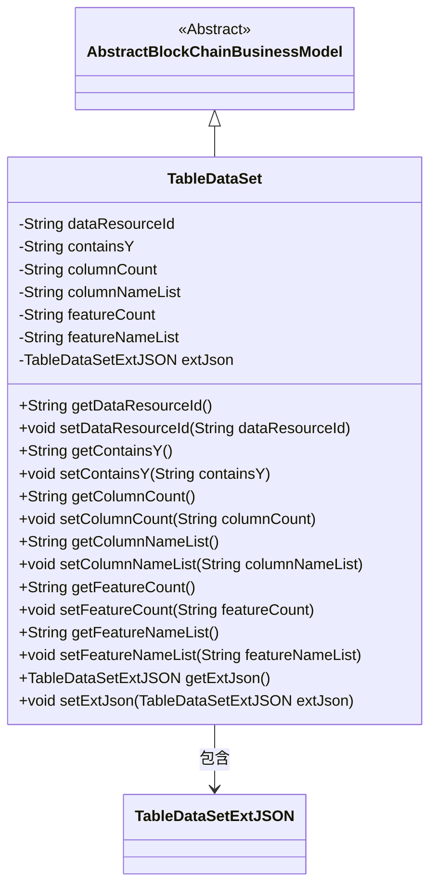

# 基础信息

|      |      |
|------|------|
| 名称 | TableDataSet |
| 编码语言 | .java |
| 代码路径 | WeFe/common/java/common-data-mongodb/src/main/java/com/welab/wefe/common/data/mongodb/entity/union/TableDataSet.java |
| 包名 | com.welab.wefe.common.data.mongodb.entity.union |
| 依赖项 | ['com.welab.wefe.common.data.mongodb.constant.MongodbTable', 'com.welab.wefe.common.data.mongodb.entity.base.AbstractBlockChainBusinessModel', 'com.welab.wefe.common.data.mongodb.entity.union.ext.DataResourceExtJSON', 'com.welab.wefe.common.data.mongodb.entity.union.ext.TableDataSetExtJSON', 'org.springframework.data.mongodb.core.mapping.Document'] |
| 概述说明 | TableDataSet类存储表格数据集信息，包含数据资源ID、列数、列名列表、特征数、特征名列表及扩展JSON字段。 |

# 说明

这是一个名为TableDataSet的Java类，用于表示MongoDB中的数据集表结构。它继承自AbstractBlockChainBusinessModel类，并映射到MongoDB的Union.TABLE_DATASET集合。类中包含数据资源ID、是否包含Y值、列数量、列名列表、特征数量、特征名列表等字段，以及一个扩展JSON对象。每个字段都有对应的getter和setter方法，用于访问和修改属性值。

# 类列表 Class Summary

| 名称   | 类型  | 说明 |
|-------|------|-------------|
| TableDataSet | class | TableDataSet类存储数据集信息，包含数据资源ID、列数、列名列表、特征数、特征名列表及扩展JSON。继承自AbstractBlockChainBusinessModel。 |

## 类 TableDataSet

|      |      |
|------|------|
| 访问范围 | @Document(collection = MongodbTable.Union.TABLE_DATASET);public |
| 类型 | class |
| 名称 | TableDataSet |
| 说明 | TableDataSet类存储数据集信息，包含数据资源ID、列数、列名列表、特征数、特征名列表及扩展JSON。继承自AbstractBlockChainBusinessModel。 |

### UML类图

这段代码定义了一个名为TableDataSet的类，它继承自AbstractBlockChainBusinessModel抽象类，并包含多个字符串类型的属性和一个TableDataSetExtJSON类型的属性。该类主要用于表示表格数据集，包含数据资源ID、是否包含Y值、列数和列名列表、特征数和特征名列表等信息，并通过extJson属性扩展存储额外JSON数据。所有属性都提供了对应的getter和setter方法，符合JavaBean规范。

### 内部方法调用关系图

```mermaid
graph TD
    A["类TableDataSet"]
    B["继承: AbstractBlockChainBusinessModel"]
    C["注解: @Document(collection = MongodbTable.Union.TABLE_DATASET)"]
    D["属性: String dataResourceId"]
    E["属性: String containsY"]
    F["属性: String columnCount"]
    G["属性: String columnNameList"]
    H["属性: String featureCount"]
    I["属性: String featureNameList"]
    J["属性: TableDataSetExtJSON extJson"]
    K["方法: getDataResourceId()"]
    L["方法: setDataResourceId(String)"]
    M["方法: getContainsY()"]
    N["方法: setContainsY(String)"]
    O["方法: getColumnCount()"]
    P["方法: setColumnCount(String)"]
    Q["方法: getColumnNameList()"]
    R["方法: setColumnNameList(String)"]
    S["方法: getFeatureCount()"]
    T["方法: setFeatureCount(String)"]
    U["方法: getFeatureNameList()"]
    V["方法: setFeatureNameList(String)"]
    W["方法: getExtJson()"]
    X["方法: setExtJson(TableDataSetExtJSON)"]

    A --> B
    A --> C
    A --> D
    A --> E
    A --> F
    A --> G
    A --> H
    A --> I
    A --> J
    A --> K
    A --> L
    A --> M
    A --> N
    A --> O
    A --> P
    A --> Q
    A --> R
    A --> S
    A --> T
    A --> U
    A --> V
    A --> W
    A --> X
```

这段代码定义了一个名为TableDataSet的类，继承自AbstractBlockChainBusinessModel，并标注为MongoDB文档集合。类中包含多个字符串类型属性（如dataResourceId、containsY等）和一个TableDataSetExtJSON类型的extJson属性，同时为每个属性提供了对应的getter和setter方法。该类主要用于表示表格数据集的结构化信息，包含列名列表、特征数量等元数据，适用于区块链业务场景下的数据存储和操作。

### 字段列表 Field List

| 名称  | 类型  | 说明 |
|-------|-------|------|
| dataResourceId | String | 私有字符串类型变量dataResourceId，用于标识数据资源。 |
| extJson = new TableDataSetExtJSON() | TableDataSetExtJSON | 定义私有变量extJson，初始化为TableDataSetExtJSON类的新实例。 |
| featureNameList | String | 私有字符串变量featureNameList，用于存储特征名称列表。 |
| containsY | String | 私有字符串变量，用于判断是否包含字母Y。 |
| columnCount | String | 私有字符串变量columnCount，用于存储列数信息。 |
| featureCount | String | 私有字符串变量featureCount，用于存储特征数量。 |
| columnNameList | String | 私有字符串变量columnNameList，用于存储列名列表。 |

### 方法列表

| 名称  | 类型  | 说明 |
|-------|-------|------|
| getDataResourceId | String | 获取数据资源ID的方法，返回字符串类型值。 |
| getColumnCount | String | 获取列数的方法，返回columnCount变量值。 |
| setFeatureNameList | void | 设置特征名称列表的方法，将输入字符串赋值给类的成员变量featureNameList。 |
| setDataResourceId | void | 设置数据资源ID的方法，将输入参数赋值给类的成员变量dataResourceId。 |
| getColumnNameList | String | 获取列名列表的方法，返回字符串类型的columnNameList。 |
| getExtJson | TableDataSetExtJSON | 获取extJson属性的方法，返回TableDataSetExtJSON类型对象。 |
| getFeatureNameList | String | 方法返回特征名称列表字符串。 |
| setExtJson | void | 这是一个Java方法，用于设置TableDataSetExtJSON类型的extJson属性值。方法接受一个extJson参数，并将其赋值给当前对象的extJson字段。 |
| getContainsY | String | 获取containsY字符串值的方法。 |
| setContainsY | void | 这是一个Java方法，用于设置字符串类型的containsY属性值。 |
| setFeatureCount | void | 这是一个Java方法，用于设置featureCount属性的值。方法接收一个字符串参数featureCount，并将其赋值给类的同名成员变量。 |
| setColumnNameList | void | 设置列名列表的方法，将输入参数赋值给类的成员变量columnNameList。 |
| setColumnCount | void | 设置列数的方法，将输入字符串赋值给类的columnCount属性。 |
| getFeatureCount | String | 获取特征数量的方法，返回字符串类型的featureCount值。 |

