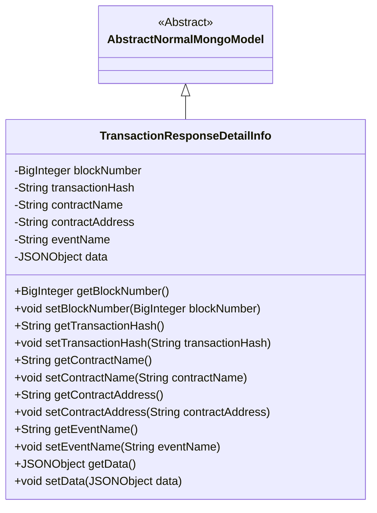

# 基础信息

|      |      |
|------|------|
| 名称 | TransactionResponseDetailInfo |
| 编码语言 | .java |
| 代码路径 | WeFe/common/java/common-data-mongodb/src/main/java/com/welab/wefe/common/data/mongodb/entity/union/TransactionResponseDetailInfo.java |
| 包名 | com.welab.wefe.common.data.mongodb.entity.union |
| 依赖项 | ['java.math.BigInteger', 'com.alibaba.fastjson.JSONObject', 'com.welab.wefe.common.data.mongodb.entity.base.AbstractNormalMongoModel'] |
| 概述说明 | TransactionResponseDetailInfo类继承AbstractNormalMongoModel，包含区块号、交易哈希、合约名、合约地址、事件名和数据等属性及其getter和setter方法。 |

# 说明

TransactionResponseDetailInfo类继承自AbstractNormalMongoModel，用于存储交易响应详细信息。包含以下字段：区块号blockNumber、交易哈希transactionHash、合约名称contractName、合约地址contractAddress、事件名称eventName以及数据data。每个字段都有对应的getter和setter方法，用于获取和设置属性值。该类主要用于处理与区块链交易相关的数据存储和检索。

# 类列表 Class Summary

| 名称   | 类型  | 说明 |
|-------|------|-------------|
| TransactionResponseDetailInfo | class | TransactionResponseDetailInfo类继承AbstractNormalMongoModel，包含区块号、交易哈希、合约名、合约地址、事件名和数据等属性及其getter/setter方法。 |

## 类 TransactionResponseDetailInfo

|      |      |
|------|------|
| 访问范围 | public |
| 类型 | class |
| 名称 | TransactionResponseDetailInfo |
| 说明 | TransactionResponseDetailInfo类继承AbstractNormalMongoModel，包含区块号、交易哈希、合约名、合约地址、事件名和数据等属性及其getter/setter方法。 |

### UML类图

这段类图展示了TransactionResponseDetailInfo类继承自抽象类AbstractNormalMongoModel，包含区块链交易相关的核心属性如区块号、交易哈希、合约信息和事件数据。该类提供了完整的getter/setter方法用于访问和修改私有字段，典型地用于存储和检索MongoDB中的区块链交易明细数据，体现了标准的数据模型设计模式。

### 内部方法调用关系图

```mermaid
graph TD
    A["类TransactionResponseDetailInfo"]
    B["继承: AbstractNormalMongoModel"]
    C["属性: BigInteger blockNumber"]
    D["属性: String transactionHash"]
    E["属性: String contractName"]
    F["属性: String contractAddress"]
    G["属性: String eventName"]
    H["属性: JSONObject data"]
    I["方法: getBlockNumber/setBlockNumber"]
    J["方法: getTransactionHash/setTransactionHash"]
    K["方法: getContractName/setContractName"]
    L["方法: getContractAddress/setContractAddress"]
    M["方法: getEventName/setEventName"]
    N["方法: getData/setData"]

    A --> B
    A --> C
    A --> D
    A --> E
    A --> F
    A --> G
    A --> H
    A --> I
    A --> J
    A --> K
    A --> L
    A --> M
    A --> N
```

这段代码定义了一个名为TransactionResponseDetailInfo的类，继承自AbstractNormalMongoModel，主要用于存储区块链交易响应详细信息。类中包含6个私有属性：blockNumber、transactionHash、contractName、contractAddress、eventName和data，每个属性都有对应的getter和setter方法。该类的设计目的是封装区块链交易相关的数据，便于在MongoDB中进行存储和查询，体现了典型的数据模型类的结构特征。

### 字段列表 Field List

| 名称  | 类型  | 说明 |
|-------|-------|------|
| contractAddress | String | 合约地址字符串变量 |
| contractName | String | 私有字符串变量contractName。 |
| transactionHash | String | 交易哈希字符串变量 |
| data | JSONObject | 私有JSONObject类型数据对象。 |
| blockNumber | BigInteger | 定义了一个私有的大整数变量blockNumber。 |
| eventName | String | 声明一个私有字符串变量eventName。 |

### 方法列表

| 名称  | 类型  | 说明 |
|-------|-------|------|
| getBlockNumber | BigInteger | 获取区块编号的方法，返回BigInteger类型的blockNumber值。 |
| getContractName | String | 获取合约名称的方法，返回字符串类型变量contractName。 |
| setEventName | void | 这是一个Java方法，用于设置事件名称。方法接收一个字符串参数eventName，并将其赋值给类的成员变量eventName。 |
| setContractName | void | Java方法：设置合同名称，将输入参数contractName赋值给当前对象的同名属性。 |
| setBlockNumber | void | 设置区块号的方法，将输入参数blockNumber赋值给当前对象的blockNumber属性。 |
| getData | JSONObject | 获取存储的JSON对象数据。 |
| setData | void | 设置JSON对象数据的方法。 |
| getTransactionHash | String | 获取交易哈希值的方法。 |
| setTransactionHash | void | Java方法：设置交易哈希值，将输入参数赋值给类成员变量transactionHash。 |
| getEventName | String | 获取事件名称的方法，返回字符串类型的事件名称。 |
| setContractAddress | void | 设置合约地址的方法，将输入参数contractAddress赋值给类的同名成员变量。 |
| getContractAddress | String | 获取合约地址的方法，返回字符串类型变量contractAddress。 |

