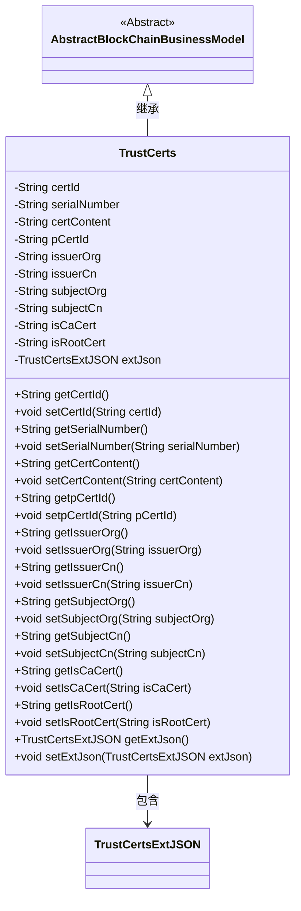

# 基础信息

|      |      |
|------|------|
| 名称 | TrustCerts |
| 编码语言 | .java |
| 代码路径 | WeFe/common/java/common-data-mongodb/src/main/java/com/welab/wefe/common/data/mongodb/entity/union/TrustCerts.java |
| 包名 | com.welab.wefe.common.data.mongodb.entity.union |
| 依赖项 | ['com.welab.wefe.common.data.mongodb.constant.MongodbTable', 'com.welab.wefe.common.data.mongodb.entity.base.AbstractBlockChainBusinessModel', 'com.welab.wefe.common.data.mongodb.entity.union.ext.TrustCertsExtJSON', 'com.welab.wefe.common.data.mongodb.entity.union.ext.UnionNodeExtJSON', 'org.springframework.data.mongodb.core.mapping.Document'] |
| 概述说明 | TrustCerts类表示MongoDB中的信任证书集合，包含证书ID、序列号、内容、颁发者、主题及CA标识等字段，继承自AbstractBlockChainBusinessModel。 |

# 说明

TrustCerts类是一个MongoDB集合模型，继承自AbstractBlockChainBusinessModel，用于存储信任证书信息。包含证书ID、序列号、证书内容、父证书ID、颁发者组织和CN、主体组织和CN、是否为CA证书和根证书标志，以及扩展JSON字段。提供了所有字段的getter和setter方法。

# 类列表 Class Summary

| 名称   | 类型  | 说明 |
|-------|------|-------------|
| TrustCerts | class | TrustCerts类存储信任证书信息，包含证书ID、序列号、内容、父证书ID、颁发者和主题信息、CA和根证书标识及扩展JSON。 |

## 类 TrustCerts

|      |      |
|------|------|
| 访问范围 | @Document(collection = MongodbTable.Union.TRUST_CERTS);public |
| 类型 | class |
| 名称 | TrustCerts |
| 说明 | TrustCerts类存储信任证书信息，包含证书ID、序列号、内容、父证书ID、颁发者和主题信息、CA和根证书标识及扩展JSON。 |

### UML类图

这段类图展示了TrustCerts类继承自AbstractBlockChainBusinessModel抽象类，并包含一个TrustCertsExtJSON类型的成员变量。TrustCerts类主要用于管理区块链中的信任证书信息，包含证书ID、序列号、证书内容、颁发者信息、主题信息等属性，以及对应的getter和setter方法。该类通过extJson字段扩展了额外的JSON格式信息，体现了区块链证书管理的核心数据结构。

### 内部方法调用关系图

这段代码定义了一个名为TrustCerts的类，用于表示信任证书的数据模型。该类继承自AbstractBlockChainBusinessModel，并使用@Document注解标记为MongoDB集合。包含12个字符串类型属性和1个TrustCertsExtJSON类型属性，每个属性都有对应的getter和setter方法。主要用于存储证书ID、序列号、内容、父证书ID、颁发者和主题信息等证书相关数据，支持区块链业务场景下的证书管理功能。

### 字段列表 Field List

| 名称  | 类型  | 说明 |
|-------|-------|------|
| serialNumber | String | 私有字符串类型变量，存储序列号。 |
| isRootCert | String | 声明一个私有字符串变量isRootCert，用于标识是否为根证书。 |
| isCaCert | String | 私有字符串变量isCaCert，用于标识是否为CA证书。 |
| certId | String | 私有字符串类型变量certId，用于存储证书ID。 |
| issuerCn | String | 声明一个私有字符串变量issuerCn，用于存储发行者的通用名称。 |
| extJson = new TrustCertsExtJSON() | TrustCertsExtJSON | 声明了一个私有变量extJson，类型为TrustCertsExtJSON，并初始化为新实例。 |
| subjectCn | String | 私有字符串变量，存储中文主题信息。 |
| pCertId | String | 私有字符串变量pCertId，用于存储证书ID。 |
| subjectOrg | String | 私有字符串变量subjectOrg，用于存储组织主题信息。 |
| certContent | String | 私有字符串变量certContent，用于存储证书内容。 |
| issuerOrg | String | 声明一个私有字符串变量issuerOrg，用于存储发行方组织信息。 |

### 方法列表

| 名称  | 类型  | 说明 |
|-------|-------|------|
| setpCertId | void | 这是一个Java方法，用于设置对象的pCertId属性值。方法接收一个字符串参数pCertId，并将其赋值给当前对象的同名属性。 |
| getSubjectOrg | String | 获取subjectOrg字符串的方法。 |
| getSubjectCn | String | 获取中文主题的方法，返回subjectCn字符串。 |
| getCertContent | String | 方法返回证书内容字符串。 |
| getSerialNumber | String | 获取序列号的方法，直接返回serialNumber变量值。 |
| setIssuerCn | void | Java方法：设置颁发者通用名(issuerCn)的字符串值。 |
| setCertContent | void | 设置证书内容的方法，将输入字符串赋值给类成员变量certContent。 |
| setIssuerOrg | void | 设置颁发机构名称的方法，将参数issuerOrg赋值给类的成员变量issuerOrg。 |
| getpCertId | String | 方法返回字符串类型的pCertId值。 |
| setSerialNumber | void | 这是一个Java方法，用于设置对象的序列号属性。方法接收一个字符串参数serialNumber，并将其赋值给对象的serialNumber字段。 |
| getIssuerCn | String | 获取证书颁发者的通用名称。 |
| getCertId | String | 获取证书ID的方法，返回certId字符串。 |
| setCertId | void | 设置证书ID的方法，将输入参数certId赋值给当前对象的certId属性。 |
| setSubjectOrg | void | 这是一个Java方法，用于设置对象的subjectOrg属性值。方法接收一个字符串参数，并将其赋值给对象的成员变量。 |
| setSubjectCn | void | 设置中文主题字段的方法，将输入值赋给类的subjectCn属性。 |
| getIssuerOrg | String | 获取颁发机构名称的方法，返回字符串issuerOrg。 |
| getIsCaCert | String | 获取isCaCert字符串值的方法。 |
| setIsCaCert | void | 设置证书是否为CA证书的方法，参数为字符串类型。 |
| getIsRootCert | String | 获取根证书标识的方法，返回字符串类型值isRootCert。 |
| setIsRootCert | void | 设置根证书标识方法，参数为字符串类型。 |
| getExtJson | TrustCertsExtJSON | 获取TrustCertsExtJSON类型的extJson对象。 |
| setExtJson | void | 设置外部JSON数据，参数为TrustCertsExtJSON类型。 |

