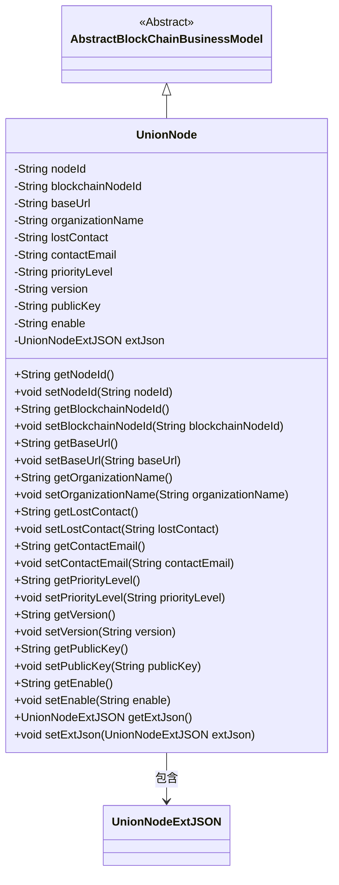

# 基础信息

|      |      |
|------|------|
| 名称 | UnionNode |
| 编码语言 | .java |
| 代码路径 | WeFe/common/java/common-data-mongodb/src/main/java/com/welab/wefe/common/data/mongodb/entity/union/UnionNode.java |
| 包名 | com.welab.wefe.common.data.mongodb.entity.union |
| 依赖项 | ['com.welab.wefe.common.data.mongodb.constant.MongodbTable', 'com.welab.wefe.common.data.mongodb.entity.base.AbstractBlockChainBusinessModel', 'com.welab.wefe.common.data.mongodb.entity.union.ext.UnionNodeExtJSON', 'org.springframework.data.mongodb.core.mapping.Document'] |
| 概述说明 | UnionNode类表示区块链联盟节点，包含节点ID、URL、组织名称、联系人、优先级、版本、公钥等属性，并扩展了额外JSON字段。 |

# 说明

UnionNode类是一个MongoDB文档模型，用于存储联盟节点信息，继承自AbstractBlockChainBusinessModel。包含节点ID、区块链节点ID、基础URL、组织名称、失联状态、联系邮箱、优先级、版本号、公钥、启用状态等字段，以及一个扩展JSON对象UnionNodeExtJSON。每个字段都有对应的getter和setter方法，用于数据的存取操作。

# 类列表 Class Summary

| 名称   | 类型  | 说明 |
|-------|------|-------------|
| UnionNode | class | UnionNode类存储联盟节点信息，包含节点ID、区块链节点ID、URL、组织名称、联系方式、优先级、版本、公钥、启用状态及扩展JSON等字段。 |

## 类 UnionNode

|      |      |
|------|------|
| 访问范围 | @Document(collection = MongodbTable.Union.UNION_NODE);public |
| 类型 | class |
| 名称 | UnionNode |
| 说明 | UnionNode类存储联盟节点信息，包含节点ID、区块链节点ID、URL、组织名称、联系方式、优先级、版本、公钥、启用状态及扩展JSON等字段。 |

### UML类图

这段代码定义了一个名为`UnionNode`的类，继承自`AbstractBlockChainBusinessModel`，用于表示区块链联盟中的节点信息。该类包含节点ID、区块链节点ID、基础URL、组织名称、联系方式、优先级、版本、公钥、启用状态等属性，并通过`UnionNodeExtJSON`类存储扩展信息。所有属性均通过getter和setter方法进行访问和修改，符合JavaBean规范。类图清晰地展示了继承关系和组合关系。

### 内部方法调用关系图

这段代码定义了一个名为UnionNode的类，继承自AbstractBlockChainBusinessModel，并使用@Document注解标记为MongoDB集合。类中包含12个私有属性，分别表示节点ID、区块链节点ID、基础URL、组织名称等，并为每个属性提供了对应的getter和setter方法。特别地，extJson属性是一个UnionNodeExtJSON对象，用于存储扩展信息。该类主要用于描述联盟链中的节点信息，通过封装属性和方法实现对节点数据的操作和管理。

### 字段列表 Field List

| 名称  | 类型  | 说明 |
|-------|-------|------|
| contactEmail | String | 私有字符串变量，存储联系邮箱。 |
| publicKey | String | 私有字符串变量publicKey，用于存储公钥。 |
| blockchainNodeId | String | 私有字符串变量，用于存储区块链节点ID。 |
| priorityLevel | String | 私有字符串变量，表示优先级级别。 |
| organizationName | String | 私有字符串变量，存储组织名称。 |
| lostContact | String | 私有字符串变量lostContact，用于存储失联信息。 |
| version | String | 私有字符串变量version，用于存储版本信息。 |
| enable | String | 私有字符串变量enable |
| nodeId | String | 私有字符串类型变量nodeId |
| baseUrl | String | 声明一个私有字符串变量baseUrl。 |
| extJson = new UnionNodeExtJSON() | UnionNodeExtJSON | 私有变量extJson初始化为UnionNodeExtJSON类的新实例。 |

### 方法列表

| 名称  | 类型  | 说明 |
|-------|-------|------|
| getNodeId | String | 获取节点ID的方法，返回字符串类型的nodeId。 |
| getVersion | String | 获取版本号的方法，返回字符串类型的version值。 |
| setContactEmail | void | 设置联系邮箱的方法，将参数contactEmail赋值给类的同名属性。 |
| getPriorityLevel | String | 获取优先级等级的方法，返回字符串类型的priorityLevel值。 |
| getContactEmail | String | 获取联系邮箱的方法，直接返回contactEmail变量值。 |
| setBaseUrl | void | 设置基础URL的方法，将输入参数baseUrl赋值给类的成员变量this.baseUrl。 |
| setPriorityLevel | void | 设置优先级方法，接收字符串参数并赋值给类成员变量priorityLevel。 |
| setVersion | void | 设置版本号的方法，将输入参数version赋值给当前对象的version属性。 |
| getLostContact | String | 获取丢失联系信息的方法，返回lostContact字符串。 |
| getBlockchainNodeId | String | 获取区块链节点ID的方法，返回字符串类型节点ID。 |
| setBlockchainNodeId | void | 设置区块链节点ID的方法，将参数赋值给成员变量。 |
| getOrganizationName | String | 获取组织名称的方法，返回字符串类型变量organizationName。 |
| setOrganizationName | void | 设置组织名称的方法，将输入参数赋值给成员变量organizationName。 |
| setNodeId | void | 设置节点ID的方法，将输入参数nodeId赋值给当前对象的nodeId属性。 |
| setLostContact | void | 设置失去联系状态的方法，参数为字符串类型。 |
| getBaseUrl | String | 方法返回baseUrl字符串值。 |
| getEnable | String | 获取enable值的公共方法，返回字符串类型。 |
| setEnable | void | 这是一个Java方法，用于设置enable属性的值。方法接受一个字符串参数enable，并将其赋值给类的同名成员变量。 |
| getExtJson | UnionNodeExtJSON | 方法返回UnionNodeExtJSON类型的extJson对象。 |
| setExtJson | void | 方法setExtJson用于设置extJson属性，参数为UnionNodeExtJSON类型对象。 |
| getPublicKey | String | 获取公钥的方法，返回字符串类型的publicKey变量值。 |
| setPublicKey | void | 设置公钥的方法，将输入字符串赋值给类的publicKey成员变量。 |

