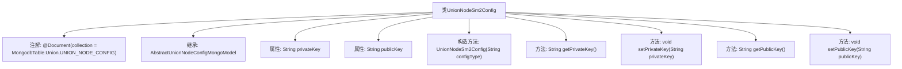

# 基础信息

|      |      |
|------|------|
| 名称 | UnionNodeSm2Config |
| 编码语言 | .java |
| 代码路径 | WeFe/common/java/common-data-mongodb/src/main/java/com/welab/wefe/common/data/mongodb/entity/union/UnionNodeSm2Config.java |
| 包名 | com.welab.wefe.common.data.mongodb.entity.union |
| 依赖项 | ['com.welab.wefe.common.data.mongodb.constant.MongodbTable', 'com.welab.wefe.common.data.mongodb.entity.base.AbstractUnionNodeConfigMongoModel', 'org.springframework.data.mongodb.core.mapping.Document'] |
| 概述说明 | UnionNodeSm2Config类继承AbstractUnionNodeConfigMongoModel，存储SM2公私钥，包含getter/setter方法。 |

# 说明

UnionNodeSm2Config类是一个MongoDB文档模型，用于存储联盟节点的SM2密钥配置。它继承自AbstractUnionNodeConfigMongoModel，标注为MongodbTable.Union.UNION_NODE_CONFIG集合。类中包含私钥privateKey和公钥publicKey两个字符串属性，并提供了对应的getter和setter方法。构造函数接受configType参数进行初始化。

# 类列表 Class Summary

| 名称   | 类型  | 说明 |
|-------|------|-------------|
| UnionNodeSm2Config | class | UnionNodeSm2Config类继承AbstractUnionNodeConfigMongoModel，存储SM2密钥对，包含公私钥字段及getter/setter方法。 |


## 类 UnionNodeSm2Config

|      |      |
|------|------|
| 访问范围 | @Document(collection = MongodbTable.Union.UNION_NODE_CONFIG);public |
| 类型 | class |
| 名称 | UnionNodeSm2Config |
| 说明 | UnionNodeSm2Config类继承AbstractUnionNodeConfigMongoModel，存储SM2密钥对，包含公私钥字段及getter/setter方法。 |


### UML类图

```mermaid
classDiagram
    class AbstractUnionNodeConfigMongoModel {
        <<Abstract>>
        // 抽象基类，提供通用配置模型功能
    }
    
    class UnionNodeSm2Config {
        -String privateKey
        -String publicKey
        +UnionNodeSm2Config(String configType)
        +String getPrivateKey()
        +void setPrivateKey(String privateKey)
        +String getPublicKey()
        +void setPublicKey(String publicKey)
    }
    
    AbstractUnionNodeConfigMongoModel <|-- UnionNodeSm2Config : 继承
    note for UnionNodeSm2Config "MongoDB集合映射：\n"+MongodbTable.Union.UNION_NODE_CONFIG
```

这段代码描述了一个用于SM2加密算法节点配置的MongoDB实体类。UnionNodeSm2Config继承自抽象基类AbstractUnionNodeConfigMongoModel，包含公私钥对存储字段，通过@Document注解映射到指定的MongoDB集合。该类提供了标准的getter/setter方法，并支持通过构造器初始化配置类型，主要用于在联盟链场景下管理节点的SM2加密密钥配置。


### 内部方法调用关系图



这段代码定义了一个名为UnionNodeSm2Config的类，该类继承自AbstractUnionNodeConfigMongoModel，并使用@Document注解指定了MongoDB的集合名称。类中包含两个私有属性privateKey和publicKey，以及对应的getter和setter方法。构造方法接收一个configType参数并初始化父类的configType属性。该类的设计主要用于存储SM2加密算法的公私钥配置信息，并通过MongoDB进行持久化存储。

### 字段列表 Field List

| 名称  | 类型  | 说明 |
|-------|-------|------|
| privateKey | String | 私有密钥字符串变量 |
| publicKey | String | 私有字符串变量publicKey，用于存储公钥。 |

### 方法列表

| 名称  | 类型  | 说明 |
|-------|-------|------|
| getPublicKey | String | 获取公钥的方法，返回publicKey字符串。 |
| setPrivateKey | void | 设置私有密钥的方法，将输入字符串赋值给类的私有密钥变量。 |
| getPrivateKey | String | 获取私有密钥的方法，返回privateKey变量值。 |
| setPublicKey | void | 设置公钥的方法，将输入字符串赋值给类的publicKey成员变量。 |


