# 基础信息

|      |      |
|------|------|
| 名称 | union |
| 编码语言 | .java |
| 代码路径 | WeFe/common/java/common-data-mongodb/src/main/java/com/welab/wefe/common/data/mongodb/entity/union |
| 包名 | docs.common.java.common-data-mongodb.src.main.java.com.welab.wefe.common.data.mongodb.entity.union |
| 概述说明 | Java模块提供JSON数据扩展框架，支持联邦学习场景下各类业务实体（数据集、成员服务、实名认证等）的扩展管理，通过POJO类定义数据结构，依赖Java标准库和MongoDB实现存储。 |

# 说明

## 概述  
该模块是联邦学习场景下的数据管理核心组件，通过MongoDB实体类实现多类型数据资源的统一建模与扩展管理。采用继承AbstractBlockChainBusinessModel的标准化结构，所有实体类均包含extJson字段支持JSON扩展，例如DataSet扩展数据权限控制，Member扩展实名认证状态。关键数据结构包括数据集元信息(DataSet)、成员权限(DataSetMemberPermission)和信任证书(TrustCerts)等12种文档模型。外部依赖仅涉及MongoDB驱动和Java标准库，类似ORM层的数据持久化方案。

## 主要业务场景  
模块支撑联邦学习全生命周期数据管理，包含三类典型场景：数据资源管理（如ImageDataSet处理图像标注）、成员服务（如MemberService维护网关信息）和区块链交互（如BlockSyncHeight记录区块同步状态）。交互模式统一采用POJO的getter/setter规范，例如RealnameAuthAgreementTemplate通过extJson动态扩展协议模板。功能完整性体现在覆盖数据标注、权限控制、节点认证等8个业务维度，类似配置中心的元数据管理架构。API类型均为MongoDB文档实体，集成案例包括数据资源标签系统（DataResourceDefaultTag）和SM2密钥配置（UnionNodeSm2Config）。

### 包内部结构视图

```mermaid
graph TD
    union --> ext
    union --> DataResourceDefaultTag.java
    union --> TableDataSet.java
    union --> TrustCerts.java
    union --> RealnameAuthAgreementTemplate.java
    union --> DataResourceLazyUpdateModel.java
    union --> MemberFileInfo.java
    union --> DataSet.java
    union --> BloomFilter.java
    union --> BlockSyncHeight.java
    union --> UnionNode.java
    union --> BlockSyncDetailInfo.java
    union --> BlockSyncContractHeight.java
    union --> DataResource.java
    union --> TransactionResponseDetailInfo.java
    union --> MemberAuthType.java
    union --> DataSetMemberPermission.java
    union --> ImageDataSet.java
    union --> MemberService.java
    union --> Member.java
    union --> DataSetDefaultTag.java
    union --> UnionNodeSm2Config.java
    ext --> DataSetDefaultTagExtJSON.java
    ext --> MemberServiceExtJSON.java
    ext --> MemberAuthTypeExtJSON.java
    ext --> TableDataSetExtJSON.java
    ext --> RealnameAuthAgreementTemplateExtJSON.java
    ext --> BloomFilterExtJSON.java
    ext --> MemberExtJSON.java
    ext --> DataSetMemberPermissionExtJSON.java
    ext --> ImageDataSetExtJSON.java
    ext --> UnionNodeExtJSON.java
    ext --> RealnameAuthFileInfo.java
    ext --> MemberFileInfoExtJSON.java
    ext --> DataResourceDefaultTagExtJSON.java
    ext --> DataResourceExtJSON.java
    ext --> TrustCertsExtJSON.java
    ext --> DataSetExtJSON.java
```

该流程图展示了union目录及其子目录ext的层级结构。union目录下包含多个实体类文件，如DataResourceDefaultTag.java、TableDataSet.java等；ext子目录则包含一系列扩展类文件，如DataSetDefaultTagExtJSON.java、MemberServiceExtJSON.java等。整个结构清晰地反映了实体类与扩展类之间的分类关系。

# 文件列表

| 名称   | 类型  | 说明 |
|-------|------|-------------|
| [DataResourceDefaultTag.java](DataResourceDefaultTag.md) | file | Java类DataResourceDefaultTag表示MongoDB集合中的默认标签，包含标签ID、名称、资源类型和扩展JSON字段，继承自AbstractBlockChainBusinessModel。 |
| [TableDataSet.java](TableDataSet.md) | file | TableDataSet类存储表格数据集信息，包含数据资源ID、列数、列名列表、特征数、特征名列表及扩展JSON字段。 |
| [TrustCerts.java](TrustCerts.md) | file | TrustCerts类表示MongoDB中的信任证书集合，包含证书ID、序列号、内容、颁发者、主题及CA标识等字段，继承自AbstractBlockChainBusinessModel。 |
| [RealnameAuthAgreementTemplate.java](RealnameAuthAgreementTemplate.md) | file | Java类RealnameAuthAgreementTemplate表示实名认证协议模板，包含文件ID、签名、名称、区块链节点ID、启用状态、版本及扩展JSON数据。 |
| [DataResourceLazyUpdateModel.java](DataResourceLazyUpdateModel.md) | file | DataResourceLazyUpdateModel类用于记录数据资源的懒更新信息，包含资源ID、类型、标签列表、数据总量、已标记数量、标记完成状态及在作业、流程、项目和成员中的使用次数。 |
| [MemberFileInfo.java](MemberFileInfo.md) | file | MemberFileInfo类表示成员文件信息，包含文件ID、签名、名称、大小、成员ID、区块链节点ID、用途、公开级别、描述、启用状态及扩展JSON数据。 |
| [DataSet.java](DataSet.md) | file | 数据集类，包含ID、名称、成员ID、行列数、特征、公开级别、使用统计、描述、标签等属性，扩展JSON字段。 |
| [BloomFilter.java](BloomFilter.md) | file | BloomFilter类继承AbstractBlockChainBusinessModel，包含dataResourceId、hashFunction和extJson属性，提供构造方法和getter/setter。 |
| [BlockSyncHeight.java](BlockSyncHeight.md) | file | Java类BlockSyncHeight用于存储区块同步高度信息，包含groupId和blockNumber字段及其getter/setter方法。 |
| [UnionNode.java](UnionNode.md) | file | UnionNode类表示区块链联盟节点，包含节点ID、URL、组织名称、联系人、优先级、版本、公钥等属性，并扩展了额外JSON字段。 |
| [BlockSyncDetailInfo.java](BlockSyncDetailInfo.md) | file | MongoDB实体类BlockSyncDetailInfo，包含groupId、blockNumber和data字段，用于存储区块同步详细信息。 |
| [BlockSyncContractHeight.java](BlockSyncContractHeight.md) | file | MongoDB实体类BlockSyncContractHeight，包含groupId、blockNumber和contractName字段，用于存储区块同步合约高度信息。 |
| [DataResource.java](DataResource.md) | file | DataResource类存储MongoDB数据资源信息，包含ID、名称、描述、标签、数据量、公开级别、使用统计及扩展JSON等属性。 |
| [TransactionResponseDetailInfo.java](TransactionResponseDetailInfo.md) | file | TransactionResponseDetailInfo类继承AbstractNormalMongoModel，包含区块号、交易哈希、合约名、合约地址、事件名和数据等属性及其getter和setter方法。 |
| [MemberAuthType.java](MemberAuthType.md) | file | Java类MemberAuthType，存储于MongoDB的MEMBER_AUTH_TYPE表，包含typeId（自动生成UUID）、typeName和extJson字段，提供getter/setter方法。继承AbstractBlockChainBusinessModel。 |
| [DataSetMemberPermission.java](DataSetMemberPermission.md) | file | 数据集成员权限类，包含权限ID、数据集ID、成员ID和扩展JSON字段，继承自区块链业务模型基类。 |
| [ImageDataSet.java](ImageDataSet.md) | file | ImageDataSet类表示MongoDB中的图像数据集，包含数据资源ID、任务类型、标签列表、标注数量、完成状态、文件大小和扩展JSON信息。 |
| [MemberService.java](MemberService.md) | file | MemberService类存储会员服务信息，包含ID、名称、URL、API、类型、状态等字段及扩展JSON。 |
| [Member.java](Member.md) | file | Member类表示区块链成员，包含ID、姓名、联系方式、状态标志、公钥、网关URI、LOGO、最后活动时间和扩展信息等属性。 |
| [DataSetDefaultTag.java](DataSetDefaultTag.md) | file | DataSetDefaultTag类继承AbstractBlockChainBusinessModel，包含tagId、tagName和extJson属性，提供对应的getter和setter方法。tagId默认生成UUID并去除横线。 |
| [UnionNodeSm2Config.java](UnionNodeSm2Config.md) | file | UnionNodeSm2Config类继承AbstractUnionNodeConfigMongoModel，存储SM2公私钥，包含getter/setter方法。 |
| [ext](ext/_module.md) | package | 多个Java扩展JSON处理类，多数为空实现，功能待定。MemberExtJSON含成员信息字段及方法，DataSetExtJSON有enable属性。RealnameAuthFileInfo存储文件信息。 |

