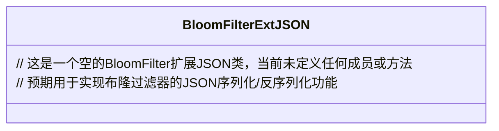

# 基础信息

|      |      |
|------|------|
| 名称 | BloomFilterExtJSON |
| 编码语言 | .java |
| 代码路径 | WeFe/common/java/common-data-mongodb/src/main/java/com/welab/wefe/common/data/mongodb/entity/union/ext/BloomFilterExtJSON.java |
| 包名 | com.welab.wefe.common.data.mongodb.entity.union.ext |
| 依赖项 | [] |
| 概述说明 | BloomFilterExtJSON是一个公开的Java类，可能用于扩展布隆过滤器的JSON功能。 |

# 说明

BloomFilterExtJSON是一个公开的Java类，目前为空实现，未包含任何成员变量或方法。类名表明它可能用于扩展布隆过滤器的JSON相关功能，但具体用途需结合上下文或后续实现确定。作为基础类结构，它为后续功能扩展提供了框架。

# 类列表 Class Summary

| 名称   | 类型  | 说明 |
|-------|------|-------------|
| BloomFilterExtJSON | class | BloomFilterExtJSON是一个公开类，用于扩展布隆过滤器的JSON功能。 |

## 类 BloomFilterExtJSON

|      |      |
|------|------|
| 访问范围 | public |
| 类型 | class |
| 名称 | BloomFilterExtJSON |
| 说明 | BloomFilterExtJSON是一个公开类，用于扩展布隆过滤器的JSON功能。 |

### UML类图

这段类图展示了一个名为BloomFilterExtJSON的空类结构。从类名推断，它可能用于扩展布隆过滤器功能，特别是处理JSON格式的数据转换。当前类未包含任何字段或方法，但未来可能会添加序列化/反序列化相关的方法，用于将布隆过滤器的位数组和哈希函数配置转换为JSON格式，或从JSON重建布隆过滤器状态。

### 内部方法调用关系图

这段流程图描述了一个名为BloomFilterExtJSON的空类结构。目前该类尚未包含任何属性或方法，仅作为类声明存在。在后续开发中，可以在此类中添加布隆过滤器相关的属性和方法，如哈希函数集合、位数组操作等核心功能。该图展示了最基本的类定义节点，为后续扩展留出了结构空间。

### 字段列表 Field List

| 名称  | 类型  | 说明 |
|-------|-------|------|

### 方法列表

| 名称  | 类型  | 说明 |
|-------|-------|------|

