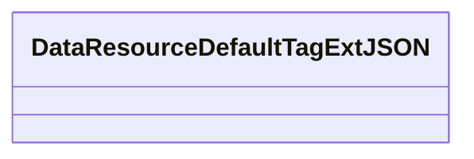
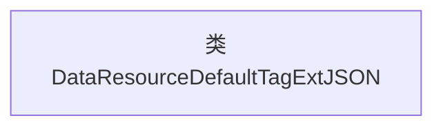

# 基础信息

|      |      |
|------|------|
| 名称 | DataResourceDefaultTagExtJSON |
| 编码语言 | .java |
| 代码路径 | WeFe/common/java/common-data-mongodb/src/main/java/com/welab/wefe/common/data/mongodb/entity/union/ext/DataResourceDefaultTagExtJSON.java |
| 包名 | com.welab.wefe.common.data.mongodb.entity.union.ext |
| 依赖项 | [] |
| 概述说明 | 类DataResourceDefaultTagExtJSON定义了一个默认标签扩展的JSON数据结构。 |

# 说明

该内容定义了一个名为DataResourceDefaultTagExtJSON的公共Java类。该类目前为空，未包含任何成员变量或方法，仅作为基础类结构存在。其命名表明可能与数据资源的默认标签扩展JSON处理相关，但具体功能需通过后续实现补充。

# 类列表 Class Summary

| 名称   | 类型  | 说明 |
|-------|------|-------------|
| DataResourceDefaultTagExtJSON | class | 类DataResourceDefaultTagExtJSON定义了一个默认标签扩展的JSON数据结构。 |

## 类 DataResourceDefaultTagExtJSON

|      |      |
|------|------|
| 访问范围 | public |
| 类型 | class |
| 名称 | DataResourceDefaultTagExtJSON |
| 说明 | 类DataResourceDefaultTagExtJSON定义了一个默认标签扩展的JSON数据结构。 |

### UML类图

这段类图描述了一个名为DataResourceDefaultTagExtJSON的空类，目前该类没有定义任何成员变量或方法。这是一个基础类结构，可以作为后续扩展的起点，未来可以添加与数据资源默认标签扩展相关的属性和行为。类名表明它可能与JSON格式的数据资源标签处理有关，但当前实现尚未提供具体功能。

### 内部方法调用关系图

这段流程图描述了一个名为DataResourceDefaultTagExtJSON的空类结构。由于该类未包含任何属性或方法，图中仅显示类名节点。这种结构通常作为基类或占位符使用，后续可通过继承扩展功能或添加成员变量和方法。空类在框架设计中常用于标记接口或作为扩展点预留。

### 字段列表 Field List

| 名称  | 类型  | 说明 |
|-------|-------|------|

### 方法列表

| 名称  | 类型  | 说明 |
|-------|-------|------|

