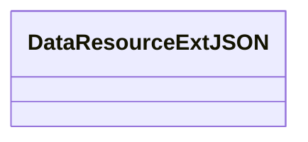

# 基础信息

|      |      |
|------|------|
| 名称 | DataResourceExtJSON |
| 编码语言 | .java |
| 代码路径 | WeFe/common/java/common-data-mongodb/src/main/java/com/welab/wefe/common/data/mongodb/entity/union/ext/DataResourceExtJSON.java |
| 包名 | com.welab.wefe.common.data.mongodb.entity.union.ext |
| 依赖项 | [] |
| 概述说明 | 类DataResourceExtJSON用于处理JSON数据资源。 |

# 说明

这是一个名为DataResourceExtJSON的公开Java类定义，当前为空类，未包含任何成员变量或方法。类名中的"ExtJSON"可能暗示其功能与JSON数据扩展处理相关，但具体用途需结合完整代码上下文确定。该定义仅提供了最基本的类结构框架。

# 类列表 Class Summary

| 名称   | 类型  | 说明 |
|-------|------|-------------|
| DataResourceExtJSON | class | DataResourceExtJSON是一个公开的Java类，用于处理JSON数据资源。 |

## 类 DataResourceExtJSON

|      |      |
|------|------|
| 访问范围 | public |
| 类型 | class |
| 名称 | DataResourceExtJSON |
| 说明 | DataResourceExtJSON是一个公开的Java类，用于处理JSON数据资源。 |

### UML类图

这段代码定义了一个名为DataResourceExtJSON的空类，目前没有任何属性和方法。从类名推测，这个类可能用于处理JSON格式的数据资源扩展功能，但当前实现为空，需要后续添加具体功能。类名中的"Ext"可能表示这是某个基础类的扩展版本，但缺少更多上下文信息。

### 内部方法调用关系图

这段流程图描述了一个名为DataResourceExtJSON的空类结构。图中仅包含一个节点表示类声明，没有展示任何属性或方法，因为原始代码中该类是空的。这种结构通常作为基类或占位符使用，后续可通过继承或扩展来添加具体功能。空类在框架设计中常用于标记特定类型或作为扩展点。

### 字段列表 Field List

| 名称  | 类型  | 说明 |
|-------|-------|------|

### 方法列表

| 名称  | 类型  | 说明 |
|-------|-------|------|

