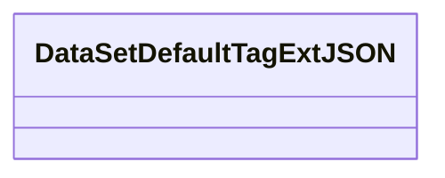
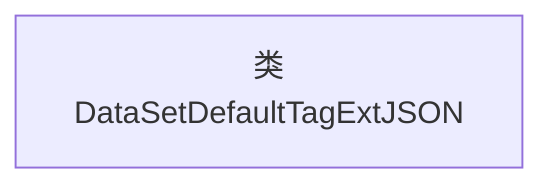

# 基础信息

|      |      |
|------|------|
| 名称 | DataSetDefaultTagExtJSON |
| 编码语言 | .java |
| 代码路径 | WeFe/common/java/common-data-mongodb/src/main/java/com/welab/wefe/common/data/mongodb/entity/union/ext/DataSetDefaultTagExtJSON.java |
| 包名 | com.welab.wefe.common.data.mongodb.entity.union.ext |
| 依赖项 | [] |
| 概述说明 | 类DataSetDefaultTagExtJSON用于处理数据集默认标签的JSON扩展。 |

# 说明

这是一个名为DataSetDefaultTagExtJSON的公开Java类，目前类体为空，未定义任何成员变量或方法。该类可能用于处理与数据集默认标签相关的JSON数据扩展功能，但具体用途需根据实际实现确定。类名采用驼峰命名法，符合Java命名规范。

# 类列表 Class Summary

| 名称   | 类型  | 说明 |
|-------|------|-------------|
| DataSetDefaultTagExtJSON | class | 类DataSetDefaultTagExtJSON用于处理默认标签数据的JSON操作。 |

## 类 DataSetDefaultTagExtJSON

|      |      |
|------|------|
| 访问范围 | public |
| 类型 | class |
| 名称 | DataSetDefaultTagExtJSON |
| 说明 | 类DataSetDefaultTagExtJSON用于处理默认标签数据的JSON操作。 |

### UML类图

这段类图描述了一个名为DataSetDefaultTagExtJSON的空类，目前没有任何属性和方法。这是一个基础的数据集标签扩展JSON处理类，可能用于处理与数据集相关的默认标签扩展功能，但当前尚未实现具体功能。类名表明它可能与JSON格式的数据集标签扩展相关，可能是某个数据处理系统的一部分。

### 内部方法调用关系图

这段代码定义了一个名为`DataSetDefaultTagExtJSON`的空类，目前没有任何属性或方法。流程图仅包含一个节点表示该类的声明。由于类体为空，没有内部结构或方法调用关系需要展示。这是一个基础类框架，可能用于后续扩展数据标记相关的JSON处理功能。

### 字段列表 Field List

| 名称  | 类型  | 说明 |
|-------|-------|------|

### 方法列表

| 名称  | 类型  | 说明 |
|-------|-------|------|

