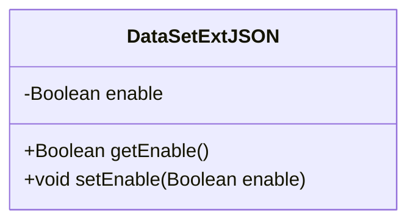
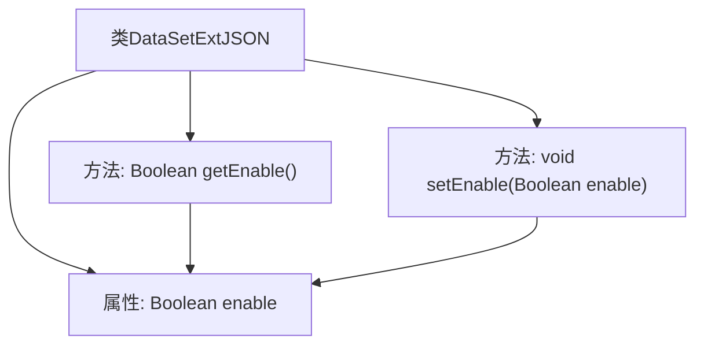

# 基础信息

|      |      |
|------|------|
| 名称 | DataSetExtJSON |
| 编码语言 | .java |
| 代码路径 | WeFe/common/java/common-data-mongodb/src/main/java/com/welab/wefe/common/data/mongodb/entity/union/ext/DataSetExtJSON.java |
| 包名 | com.welab.wefe.common.data.mongodb.entity.union.ext |
| 依赖项 | [] |
| 概述说明 | DataSetExtJSON类包含一个布尔类型属性enable及其getter和setter方法。 |

# 说明

DataSetExtJSON是一个Java类，包含一个私有布尔类型成员变量enable，表示启用状态。该类提供了获取和设置enable值的公共方法getEnable和setEnable，用于访问和修改该变量的值。

# 类列表 Class Summary

| 名称   | 类型  | 说明 |
|-------|------|-------------|
| DataSetExtJSON | class | DataSetExtJSON类包含一个布尔类型enable属性及其getter和setter方法。 |

## 类 DataSetExtJSON

|      |      |
|------|------|
| 访问范围 | public |
| 类型 | class |
| 名称 | DataSetExtJSON |
| 说明 | DataSetExtJSON类包含一个布尔类型enable属性及其getter和setter方法。 |

### UML类图

这段代码定义了一个名为DataSetExtJSON的简单Java类，用于表示某种数据集的扩展JSON配置。该类包含一个私有布尔类型字段enable，以及对应的公有getter和setter方法。enable字段用于控制数据集扩展功能的启用状态，通过getEnable()方法可以获取当前状态，通过setEnable()方法可以修改该状态。这是一个典型的数据封装类，符合JavaBean规范。

### 内部方法调用关系图

这段代码定义了一个名为DataSetExtJSON的简单Java类，包含一个Boolean类型的enable属性和对应的getter/setter方法。流程图展示了类的基本结构：类作为根节点，向下延伸出属性节点和方法节点，其中getEnable()和setEnable()方法都操作enable属性。这是一个典型的数据封装类，用于存储和访问布尔型配置标志，常见于配置管理或数据传输场景。

### 字段列表 Field List

| 名称  | 类型  | 说明 |
|-------|-------|------|
| enable | Boolean | 私有布尔类型变量enable，用于控制功能开关状态。 |

### 方法列表

| 名称  | 类型  | 说明 |
|-------|-------|------|
| getEnable | Boolean | 获取enable布尔值的公共方法。 |
| setEnable | void | 方法setEnable用于设置布尔类型的enable属性值。 |

