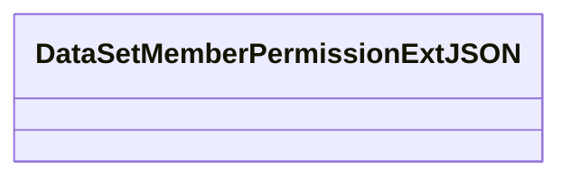
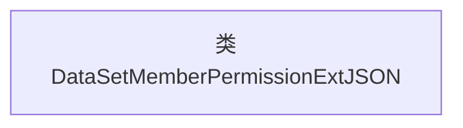

# 基础信息

|      |      |
|------|------|
| 名称 | DataSetMemberPermissionExtJSON |
| 编码语言 | .java |
| 代码路径 | WeFe/common/java/common-data-mongodb/src/main/java/com/welab/wefe/common/data/mongodb/entity/union/ext/DataSetMemberPermissionExtJSON.java |
| 包名 | com.welab.wefe.common.data.mongodb.entity.union.ext |
| 依赖项 | [] |
| 概述说明 | 类定义：DataSetMemberPermissionExtJSON，用于处理数据集成员权限扩展的JSON数据。 |

# 说明

这是一个名为DataSetMemberPermissionExtJSON的公开Java类，目前类体为空，未定义任何成员变量或方法。该类可能用于处理数据集成员权限相关的扩展JSON数据，但具体功能需根据后续实现的代码逻辑确定。类名采用驼峰命名法，符合Java命名规范，后缀"ExtJSON"暗示其与JSON数据扩展功能相关。

# 类列表 Class Summary

| 名称   | 类型  | 说明 |
|-------|------|-------------|
| DataSetMemberPermissionExtJSON | class | 类DataSetMemberPermissionExtJSON用于定义数据集成员权限扩展的JSON结构。 |

## 类 DataSetMemberPermissionExtJSON

|      |      |
|------|------|
| 访问范围 | public |
| 类型 | class |
| 名称 | DataSetMemberPermissionExtJSON |
| 说明 | 类DataSetMemberPermissionExtJSON用于定义数据集成员权限扩展的JSON结构。 |

### UML类图

这段类图描述了一个名为DataSetMemberPermissionExtJSON的空类，目前该类未定义任何成员变量或方法。从类名推断，这可能是一个用于处理数据集成员权限扩展信息的JSON相关类，但当前实现为空，未来可能会添加与权限验证、数据序列化/反序列化相关的属性和方法。类名中的"Ext"暗示这是某个基础权限类的扩展实现，但当前缺乏具体实现细节。

### 内部方法调用关系图

这段流程图描述了一个名为DataSetMemberPermissionExtJSON的空类结构。该类目前未包含任何属性或方法，仅作为框架存在。在Mermaid图中，我们用一个单独的节点表示这个类，没有进一步的内部结构或方法调用关系。这种设计可能用于未来扩展权限管理功能，或作为数据集的成员权限扩展接口的基类。当前实现需要后续补充具体业务逻辑和成员变量。

### 字段列表 Field List

| 名称  | 类型  | 说明 |
|-------|-------|------|

### 方法列表

| 名称  | 类型  | 说明 |
|-------|-------|------|

