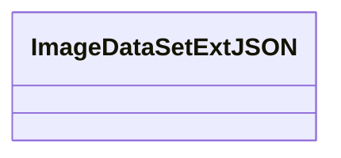

# 基础信息

|      |      |
|------|------|
| 名称 | ImageDataSetExtJSON |
| 编码语言 | .java |
| 代码路径 | WeFe/common/java/common-data-mongodb/src/main/java/com/welab/wefe/common/data/mongodb/entity/union/ext/ImageDataSetExtJSON.java |
| 包名 | com.welab.wefe.common.data.mongodb.entity.union.ext |
| 依赖项 | [] |
| 概述说明 | ImageDataSetExtJSON是一个公共类，用于处理图像数据集扩展的JSON数据。 |

# 说明

这是一个名为ImageDataSetExtJSON的公开Java类，目前为空实现，未包含任何成员变量或方法。类名表明其可能用于处理图像数据集的扩展JSON相关功能，但具体用途需结合完整代码上下文确定。类采用驼峰命名法，符合Java命名规范。

# 类列表 Class Summary

| 名称   | 类型  | 说明 |
|-------|------|-------------|
| ImageDataSetExtJSON | class | ImageDataSetExtJSON是一个公共类，用于处理图像数据集扩展的JSON数据。 |

## 类 ImageDataSetExtJSON

|      |      |
|------|------|
| 访问范围 | public |
| 类型 | class |
| 名称 | ImageDataSetExtJSON |
| 说明 | ImageDataSetExtJSON是一个公共类，用于处理图像数据集扩展的JSON数据。 |

### UML类图

这段类图描述了一个名为ImageDataSetExtJSON的空类，目前没有定义任何属性和方法。根据类名推测，它可能用于处理图像数据集的JSON扩展功能，但当前实现为空，需要后续补充具体功能实现。类名中的"ExtJSON"暗示该类可能与JSON格式的数据扩展相关。

### 内部方法调用关系图

这段流程图描述了一个名为ImageDataSetExtJSON的空类结构。图中仅包含一个节点表示类声明，没有属性或方法定义。该图展示了最基本的类框架，可作为后续扩展的基础结构。由于当前类体为空，流程图仅反映类名标识，没有内部成员或方法调用关系需要展示。

### 字段列表 Field List

| 名称  | 类型  | 说明 |
|-------|-------|------|

### 方法列表

| 名称  | 类型  | 说明 |
|-------|-------|------|

