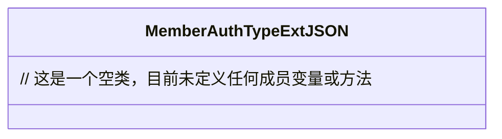

# 基础信息

|      |      |
|------|------|
| 名称 | MemberAuthTypeExtJSON |
| 编码语言 | .java |
| 代码路径 | WeFe/common/java/common-data-mongodb/src/main/java/com/welab/wefe/common/data/mongodb/entity/union/ext/MemberAuthTypeExtJSON.java |
| 包名 | com.welab.wefe.common.data.mongodb.entity.union.ext |
| 依赖项 | [] |
| 概述说明 | 类MemberAuthTypeExtJSON定义了一个公开的JSON扩展类。 |

# 说明

该内容定义了一个名为MemberAuthTypeExtJSON的公开Java类，当前类体为空，未包含任何成员变量或方法。类名表明其可能用于处理成员认证类型的扩展JSON数据，但具体功能需结合后续实现确定。

# 类列表 Class Summary

| 名称   | 类型  | 说明 |
|-------|------|-------------|
| MemberAuthTypeExtJSON | class | MemberAuthTypeExtJSON是一个空的公共类，可能用于扩展成员认证类型相关功能。 |

## 类 MemberAuthTypeExtJSON

|      |      |
|------|------|
| 访问范围 | public |
| 类型 | class |
| 名称 | MemberAuthTypeExtJSON |
| 说明 | MemberAuthTypeExtJSON是一个空的公共类，可能用于扩展成员认证类型相关功能。 |

### UML类图

这段类图描述了一个名为MemberAuthTypeExtJSON的空类，当前未包含任何属性或方法。从类名推测可能用于处理会员认证类型的扩展JSON数据，但具体功能需根据后续实现的成员变量和方法来确定。类图采用标准UML格式展示，虚线框表示类定义，内部空白反映当前无成员状态，符合Mermaid语法规范。

### 内部方法调用关系图

这段流程图描述了一个名为MemberAuthTypeExtJSON的空类结构。该图仅包含一个节点，表示该类当前未定义任何属性、构造方法或成员方法。这是一个最简单的类结构示意图，适用于框架预留或待实现的类模板。图中没有箭头连接，因为不存在内部调用关系或继承关系。

### 字段列表 Field List

| 名称  | 类型  | 说明 |
|-------|-------|------|

### 方法列表

| 名称  | 类型  | 说明 |
|-------|-------|------|

