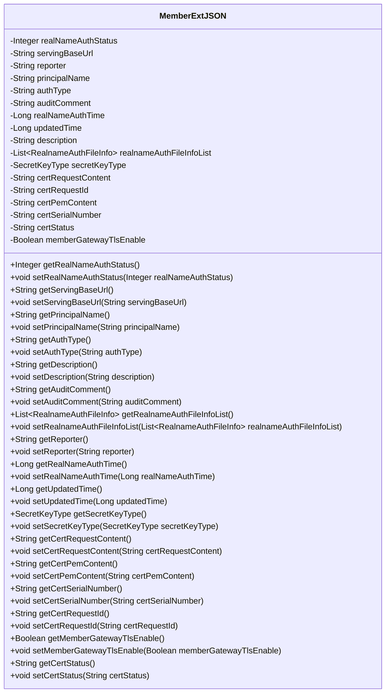

# 基础信息

|      |      |
|------|------|
| 名称 | MemberExtJSON |
| 编码语言 | .java |
| 代码路径 | WeFe/common/java/common-data-mongodb/src/main/java/com/welab/wefe/common/data/mongodb/entity/union/ext/MemberExtJSON.java |
| 包名 | com.welab.wefe.common.data.mongodb.entity.union.ext |
| 依赖项 | ['com.welab.wefe.common.constant.SecretKeyType', 'java.util.List'] |
| 概述说明 | MemberExtJSON类包含成员认证状态、服务URL、证书信息及TLS通信开关等字段，用于管理成员认证和证书相关数据。 |

# 说明

MemberExtJSON类是一个用于管理成员扩展信息的Java类，包含实名认证状态、服务基础URL、报告人、负责人名称、认证类型、审核意见、认证时间、更新时间、描述等字段。此外，还包含实名认证文件列表和密钥类型信息。证书相关字段包括证书请求内容、请求ID、PEM内容、序列号、状态以及是否启用TLS通信的标识。类中提供了所有字段的getter和setter方法，用于访问和修改这些属性。

# 类列表 Class Summary

| 名称   | 类型  | 说明 |
|-------|------|-------------|
| MemberExtJSON | class | MemberExtJSON类包含成员认证状态、服务URL、证书信息及TLS开关等字段，用于管理用户认证和证书相关数据。 |

## 类 MemberExtJSON

|      |      |
|------|------|
| 访问范围 | public |
| 类型 | class |
| 名称 | MemberExtJSON |
| 说明 | MemberExtJSON类包含成员认证状态、服务URL、证书信息及TLS开关等字段，用于管理用户认证和证书相关数据。 |

### UML类图

该类图展示了一个成员扩展信息类(MemberExtJSON)，包含实名认证状态、服务基础URL、报告人、主体名称、认证类型等核心字段，以及证书相关字段如证书请求内容、证书PEM内容、证书序列号等。该类提供了完整的getter和setter方法，用于管理成员的扩展信息，包括实名认证、证书管理和TLS通信配置等。字段类型涵盖基本类型、字符串、列表和自定义枚举类型(SecretKeyType)，体现了复杂业务对象的数据封装需求。

### 内部方法调用关系图

该流程图展示了`MemberExtJSON`类的完整结构，包含所有属性和方法。类主要用于管理成员扩展信息，包括实名认证状态、服务基础URL、报告人、负责人名称、认证类型、审核评论、认证时间、更新时间、描述、实名认证文件信息列表、密钥类型等属性，以及与证书相关的字段如证书请求内容、证书请求ID、证书PEM内容、证书序列号、证书状态和是否启用TLS通信等。每个属性都有对应的getter和setter方法，用于获取和设置属性值。

### 字段列表 Field List

| 名称  | 类型  | 说明 |
|-------|-------|------|
| certSerialNumber | String | 声明一个私有字符串变量certSerialNumber。 |
| authType | String | 声明私有字符串变量authType，用于存储认证类型信息。 |
| reporter | String | 私有字符串变量reporter。 |
| servingBaseUrl | String | 私有字符串变量，存储服务基础URL。 |
| realNameAuthStatus | Integer | 字段realNameAuthStatus表示实名认证状态，类型为Integer。 |
| description | String | 私有字符串类型变量description。 |
| certPemContent | String | 私有字符串变量certPemContent，用于存储证书PEM格式内容。 |
| certRequestContent | String | 私有字符串变量certRequestContent，用于存储证书请求内容。 |
| principalName | String | 声明一个私有字符串变量principalName。 |
| certStatus | String | 私有字符串变量certStatus，用于存储证书状态信息。 |
| memberGatewayTlsEnable | Boolean | 成员网关TLS启用状态布尔变量。 |
| auditComment | String | 私有字符串变量auditComment，用于存储审核意见。 |
| realNameAuthTime | Long | 字段realNameAuthTime用于记录实名认证时间，类型为长整型。 |
| realnameAuthFileInfoList | List<RealnameAuthFileInfo> | 私有实名认证文件信息列表。 |
| updatedTime | Long | 私有长整型变量updatedTime，用于记录更新时间。 |
| certRequestId | String | 私有字符串变量certRequestId，用于存储证书请求ID。 |
| secretKeyType | SecretKeyType | 私有密钥类型变量secretKeyType。 |

### 方法列表

| 名称  | 类型  | 说明 |
|-------|-------|------|
| getCertSerialNumber | String | 获取证书序列号的方法，返回字符串类型变量certSerialNumber。 |
| getDescription | String | 获取描述信息的公共方法，返回字符串类型的描述内容。 |
| getRealnameAuthFileInfoList | List<RealnameAuthFileInfo> | 获取实名认证文件信息列表的方法，返回类型为RealnameAuthFileInfo的列表。 |
| setCertPemContent | void | 设置证书PEM内容的方法，将输入字符串赋值给类成员变量certPemContent。 |
| getAuthType | String | 获取认证类型的公共方法，返回字符串authType。 |
| setUpdatedTime | void | 设置对象更新时间的方法，参数为长整型时间戳。 |
| setAuditComment | void | 设置审计评语的方法，将参数auditComment赋值给类的auditComment属性。 |
| setReporter | void | 设置报告人方法，将输入字符串赋值给类的reporter属性。 |
| setServingBaseUrl | void | 设置服务基础URL的方法，将输入参数赋给类变量servingBaseUrl。 |
| getPrincipalName | String | 获取principalName的字符串值。 |
| setCertRequestContent | void | 设置证书请求内容的方法，将输入参数赋值给类成员变量certRequestContent。 |
| setSecretKeyType | void | 设置密钥类型的方法，将传入的secretKeyType赋值给当前对象的secretKeyType属性。 |
| getRealNameAuthTime | Long | 获取实名认证时间的方法，返回值为长整型。 |
| getServingBaseUrl | String | 这是一个Java方法，返回名为servingBaseUrl的字符串变量值。 |
| getCertPemContent | String | 获取证书PEM内容的方法，返回certPemContent字符串。 |
| getSecretKeyType | SecretKeyType | 方法返回secretKeyType的值。 |
| setPrincipalName | void | 设置principalName属性的方法，将输入参数赋值给类的成员变量。 |
| setRealnameAuthFileInfoList | void | 设置实名认证文件信息列表的方法，参数为文件信息列表。 |
| getAuditComment | String | 获取审计评语的方法，返回auditComment字符串。 |
| setRealNameAuthTime | void | 设置实名认证时间的方法，参数为长整型时间戳。 |
| setCertSerialNumber | void | 设置证书序列号的方法，将输入参数赋值给类成员变量certSerialNumber。 |
| getCertRequestId | String | 获取证书请求ID的方法，返回字符串类型变量certRequestId。 |
| setCertRequestId | void | 方法setCertRequestId用于设置certRequestId字段的值，参数为字符串类型。 |
| getMemberGatewayTlsEnable | Boolean | 获取成员网关TLS启用状态的布尔值方法。 |
| setMemberGatewayTlsEnable | void | 设置成员网关TLS启用状态的方法，参数为布尔值。 |
| getCertStatus | String | 获取证书状态的方法，返回certStatus字符串。 |
| setCertStatus | void | 设置证书状态的方法，将输入字符串赋值给类成员变量certStatus。 |
| getUpdatedTime | Long | 获取updatedTime的长整型值。 |
| setRealNameAuthStatus | void | 设置实名认证状态的方法，参数为整型状态值。 |
| getReporter | String | 这是一个Java方法，返回名为reporter的字符串变量。 |
| setAuthType | void | 设置认证类型的方法，将输入参数authType赋值给类的成员变量authType。 |
| setDescription | void | 这是一个Java方法，用于设置对象的描述属性。方法接收一个字符串参数description，并将其赋值给对象的description字段。 |
| getCertRequestContent | String | 方法返回证书请求内容字符串。 |
| getRealNameAuthStatus | Integer | 获取实名认证状态的方法，返回整型状态值。 |

