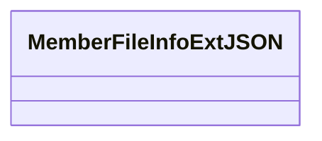

# 基础信息

|      |      |
|------|------|
| 名称 | MemberFileInfoExtJSON |
| 编码语言 | .java |
| 代码路径 | WeFe/common/java/common-data-mongodb/src/main/java/com/welab/wefe/common/data/mongodb/entity/union/ext/MemberFileInfoExtJSON.java |
| 包名 | com.welab.wefe.common.data.mongodb.entity.union.ext |
| 依赖项 | [] |
| 概述说明 | 类MemberFileInfoExtJSON用于存储成员文件信息的JSON扩展数据。 |

# 说明

这是一个名为MemberFileInfoExtJSON的公开Java类，目前为空实现，未包含任何成员变量或方法。类名表明其可能用于处理与成员文件信息相关的JSON数据扩展功能，但具体用途需结合上下文确定。

# 类列表 Class Summary

| 名称   | 类型  | 说明 |
|-------|------|-------------|
| MemberFileInfoExtJSON | class | MemberFileInfoExtJSON是一个空的公共类，可能用于扩展成员文件信息处理功能。 |

## 类 MemberFileInfoExtJSON

|      |      |
|------|------|
| 访问范围 | public |
| 类型 | class |
| 名称 | MemberFileInfoExtJSON |
| 说明 | MemberFileInfoExtJSON是一个空的公共类，可能用于扩展成员文件信息处理功能。 |

### UML类图

这段类图展示了一个名为MemberFileInfoExtJSON的空类结构。当前该类未定义任何属性或方法，仅作为基础框架存在，后续可扩展用于处理与成员文件信息相关的JSON数据操作。根据命名规范推测，该类可能用于存储或解析成员文件的扩展JSON信息，但具体功能需通过后续代码实现来明确。

### 内部方法调用关系图

这段流程图描述了一个名为MemberFileInfoExtJSON的空类结构。图中仅包含一个节点表示类声明，没有属性或方法分支，因为当前类体为空。该图清晰地反映了代码现状——这是一个尚未实现任何功能的简单类定义，可作为后续扩展的基类或占位符类使用。

### 字段列表 Field List

| 名称  | 类型  | 说明 |
|-------|-------|------|

### 方法列表

| 名称  | 类型  | 说明 |
|-------|-------|------|

