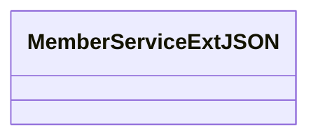
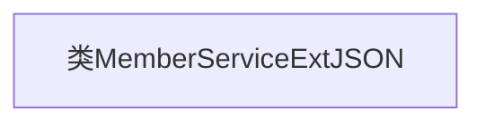

# 基础信息

|      |      |
|------|------|
| 名称 | MemberServiceExtJSON |
| 编码语言 | .java |
| 代码路径 | WeFe/common/java/common-data-mongodb/src/main/java/com/welab/wefe/common/data/mongodb/entity/union/ext/MemberServiceExtJSON.java |
| 包名 | com.welab.wefe.common.data.mongodb.entity.union.ext |
| 依赖项 | [] |
| 概述说明 | MemberServiceExtJSON是一个空的公共类。 |

# 说明

MemberServiceExtJSON是一个公开的Java类，目前为空实现，未包含任何成员变量或方法。该类的命名表明其可能用于处理与会员服务相关的JSON数据扩展功能，但具体用途需结合上下文进一步分析。类名中的"Ext"暗示这是某个基础会员服务类的扩展实现。

# 类列表 Class Summary

| 名称   | 类型  | 说明 |
|-------|------|-------------|
| MemberServiceExtJSON | class | MemberServiceExtJSON是一个公开的Java类，用于扩展成员服务功能。 |

## 类 MemberServiceExtJSON

|      |      |
|------|------|
| 访问范围 | public |
| 类型 | class |
| 名称 | MemberServiceExtJSON |
| 说明 | MemberServiceExtJSON是一个公开的Java类，用于扩展成员服务功能。 |

### UML类图

这段类图展示了一个名为`MemberServiceExtJSON`的空类结构。目前该类尚未定义任何成员变量或方法，是一个基础框架类，可能用于后续扩展JSON相关的成员服务功能。根据类名推断，该类可能涉及会员服务的JSON数据扩展处理，但需要进一步实现具体业务逻辑。

### 内部方法调用关系图

这段流程图描述了一个名为MemberServiceExtJSON的空类结构。由于该类目前没有任何属性、方法或构造函数，因此图中仅包含一个表示类本身的节点。这是一个基础框架，后续可根据实际需求添加成员变量、方法等元素来扩展功能。当前结构为后续开发提供了清晰的起点，符合面向对象编程中类的定义规范。

### 字段列表 Field List

| 名称  | 类型  | 说明 |
|-------|-------|------|

### 方法列表

| 名称  | 类型  | 说明 |
|-------|-------|------|

