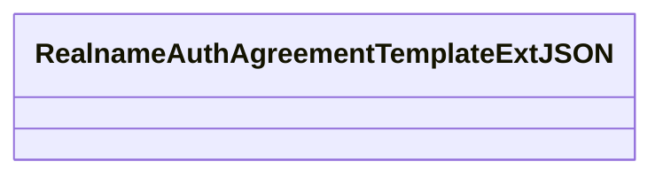
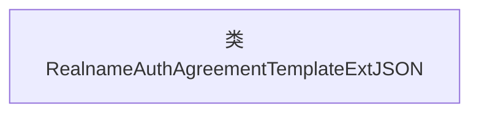

# 基础信息

|      |      |
|------|------|
| 名称 | RealnameAuthAgreementTemplateExtJSON |
| 编码语言 | .java |
| 代码路径 | WeFe/common/java/common-data-mongodb/src/main/java/com/welab/wefe/common/data/mongodb/entity/union/ext/RealnameAuthAgreementTemplateExtJSON.java |
| 包名 | com.welab.wefe.common.data.mongodb.entity.union.ext |
| 依赖项 | [] |
| 概述说明 | 类RealnameAuthAgreementTemplateExtJSON用于实名认证协议模板扩展JSON数据。 |

# 说明

该内容定义了一个名为RealnameAuthAgreementTemplateExtJSON的公开Java类，目前类体为空，未包含任何成员变量或方法。类名表明其可能用于实名认证协议模板的扩展JSON数据处理，但具体功能需通过后续实现补充。类采用驼峰命名法，符合Java命名规范，public修饰符表示可被其他类访问。

# 类列表 Class Summary

| 名称   | 类型  | 说明 |
|-------|------|-------------|
| RealnameAuthAgreementTemplateExtJSON | class | 类RealnameAuthAgreementTemplateExtJSON用于实名认证协议模板扩展JSON数据。 |

## 类 RealnameAuthAgreementTemplateExtJSON

|      |      |
|------|------|
| 访问范围 | public |
| 类型 | class |
| 名称 | RealnameAuthAgreementTemplateExtJSON |
| 说明 | 类RealnameAuthAgreementTemplateExtJSON用于实名认证协议模板扩展JSON数据。 |

### UML类图

这段类图描述了一个名为RealnameAuthAgreementTemplateExtJSON的空类，该类可能用于处理实名认证协议模板的JSON扩展数据。当前类未定义任何属性或方法，表明它可能是一个待实现的基类或数据容器，后续会根据业务需求添加与实名认证协议模板相关的JSON处理功能。类名中的"ExtJSON"暗示该类可能用于扩展标准JSON处理功能。

### 内部方法调用关系图

这段代码定义了一个名为`RealnameAuthAgreementTemplateExtJSON`的空类，目前未包含任何属性或方法。从类名推断，它可能用于处理实名认证协议模板的JSON扩展数据，但当前仅作为占位符存在，需后续补充具体实现逻辑。类名表明其功能可能与身份验证、协议模板及JSON格式数据处理相关。

### 字段列表 Field List

| 名称  | 类型  | 说明 |
|-------|-------|------|

### 方法列表

| 名称  | 类型  | 说明 |
|-------|-------|------|

