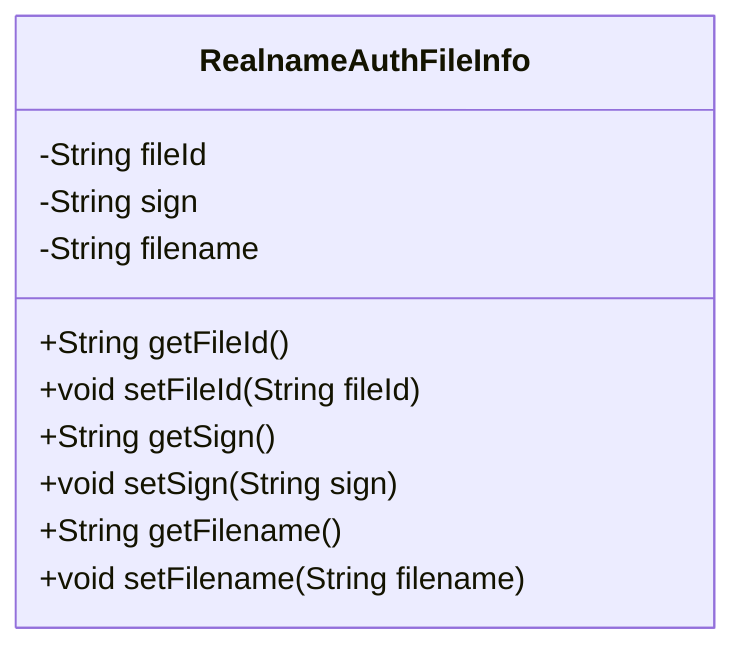
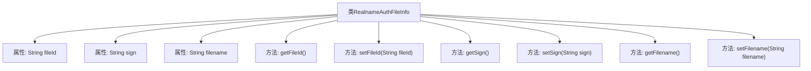

# 基础信息

|      |      |
|------|------|
| 名称 | RealnameAuthFileInfo |
| 编码语言 | .java |
| 代码路径 | WeFe/common/java/common-data-mongodb/src/main/java/com/welab/wefe/common/data/mongodb/entity/union/ext/RealnameAuthFileInfo.java |
| 包名 | com.welab.wefe.common.data.mongodb.entity.union.ext |
| 依赖项 | [] |
| 概述说明 | RealnameAuthFileInfo类包含文件ID、签名和文件名属性，提供getter和setter方法。 |

# 说明

RealnameAuthFileInfo类是一个用于存储实名认证文件信息的Java类，包含三个私有字符串属性：fileId表示文件唯一标识，sign表示文件签名，filename表示文件名。类中为每个属性提供了对应的getter和setter方法，用于获取和设置属性值。

# 类列表 Class Summary

| 名称   | 类型  | 说明 |
|-------|------|-------------|
| RealnameAuthFileInfo | class | Java类RealnameAuthFileInfo包含文件ID、签名和文件名属性及对应getter/setter方法。 |

## 类 RealnameAuthFileInfo

|      |      |
|------|------|
| 访问范围 | public |
| 类型 | class |
| 名称 | RealnameAuthFileInfo |
| 说明 | Java类RealnameAuthFileInfo包含文件ID、签名和文件名属性及对应getter/setter方法。 |

### UML类图

这段代码定义了一个名为RealnameAuthFileInfo的类，用于存储实名认证文件的相关信息。该类包含三个私有属性：fileId（文件ID）、sign（签名）和filename（文件名），并为每个属性提供了对应的getter和setter方法。这个类主要用于封装实名认证过程中上传的文件信息，便于在系统中传递和处理这些数据。

### 内部方法调用关系图

该流程图展示了RealnameAuthFileInfo类的结构，包含三个私有字符串属性(fileId、sign、filename)及其对应的getter和setter方法。每个属性都有独立的方法对进行读写操作，形成典型的JavaBean模式。类通过方法封装属性访问，符合面向对象设计原则，适用于需要控制属性访问权限的场景，如文件认证信息管理。

### 字段列表 Field List

| 名称  | 类型  | 说明 |
|-------|-------|------|
| filename | String | 私有字符串变量filename，用于存储文件名。 |
| fileId | String | 私有字符串变量fileId，用于存储文件标识符。 |
| sign | String | 私有字符串变量sign |

### 方法列表

| 名称  | 类型  | 说明 |
|-------|-------|------|
| getFilename | String | 这是一个Java方法，返回字符串类型的filename变量值。 |
| setSign | void | 这是一个Java方法，用于设置类中的sign属性值。方法接收一个字符串参数sign，并将其赋值给类的成员变量this.sign。 |
| setFilename | void | 设置文件名的方法，将输入字符串赋值给类的filename变量。 |
| getFileId | String | 获取文件ID的方法，返回fileId字符串。 |
| setFileId | void | 设置文件ID的方法，将输入参数fileId赋值给当前对象的fileId属性。 |
| getSign | String | 获取sign值的公共方法。 |

