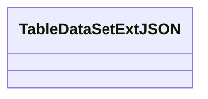
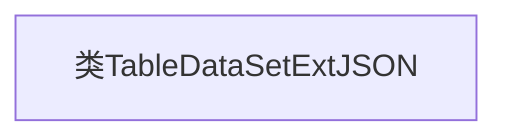

# 基础信息

|      |      |
|------|------|
| 名称 | TableDataSetExtJSON |
| 编码语言 | .java |
| 代码路径 | WeFe/common/java/common-data-mongodb/src/main/java/com/welab/wefe/common/data/mongodb/entity/union/ext/TableDataSetExtJSON.java |
| 包名 | com.welab.wefe.common.data.mongodb.entity.union.ext |
| 依赖项 | [] |
| 概述说明 | 类TableDataSetExtJSON用于JSON数据集的扩展处理。 |

# 说明

这是一个名为TableDataSetExtJSON的公开Java类，当前为空实现，未包含任何成员变量或方法。类名暗示其功能可能与表格数据集的JSON扩展处理相关，但具体用途需结合完整代码上下文进一步分析。

# 类列表 Class Summary

| 名称   | 类型  | 说明 |
|-------|------|-------------|
| TableDataSetExtJSON | class | 类TableDataSetExtJSON是一个空的公共类，用于JSON数据处理。 |

## 类 TableDataSetExtJSON

|      |      |
|------|------|
| 访问范围 | public |
| 类型 | class |
| 名称 | TableDataSetExtJSON |
| 说明 | 类TableDataSetExtJSON是一个空的公共类，用于JSON数据处理。 |

### UML类图

这段类图展示了一个名为TableDataSetExtJSON的空类结构。当前该类没有定义任何属性或方法，仅作为框架存在，可能用于后续扩展JSON数据处理功能。这种基础类设计常见于需要预留扩展点的系统架构中，为未来添加表数据与JSON格式转换功能提供基础容器。类名中的"Ext"后缀暗示其扩展性质，而"JSON"则表明与数据序列化相关。

### 内部方法调用关系图

这段流程图描述了一个名为TableDataSetExtJSON的空类结构。由于该类未定义任何属性或方法，流程图仅包含一个节点表示类本身。这种基础结构通常作为扩展点或占位符类使用，后续可通过添加字段和方法来实现具体功能。当前图示简洁明了地反映了类的初始状态。

### 字段列表 Field List

| 名称  | 类型  | 说明 |
|-------|-------|------|

### 方法列表

| 名称  | 类型  | 说明 |
|-------|-------|------|

