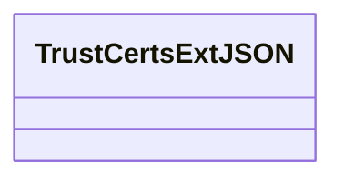
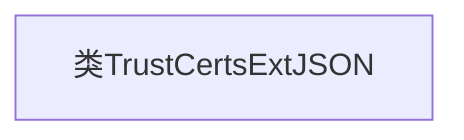

# 基础信息

|      |      |
|------|------|
| 名称 | TrustCertsExtJSON |
| 编码语言 | .java |
| 代码路径 | WeFe/common/java/common-data-mongodb/src/main/java/com/welab/wefe/common/data/mongodb/entity/union/ext/TrustCertsExtJSON.java |
| 包名 | com.welab.wefe.common.data.mongodb.entity.union.ext |
| 依赖项 | [] |
| 概述说明 | TrustCertsExtJSON是一个公开的Java类，用于处理信任证书扩展JSON数据。 |

# 说明

TrustCertsExtJSON是一个公开的Java类，用于处理与信任证书相关的扩展JSON数据。该类目前为空，未包含任何方法或属性，可能作为框架或系统的基础结构预留，后续可扩展实现证书验证、解析或管理功能。其命名表明它专注于证书信任链的JSON格式扩展操作。

# 类列表 Class Summary

| 名称   | 类型  | 说明 |
|-------|------|-------------|
| TrustCertsExtJSON | class | 类TrustCertsExtJSON定义了一个公共类，用于处理信任证书扩展JSON数据。 |

## 类 TrustCertsExtJSON

|      |      |
|------|------|
| 访问范围 | public |
| 类型 | class |
| 名称 | TrustCertsExtJSON |
| 说明 | 类TrustCertsExtJSON定义了一个公共类，用于处理信任证书扩展JSON数据。 |

### UML类图

这段代码定义了一个名为TrustCertsExtJSON的空类，目前没有任何成员变量或方法。从类名推断，它可能与信任证书扩展JSON相关，但当前实现为空，可能作为未来功能的占位符或需要后续开发填充具体逻辑。类图仅展示了一个没有任何属性和方法的空类结构，后续可根据实际需求添加证书解析、验证等相关功能。

### 内部方法调用关系图

这段流程图描述了一个名为TrustCertsExtJSON的空类结构。图中仅包含一个节点表示类本身，没有任何属性或方法。这是一个基础框架类，可能用于后续扩展证书信任相关的功能。当前设计表明这是一个待实现的类，未来可能会添加证书验证、信任管理等相关功能模块。

### 字段列表 Field List

| 名称  | 类型  | 说明 |
|-------|-------|------|

### 方法列表

| 名称  | 类型  | 说明 |
|-------|-------|------|

